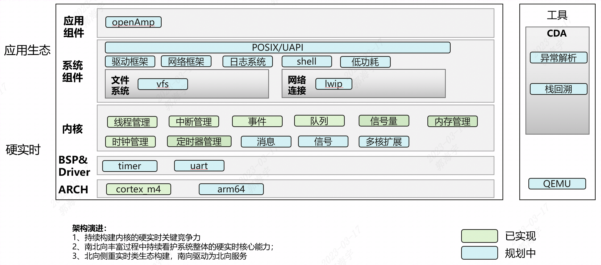

# UniProton 技术分析

## 1. UniProton 介绍

UniProton 主要目的在于为上层业务软件提供一个统一的操作系统平台，屏蔽底层硬件差异，并提供强大的调试功能。使得业务软件可在不同的硬件平台之间快速移植，方便产品芯片选型，降低硬件采购成本和软件维护成本。

## 2. UniProton 概览

UniProton 架构图如下：

UniProton 系统由 Mem、Arch、Kernel、IPC、OM 五大子系统构成，其中 Mem、Arch 是整个系统的基石。

各子系统的职责如下：

- Mem：实现内存分区的创建，内存块的申请和释放等功能。
- Arch：实现和芯片强相关的硬件特性功能，如硬中断、异常接管等。
- Kernel：实现任务、软中断、TICK中断、软件定时器等功能。
- IPC：实现事件、队列、信号量等功能。
- OM：实现 cpup、hook 等调测功能。

UniProton 目录结构介绍：

| 一级目录 | 二级目录         | 三级目录               | 说明                                                 |
|----------|------------------|------------------------|------------------------------------------------------|
| build    | uniproton_ci_lib |                        | 编译框架的公共脚本                                   |
|          | uniproton_config | config_m4              | cortex_m4芯片的功能宏配置文件                        |
| cmake    | common           | build_auxiliary_script | 转换Kconfig文件为buildef.h脚本                       |
|          | functions        |                        | cmake的公共功能函数                                  |
|          | tool_chain       |                        | 编译器和编译选项配置文件                             |
| doc      |                  |                        | 项目配置、规范、协议等文档                           |
|          | design           |                        | UniProton系统架构和特性说明                          |
| platform |                  |                        | libboundscheck使用说明                               |
|          | libboundscheck   |                        | libboundscheck预留目录，用户将下载的源码放在此目录下 |
| src      | arch             | cpu                    | cpu对应架构的功能适配代码                            |
|          |                  | include                | cpu对应架构的头文件                                  |
|          | config           |                        | 用户main函数入口                                     |
|          |                  | config                 | 用户配置功能宏开关                                   |
|          | core             | ipc                    | 事件、队列、信号量等功能                             |
|          |                  | kernel                 | 任务、中断、异常、软件定时器等功能                   |
|          | include          | uapi                   | 对外头文件                                           |
|          | mem              |                        | 内存管理基本功能                                     |
|          |                  | fsc                    | 内存管理FSC算法代码                                  |
|          |                  | include                | 内存管理头文件                                       |
|          | om               | cpup                   | cpu占用率统计功能                                    |
|          |                  | err                    | 错误处理功能                                         |
|          |                  | hook                   | 钩子函数功能                                         |
|          |                  | include                | 系统管理头文件                                       |
|          | security         | rnd                    | 随机化功能                                           |
|          | utility          | lib                    | 公共库函数                                           |

## 3. 内核分析

**1）任务管理**

UniProton 是一个单进程支持多线程的操作系统。在 UniProton 中，一个任务表示一个线程。UniProton 中的任务为抢占式调度机制，而非时间片轮转调度方式。高优先级的任务可打断低优先级任务，低优先级任务必须在高优先级任务挂起或阻塞后才能得到调度。

UniProton 的任务优先级数是没有限制的，但一般出于内存限制和性能考虑，32位/64位系统都建议设置为 32 个优先级。如 ARM Cortex-M 系列芯片建议设置为 32 个优先级（0-31），最高优先级为 0，最低优先级为 31。每个优先级可以创建多个任务。

UniProton 任务管理模块提供任务创建、任务删除、任务挂起、任务恢复、任务延时、锁任务调度、解锁任务调度、当前任务 ID 获取、任务私有数据获取与设置、查询指定任务正在 Pending 的信号量 ID、查询指定任务状态、上下文信息、任务通用信息、任务优先级设定与获取、调整指定优先级的任务调度顺序、注册及取消任务创建钩子、任务删除钩子、任务切换钩子等功能。UniProton 在初始化阶段，默认会创建一个最低优先级的 IDLE 任务，用户在没有处于运行态的任务时，IDLE 任务被运行。

**2）事件管理**

事件机制可以实现线程之间的通讯。事件通讯只能是事件类型的通讯，无数据传输。

UniProton 事件作为任务的扩展，实现任务之间的通讯。每个任务支持 32 种类型事件（32个 bit 位，每 bit 代表一种事件类型）。

UniProton 提供读取本任务事件和写指定任务事件的功能。读事件时可以同时读取多种事件，也可以只读取一种事件，写事件时也可以同时写一种或多种类型事件。

**3）队列管理**

队列（Queue），又称消息队列，是线程间实现通信的一种方式，实现了数据的存储和传递功能。根据优先级可以将数据写入到队列头或队列尾，但只能从队列的头处读取数据。

**4）硬中断管理**

硬中断是由硬件触发的会改变系统运行轨迹的一个电平信号，硬中断用于通知 CPU 某个硬件事件的发生。硬中断一般分为可屏蔽中断和不可屏蔽中断（NMI）两种。

硬中断的优先级高于所有任务，其内部也有不同的优先级，当同时有多个硬中断被触发时，最高优先级的硬中断总是优先得到响应。高优先级硬中断是否能打断正在执行的低优先级硬中断（即中断嵌套），视不同芯片平台而异。

**5）内存管理**

内存管理主要工作是动态的划分并管理用户分配好的大片内存区间。当程序某一部分需要使用内存，可以通过操作系统的内存申请函数索取指定大小内存块，一旦使用完毕，通过内存释放函数归还所占用内存，使之可以重复使用。

目前 UniProton 提供了 FSC 内存算法，该算法优缺点及应用场景如下表所示：

| 内存算法        | 优点                                                                                                      | 缺点                           | 应用场景                     |
|-----------------|-----------------------------------------------------------------------------------------------------------|--------------------------------|------------------------------|
| 类型私有FSC算法 | 内存控制块信息占用内存较少，支持最小4字节对齐的内存块大小申请；支持相邻内存块的快速分割合并，无内存碎片。 | 内存申请和内存释放的效率较低。 | 能够灵活适应各种产品的场景。 |

**6）定时器管理**

定时器管理是为满足产品定时业务需要，UniProton 提供了软件定时器功能。

对于软件定时器，是基于 Tick 实现，所以定时周期必须为 Tick 的整数倍，在 Tick 处理函数中进行软件定时器的超时扫描。

目前提供的软件定时器接口，可以完成定时器创建，启动，停止，重启，删除操作。

**7）支持信号量管理**

信号量（Semaphore）常用于协助一组互相竞争的任务来访问临界资源，在需要互斥的场合作为临界资源计数使用，根据临界资源使用场景分为核内信号量和核间信号量。

**8）支持异常管理**

UniProton 中的异常接管属于维测特性，其主要目的是在系统出现异常后，记录尽可能多的异常现场信息，便于后续问题定位。同时提供异常时的钩子函数，便于用户能够在异常发生时做一些用户化的特殊处理。其主要功能是接管内部异常处理或者外部硬件异常。

**9）CPU占用率统计**

UniProton 中的系统 CPU 占用率（CPU Percent）是指周期时间内系统的 CPU 占用率，用于表示系统一段时间内的闲忙程度，也表示CPU的负载情况。

UniProton 中的线程 CPU 占用率指单个线程的 CPU 占用率，用于表示单个线程在一段时间内的闲忙程度。

UniProton 的系统级 CPU 占用率依赖于 Tick 模块，通过 Tick 采样 IDLE 任务或 IDLE 软中断计数来实现。

**10）OpenAMP 混合部署**

OpenAMP 是一个开源软件框架，旨在通过非对称多处理器的开源解决方案，来标准化异构嵌入式系统中操作环境之间的交互。OpenAMP 包括如下四大组件：

-   remoteproc：管理从核的生命周期，管理共享内存、通信使用的 buffer、vring 等资源，初始化 rpmsg 和 virtio。
-   rpmsg：实现多核通信的通道，基于 virtio 实现。
-   virtio：通过一套虚拟 IO 实现主从核的驱动程序通信，是一种半虚拟化技术。
-   libmetal：屏蔽操作系统实现细节，提供通用用户 API 访问设备，处理设备中断、内存请求。

**11）异常管理模块**

UniProton 中的异常接管属于维测特性，其主要目的是在系统出现异常后，记录尽可能多的异常现场信息，便于后续问题定位。同时提供异常时的钩子函数，便于用户能够在异常发生时做一些用户化的特殊处理。其主要功能是接管内部异常处理或者外部硬件异常。

关键特性：

用户注册异常处理钩子。

## 4. 开发与调测

### 4\. 1 编译构建

UniProton 的编译环境要求：python 3.1+、cmake-3.20.5 、交叉编译工具链。执行构建脚本即可完成编译，如下图所示。

### 4\. 2 调测方法

UniProton 能通过劳德巴赫硬件仿真器调测，能完成断点调试，单步调试功能。具体使用方式和场景后续补充。
