# Uniproton Micro-ros使用指南

## Micro-ROS基本介绍

micro-ROS 是 ROS 2（机器人操作系统第二代）的轻量级实现，专为资源受限的嵌入式设备设计。它旨在提供 ROS 2 的核心功能，同时支持小内存占用和低功耗硬件。通过 micro-ROS，开发者可以在微控制器上实现与传统机器人、物联网传感器和设备的互操作性。该框架允许在微控制器（如 Arduino）上运行的 micro-ROS 应用程序与在单独计算上运行的 ROS 2 节点之间进行双向通信。

目前Uniproton在sd3403以及ascend310B上支持运行Micro-Ros库。

Micro-ros依赖于正常OS（如ubuntu主机）上的ROS2软件栈，通过运行在RO2软件栈上的ROS2 agent实现消息的传递。同时micro-ros的静态库需要在ROS2框架下进行编译，也依赖于主机侧正常OS。所以需要在主机上安装ROS2与micros-ros编译框架。后续编译静态库与运行ROS2-agent。

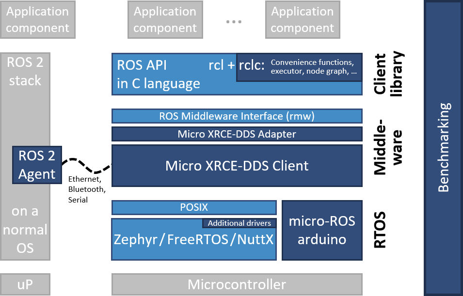


## 安装ROS2

Micro-ros通过主机侧ROS2 agent进行数据传输，需要在主机侧安装ROS2与micro-ros功能包，主机使用环境Ubuntu 24.04，方便后续单板通过网口与主机的ROS2 agent通信

参考 https://docs.ros.org/en/jazzy/Installation/Ubuntu-Install-Debs.html 安装 ROS2 jazzy版本

1. 设置地区支持

```bash
# 确保地区设置正确
sudo apt update && sudo apt install locales
sudo locale-gen en_US en_US.UTF-8
sudo update-locale LC_ALL=en_US.UTF-8 LANG=en_US.UTF-8
export LANG=en_US.UTF-8
```

2. 添加ROS 2仓库

```bash
# 启用Ubuntu universe仓库
sudo apt install software-properties-common
sudo add-apt-repository universe

# 添加ROS 2 GPG密钥
sudo apt update && sudo apt install curl
sudo curl -sSL https://raw.githubusercontent.com/ros/rosdistro/master/ros.key -o /usr/share/keyrings/ros-archive-keyring.gpg

# 添加软件源
echo "deb [arch=$(dpkg --print-architecture) signed-by=/usr/share/keyrings/ros-archive-keyring.gpg] http://packages.ros.org/ros2/ubuntu $(. /etc/os-release && echo $UBUNTU_CODENAME) main" | sudo tee /etc/apt/sources.list.d/ros2.list > /dev/null

```

3. 安装ROS2

```bash
# 更新软件包列表
sudo apt update

# 安装ROS 2基础包
sudo apt install ros-jazzy-desktop
```

4. 设置环境变量

```bash
# 添加到~/.bashrc
echo "source /opt/ros/jazzy/setup.bash" >> ~/.bashrc
source ~/.bashrc

# 临时设置（当前会话）
source /opt/ros/jazzy/setup.bash
```

5. 初始化rosdep

```bash
# 初始化rosdep
sudo rosdep init
rosdep update
```

rosdep update 可能超时，可以更改rosdep使用的源解决。

```bash
sudo cp /etc/ros/rosdep/sources.list.d/20-default.list /etc/ros/rosdep/sources.list.d/20-default.list.bak
sudo sh -c 'echo "yaml https://mirrors.tuna.tsinghua.edu.cn/github-raw/ros/rosdistro/master/rosdep/osx-homebrew.yaml" > /etc/ros/rosdep/sources.list.d/20-default.list'
sudo sh -c 'echo "yaml https://mirrors.tuna.tsinghua.edu.cn/github-raw/ros/rosdistro/master/rosdep/base.yaml" >> /etc/ros/rosdep/sources.list.d/20-default.list'
sudo sh -c 'echo "yaml https://mirrors.tuna.tsinghua.edu.cn/github-raw/ros/rosdistro/master/rosdep/python.yaml" >> /etc/ros/rosdep/sources.list.d/20-default.list'
sudo sh -c 'echo "yaml https://mirrors.tuna.tsinghua.edu.cn/github-raw/ros/rosdistro/master/releases/fuerte.yaml" >> /etc/ros/rosdep/sources.list.d/20-default.list'
```


## 安装micro-ros

参考  https://micro.ros.org/docs/tutorials/core/first_application_rtos/freertos/ 中的第一步在主机侧安装micros-ros

```bash
# Source the ROS 2 installation
source /opt/ros/$ROS_DISTRO/setup.bash

# Create a workspace and download the micro-ROS tools
mkdir microros_ws
cd microros_ws
git clone -b $ROS_DISTRO https://github.com/micro-ROS/micro_ros_setup.git src/micro_ros_setup

# Update dependencies using rosdep
sudo apt update && rosdep update
rosdep install --from-paths src --ignore-src -y

# Install pip
sudo apt-get install python3-pip

# Build micro-ROS tools and source them
colcon build
source install/local_setup.bash
```


## 编译静态库，生成头文件

参考 https://micro.ros.org/docs/tutorials/advanced/create_custom_static_library/ 编译Uniproton可以使用的静态库

在microros_ws文件夹中运行，安装依赖。

```bash
source install/local_setup.bash
ros2 run micro_ros_setup create_firmware_ws.sh generate_lib
```

准备my_custom_toolchain.cmake，与my_custom_colcon.meta文件。

```bash
touch my_custom_toolchain.cmake
touch my_custom_colcon.meta
```

my_custom_toolchain.cmake文件中 CMAKE_C_COMPILER， CMAKE_CXX_COMPILER 要与 UniProton使用相同的编译器，例如sd3403平台可以用参考 demos/sd3403/CMakeLists.txt，demos/sd3403/build/build_app.sh 中指定的编译器。

编译器选项也尽量与UniProton编译demo时使用的选项保持一致，参考 demos/sd3403/CMakeLists.txt。

```cmake
set(CMAKE_SYSTEM_NAME Generic)
set(CMAKE_CROSSCOMPILING 1)
set(CMAKE_TRY_COMPILE_TARGET_TYPE STATIC_LIBRARY)

# SET HERE THE PATH TO YOUR C99 AND C++ COMPILERS
# 在这里添加编译器路径
set(CMAKE_C_COMPILER /opt/buildtools/gcc-arm-10.3-2021.07-x86_64-aarch64-none-elf/bin/aarch64-none-elf-gcc)
set(CMAKE_CXX_COMPILER /opt/buildtools/gcc-arm-10.3-2021.07-x86_64-aarch64-none-elf/bin/aarch64-none-elf-g++)

set(CMAKE_C_COMPILER_WORKS 1 CACHE INTERNAL "")
set(CMAKE_CXX_COMPILER_WORKS 1 CACHE INTERNAL "")

# hi3093
# set(CC_OPTION "-g -march=armv8.2-a -nostdlib -nostdinc -Wl,--build-id=none -fno-builtin -fno-PIE -Wall -fno-dwarf2-cfi-asm -O0 -mcmodel=large -fomit-frame-pointer -fzero-initialized-in-bss -fdollars-in-identifiers -ffunction-sections -fdata-sections -fno-common -fno-aggressive-loop-optimizations -fno-optimize-strlen -fno-schedule-insns -fno-inline-small-functions -fno-inline-functions-called-once -fno-strict-aliasing -fno-builtin -finline-limit=20 -mstrict-align -mlittle-endian -nostartfiles -funwind-tables -D'RCUTILS_LOG_MIN_SEVERITY=RCUTILS_LOG_MIN_SEVERITY_NONE'")

# sd3403
set(CC_OPTION "-g -march=armv8.2-a+nosimd -Wl,--build-id=none -fno-builtin -fno-PIE -Wall -fno-dwarf2-cfi-asm -mcmodel=large -fomit-frame-pointer -fzero-initialized-in-bss -fdollars-in-identifiers -ffunction-sections -fdata-sections -fno-common -fno-aggressive-loop-optimizations -fno-optimize-strlen -fno-schedule-insns -fno-inline-small-functions -fno-inline-functions-called-once -fno-strict-aliasing -fno-builtin -finline-limit=20 -mstrict-align -mlittle-endian -specs=nosys.specs -nostartfiles -funwind-tables -nostdlib -nostdinc -D'RCUTILS_LOG_MIN_SEVERITY=RCUTILS_LOG_MIN_SEVERITY_NONE'")

set(CMAKE_C_FLAGS_INIT "${CC_OPTION}")
set(CMAKE_CXX_FLAGS_INIT "${CMAKE_C_FLAGS} -nostdinc++")

include_directories(
    # /home/tianyu/Uniproton_docker/UniProton/output/libc/include
    /home/tianyu/Uniproton_docker/UniProton/src/libc/litelibc/include
    /home/tianyu/Uniproton_docker/UniProton/src/libc/musl/include
    /home/tianyu/Uniproton_docker/UniProton/demos/x86_64/component/libcxx/include
    /home/tianyu/Uniproton_docker/UniProton/src/libc/litelibc/include/bits
    /home/tianyu/Uniproton_docker/UniProton/build/uniproton_config/config_armv8_sd3403
    /home/tianyu/Uniproton_docker/UniProton/src/include/uapi/
)

set(__BIG_ENDIAN__ 0)
```


my_custom_colcon.meta 中 RMW_UXRCE_DEFAULT_UDP_IP 需要定义为主机侧使用的固定IP地址，此处指定的IP为192.168.7.1。

```cmake
{
    "names": {
        "tracetools": {
            "cmake-args": [
                "-DTRACETOOLS_DISABLED=ON",
                "-DTRACETOOLS_STATUS_CHECKING_TOOL=OFF"
            ]
        },
        "rosidl_typesupport": {
            "cmake-args": [
                "-DROSIDL_TYPESUPPORT_SINGLE_TYPESUPPORT=ON"
            ]
        },
        "rcl": {
            "cmake-args": [
                "-DBUILD_TESTING=OFF",
                "-DRCL_COMMAND_LINE_ENABLED=OFF",
                "-DRCL_LOGGING_ENABLED=OFF"
            ]
        }, 
        "rcutils": {
            "cmake-args": [
                "-DENABLE_TESTING=OFF",
                "-DRCUTILS_NO_FILESYSTEM=ON",
                "-DRCUTILS_NO_THREAD_SUPPORT=ON",
                "-DRCUTILS_NO_64_ATOMIC=ON",
                "-DRCUTILS_AVOID_DYNAMIC_ALLOCATION=ON"
            ]
        },
        "microxrcedds_client": {
            "cmake-args": [
                "-DUCLIENT_PIC=OFF",
                "-DUCLIENT_PROFILE_UDP=ON",
                "-DUCLIENT_PROFILE_TCP=ON",
                "-DUCLIENT_PROFILE_DISCOVERY=OFF",
                "-DUCLIENT_PROFILE_SERIAL=OFF",
                "-UCLIENT_PROFILE_STREAM_FRAMING=ON",
                "-DUCLIENT_PROFILE_CUSTOM_TRANSPORT=OFF",
                "-DUCLIENT_PLATFORM_POSIX=ON",
                "-DUCLIENT_PROFILE_MULTITHREAD=ON"
            ]
        },

        "rmw_microxrcedds": {
            "cmake-args": [
                "-DRMW_UXRCE_MAX_NODES=2",
                "-DRMW_UXRCE_MAX_PUBLISHERS=10",
                "-DRMW_UXRCE_MAX_SUBSCRIPTIONS=5",
                "-DRMW_UXRCE_MAX_SERVICES=4",
                "-DRMW_UXRCE_MAX_CLIENTS=4",
                "-DRMW_UXRCE_MAX_HISTORY=20",
                "-DRMW_UXRCE_TRANSPORT=udp",
                "-DRMW_UXRCE_IPV=ipv4",
                "-DRMW_UXRCE_DEFAULT_UDP_IP=192.168.7.1",
                "-DRMW_UXRCE_DEFAULT_UDP_PORT=8888",
            ]
        }
        
    }
}

```

编译前有几处修改点：

1. 文件 firmware/mcu_ws/uros/rmw_microxrcedds/rmw_microxrcedds_c/src/memory.c 中

函数 `has_memory`使用的锁会导致程序卡死，需要注释掉。


2. 文件 firmware/mcu_ws/eProsima/Micro-CDR/CMakeLists.txt 中

UCDR_PIC 选项改为OFF，解决编译出错问题。

option(UCDR_PIC "Control Position Independent Code." OFF)


3. 文件 firmware/mcu_ws/ros2/rcpputils/CMakeLists.txt 和 firmware/mcu_ws/uros/rcutils/CMakeLists.txt中

add_compile_options(-fPIC) 需要注释掉，解决编译出错问题。


准备好 my_custom_toolchain.cmake 和 my_custom_colcon.meta 文件后进行编译

```bash
ros2 run micro_ros_setup build_firmware.sh $(pwd)/my_custom_toolchain.cmake $(pwd)/my_custom_colcon.meta
```


micro-ros编译后生成静态库与头文件拷贝到UniProton指定文件夹，以sd3403为例子：

```bash
cp firmware/build/libmicroros.a ../UniProton/demos/sd3403/libs/
cp -r firmware/build/include ../UniProton/demos/sd3403/include_ros
```


### 安装编译器

如果没有对应的编译器，可以参考如下命令安装：

```bash
wget https://developer.arm.com/-/media/Files/downloads/gnu-a/10.3-2021.07/binrel/gcc-arm-10.3-2021.07-x86_64-aarch64-none-elf.tar.xz
tar -xf gcc-arm-10.3-2021.07-x86_64-aarch64-none-elf.tar.xz
sudo mv gcc-arm-10.3-2021.07-x86_64-aarch64-none-elf /opt/buildtools
sudo chmod -R 755 /opt/buildtools/gcc-arm-10.3-2021.07-x86_64-aarch64-none-elf
```


### 自定义ROS2 消息类型

[action测试用例](#Action测试) 中使用了micro-ros中未定义的消息类型: turtlesim-action- RotateAbsolute，如果直接编译测试用例会出现头文件缺失。

参考 https://micro.ros.org/docs/tutorials/advanced/create_new_type/ 创建自定义的消息类型：

```bash
cd firmware/mcu_ws
ros2 pkg create --build-type ament_cmake turtlesim
cd turtlesim
mkdir action
touch action/RotateAbsolute.action
```

RotateAbsolute.action 内容：

```
# The desired heading in radians
float32 theta
---
# The angular displacement in radians to the starting position
float32 delta
---
# The remaining rotation in radians
float32 remaining
```

按照参考链接修改自动生成的 CMakeLists.txt 和 package.xml

```
...
find_package(rosidl_default_generators REQUIRED)

rosidl_generate_interfaces(${PROJECT_NAME}
  "action/RotateAbsolute.action"
 )
...
...
<build_depend>rosidl_default_generators</build_depend>
<exec_depend>rosidl_default_runtime</exec_depend>
<member_of_group>rosidl_interface_packages</member_of_group>
...
```

修改完成后重新编译静态库，生成的头文件中会生有新定义的消息类型，如前文所述将静态库和头文件拷贝到Uniproton指定文件夹。

```
ros2 run micro_ros_setup build_firmware.sh $(pwd)/my_custom_toolchain.cmake $(pwd)/my_custom_colcon.meta
```

修改CmakeList中include的头文件，新增头文件目录：

```cmake
# need copy from microros_ws/firmware/build/include
if ("${CONFIG_OS_SUPPORT_MICRO_ROS}" STREQUAL "y")
include_directories(
    ${CMAKE_CURRENT_SOURCE_DIR}/include_ros
    ${CMAKE_CURRENT_SOURCE_DIR}/include_ros/rcl
    ${CMAKE_CURRENT_SOURCE_DIR}/include_ros/rmw
    ${CMAKE_CURRENT_SOURCE_DIR}/include_ros/rcutils
    ${CMAKE_CURRENT_SOURCE_DIR}/include_ros/type_description_interfaces
    ${CMAKE_CURRENT_SOURCE_DIR}/include_ros/rosidl_runtime_c
    ${CMAKE_CURRENT_SOURCE_DIR}/include_ros/service_msgs
    ${CMAKE_CURRENT_SOURCE_DIR}/include_ros/builtin_interfaces
    ${CMAKE_CURRENT_SOURCE_DIR}/include_ros/rosidl_typesupport_interface
    ${CMAKE_CURRENT_SOURCE_DIR}/include_ros/rosidl_dynamic_typesupport
    ${CMAKE_CURRENT_SOURCE_DIR}/include_ros/rcl_action
    ${CMAKE_CURRENT_SOURCE_DIR}/include_ros/std_msgs
    ${CMAKE_CURRENT_SOURCE_DIR}/include_ros/turtlesim
    ${CMAKE_CURRENT_SOURCE_DIR}/include_ros/geometry_msgs
    ${CMAKE_CURRENT_SOURCE_DIR}/include_ros/action_msgs
    ${CMAKE_CURRENT_SOURCE_DIR}/include_ros/unique_identifier_msgs
    ${CMAKE_CURRENT_SOURCE_DIR}/include_ros/example_interfaces
)
endif()
```


## 编译Uniproton

拷贝头文件和静态库完成后可以编译Uniproton micro-ros测试用例

先修改ascend310B或sd3403的defconfig，CONFIG_OS_SUPPORT_MICRO_ROS选项开启，开启后就可以正常使用micro-ros的功能了

```
CONFIG_OS_SUPPORT_MICRO_ROS=y
```

如果要运行测试用例，可以在ascend310B或sd3403的main.c 里面解注释开启指定的测试用例运行，因为rclc_executor只能有一个，一次运行只能跑一个用例。

```
#if defined(UROS_DEMO)
    // only one testcase in one run
    printf("ros test start\n");
    RosServerClientTest();
    // RosPubTest();
    // RosSubTest();
    // RosTurtleActionTest();
    // RosMazeDemo();
#endif
```

如果要运行测试用例，编译Uniproton时使用如下命令：

```bash
sh build_app.sh UniProton_uros_demo
```


## 运行ROS2 agent

参考 https://micro.ros.org/docs/tutorials/core/first_application_linux/ 中 Creating the micro-ROS agent 章节

在microros_ws文件夹中运行，安装依赖。

```bash
# Download micro-ROS-Agent packages
ros2 run micro_ros_setup create_agent_ws.sh
```

编译 micro-ros agent

```bash
# Build step
ros2 run micro_ros_setup build_agent.sh
source install/local_setup.bash
```

运行 micro-ros agent

```bash
# Run a micro-ROS agent
ros2 run micro_ros_agent micro_ros_agent udp4 --port 8888
```

agent 正常启动：

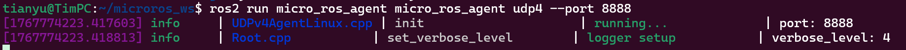


## 测试场景

如章节 [编译静态库，生成头文件](#编译静态库，生成头文件) 中所述，单板通过网口固定IP连接到主机上的运行的ROS2 agent。

成功连接，并运行测试用例后agent会有后续打印：

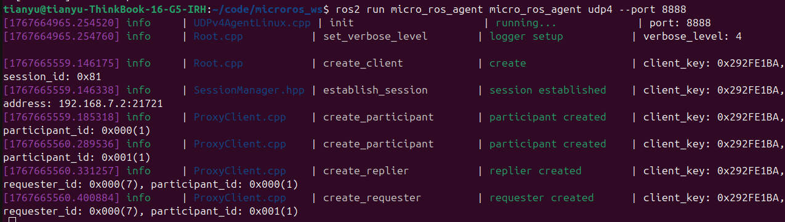


### Server-Client测试

Uniproton 侧实现了一个加法server和一个client，client发送一个请求提供需要进行加法的数字a和b，server计算出结果，结果发送回client。在主机侧也同样可以发送加法请求，Uniproton侧的加法server计算后回复。

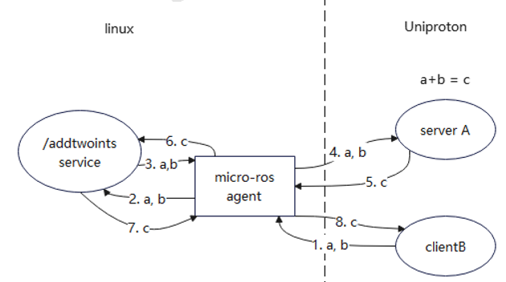

主机侧请求并收到回复：

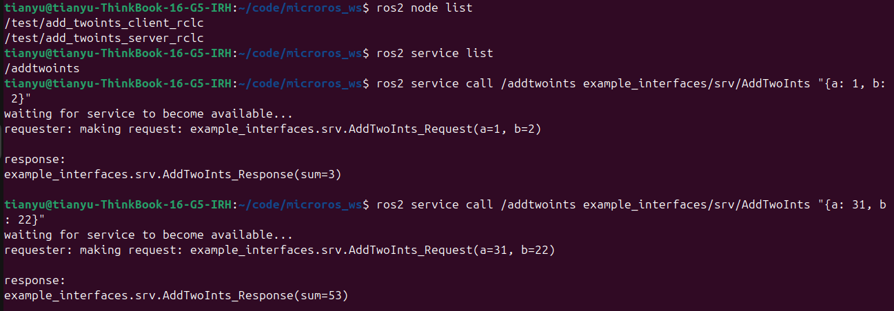

Uniproton侧server打印：

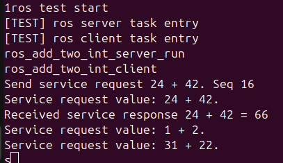

### Publisher测试

Uniproton侧实现一个 Publisher，周期性在 /chatter 话题下发送字符串。主机侧可以订阅该话题获取到字符串。

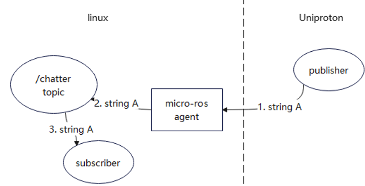

Uniproton侧打印发送的字符串：

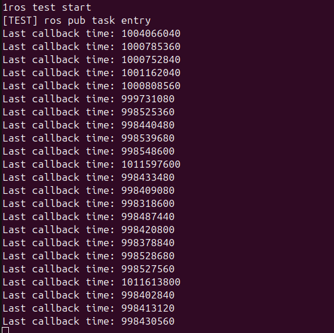

主机侧订阅获取字符串：

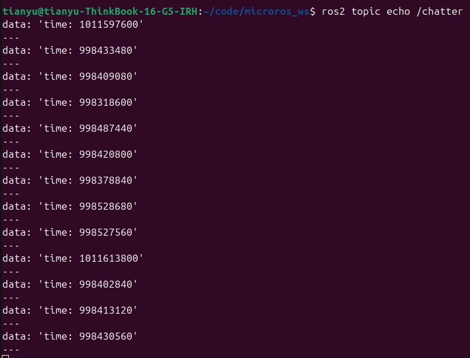

### Subscriber测试

Uniproton侧实现一个 Subscriber，订阅 /chatter 话题下发送的字符串。主机侧可以发布字符串到该话题，Uniproton侧收到后打印。

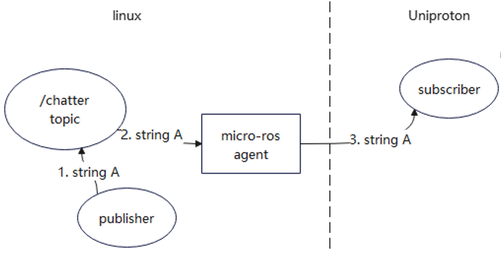

主机侧发布字符串：

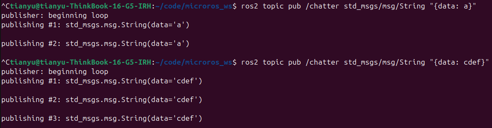

Uniproton侧获取并打印字符串：

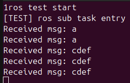

### Action测试

主机侧运行小乌龟demo，Uniproton侧实现一个publisher，发布前进指令到话题 /turtle1/cmd_vel，实现一个action client，发送旋转的action请求到/turtle1/rotate_absolute。实现小乌龟先画方后画圆的效果。画方通过前进指令和旋转请求配合完成，画圆通过有角度的前进指令单独完成。

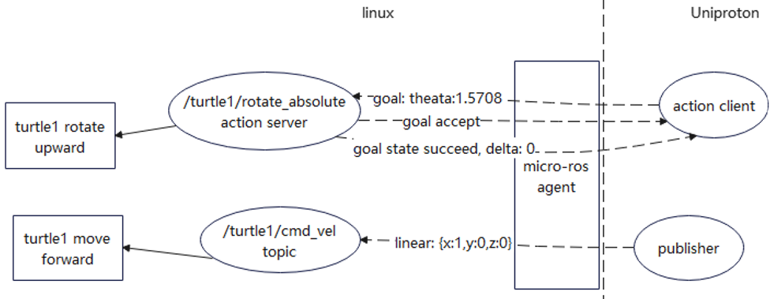

Uniproton侧发送指令/请求的同时打印：

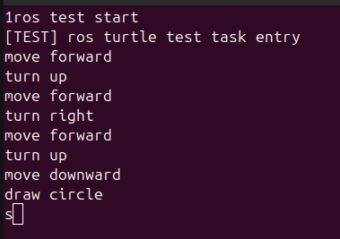

主机侧小乌龟运行结果

ros2 run turtlesim turtlesim_node

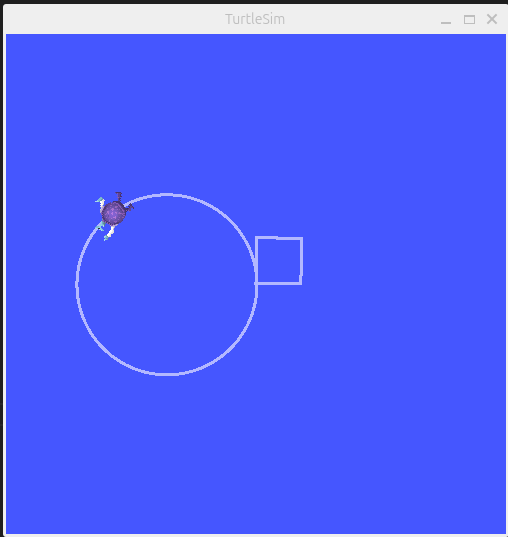