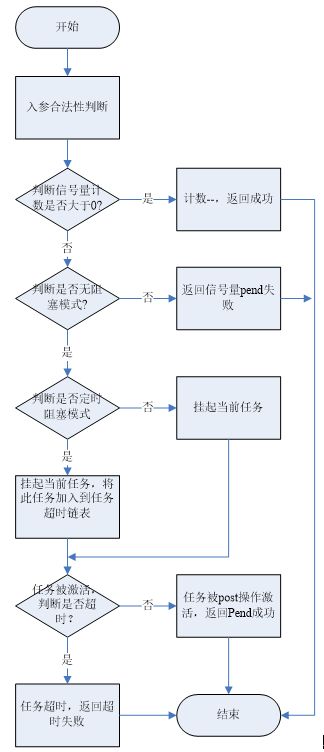

# UniProton接口说明

## 任务

### 创建并激活任务

在OS启动之前(比如在uniAppInit)中创建的任务，只是简单地加入就绪队列。 OS启动后创建的任务，如果优先级高于当前任务且未锁任务，则立即发生任务调度并被运行，否则加入就绪队列，等待执行。

**输入**： 任务创建参数，包括任务名、任务栈大小、任务优先级、任务处理函数等。

**处理**：

1. 申请任务栈空间，初始化任务栈，置栈顶魔术字。
2. 初始化任务上下文。
3. 初始化任务控制块。
4. 激活任务，任务是否马上能得到执行，取决于OS是否已经启动、优先级是否高于当前任务且没有锁任务调度、当前线程是否为硬中断。

**输出**  ：

- 成功：任务ID，若任务具备执行条件，则直接运行任务，否则将任务挂入就绪队列。

- 失败：提示错误码。

### 删除任务

   删除任务并释放任务资源。

**输入**：任务ID。

**处理**：

1. 检查任务是否具备删除条件，如锁任务调度情况下不允许删除任务。
2. 如果任务处于阻塞状态，从对应的阻塞队列中摘除。
3. 释放任务控制块。
4. 释放任务栈空间。
5. 从就绪队列中载入最高优先级的任务，若具备调度条件，则执行。

**输出**：

- 成功：若具备调度条件，则执行就绪队列中的最高任务；

- 失败：返回错误码。

### 挂起任务

 挂起任务。

**输入**：任务ID。

**处理**：将指定任务从就绪队列中摘除，若指定任务处于Running态，则会触发任务切换。

**输出**：

- 成功：挂起指定任务。

- 失败：返回错误码。

### 恢复任务

恢复挂起的任务。

**输入**：任务ID。

**处理**：恢复挂起的任务，若任务仍处于延时、阻塞态，则只是取消挂起态，并不加入就绪队列。

**输出**：

- 成功：取消任务挂起状态。
- 失败：返回错误码。

### 任务延时

将当前任务延时指定时间。

**输入**：延时时间。

**处理**：

1. 延时时间转换成OS的Tick数。
2. 将当前任务从就绪队列中摘除，置成延时态。
3. 从就绪队列中载入最高优先级的任务，并执行。
4. Tick中断处理函数中判断任务的延时时间是否已经足够，如果足够，将任务加入就绪队列。

**输出**：

- 成功：当前任务切出，就绪队列中的最高优先级任务切入。
- 失败：返回错误码。

### 锁任务调度

禁止任务之间的切换。

**输入**：锁任务调度请求。

**处理**：

1. 若有任务切换请求，将其清除。
2. 锁任务调度次数依次递增。

**输出**： 任务之间无法切换。

### 恢复任务调度的锁/解锁状态

与锁任务调度配对使用，是否解锁任务调度，取决于最近一次锁任务调度前，是否允许任务调度。

**输入**：恢复任务调度的锁/解锁状态请求。

**处理**：

1. 锁任务调度次数依次递减。
2. 若锁任务调度次数等于0，则发起任务调度。

**输出**：若最近一次锁任务调度前，允许任务调度，则从就绪队列中载入最高优先级任务，并执行。否则，维持原状，不能发生任务切换。

### 任务PID合法性检查

检查指定任务PID是否合法。

**输入**：任务PID。

**处理**：判断输入的任务PID是否超过最大任务PID号或是否已创建。

**输出**：

- TRUE ：任务PID有效。
- FALSE：任务PID无效。

### 任务私有数据获取

获取当前任务的私有数据。

**输入**：无。

**处理**：将任务TCB中记录的任务私有数据返回。

**输出**：任务私有数据。

### 查询本核指定任务正在PEND的信号量

查询指定任务正在PEND的信号量ID。

**输入**：任务PID。

**处理**： 根据任务状态和任务控制块，判断任务是否PEND在某个信号量上，以及PEND的信号量ID。

**输出**：

- 成功：返回信号量ID。
- 失败：返回错误码。

### 查询任务状态

获取指定任务的状态。

**输入**：任务PID。

**处理**：将指定任务的TCB中记录的任务状态字段返回。

**输出**：

- 成功：返回任务状态信息。
- 失败：返回错误码。

### 查询任务上下文信息

获取指定任务的上下文信息。

**输入**：任务PID。

**处理**：  将指定任务的TCB中记录的任务上下文信息返回。

**输出**：

- 成功：返回任务上下文信息。
- 失败：返回错误码。

### 查询任务基本信息

获取任务基本信息，包括任务切换时的PC，SP、任务状态、优先级、任务栈大小、栈顶值，任务名等。

**输入**：任务PID，用于存放任务基本信息查询结果的缓冲区

**处理**： 将指定任务的TCB中记录的任务基本信息返回。

**输出**：

- 成功：返回任务基本信息。
- 失败：返回错误码。

### 任务优先级获取

获取指定任务的优先级。

**输入**：任务PID

**处理**：将指定任务的TCB中记录的优先级字段返回。

**输出**：

- 成功：返回任务优先级信息。
- 失败：返回错误码。

### 任务优先级设定

设置指定任务的优先级。

**输入**：任务PID、优先级值

**处理**：将输入的任务优先级信息存入指定任务TCB中优先级字段

**输出**：

- 成功：指定任务的优先级被修改。
- 失败：返回错误码。

### 调整指定优先级的任务调度顺序

设置指定任务的优先级以及调整调度顺序。

**输入**：指定的优先级、指定需要调整调度顺序的任务，用于保存被调整到队首的任务ID的缓冲。

**处理**：若指定要调整调度顺序的任务为TASK_NULL_ID，则优先级队列中的第一个就绪任务调整至队尾；否则，将指定要调整调度顺序的任务调整至优先级队列的队首。

**输出**：

- 成功：指定优先级的任务调度顺序被修改。
- 失败：返回错误码。

## 事件

### 写事件

写事件操作实现对指定任务写入指定类型的事件，可以一次同时写多个事件。

**输入**：任务ID、事件号。

**处理**：

1. 对指定任务事件类型写上输入事件。
2. 判断目的任务是否正在接收等待事件，且其等待的事件是否已经符合唤醒条件（唤醒条件即读取的事件已经发生）。
3. 如果符合唤醒条件，则需清除任务读事件状态。
4. 如果符合唤醒条件，则需清除任务读事件状态。
5. 清除任务超时状态。
6. 在任务没有被挂起的情况下，需要将任务加入就绪队列并尝试任务调度。

**输出**：

- 成功：事件写入成功。
- 失败：错误码。

### 读事件

读事件操作可以根据入参事件掩码类型读取单个或者多个事件。

**输入**：要读取的事件掩码、读取事件所采取的策略、超时时间、接收事件的指针。

**处理**：

1. 根据入参事件掩码类型对自身任务输入读取事件类型。
2. 判断事件读取模式，是读取输入的所有事件还是其中的任意一种事件。
3. 根据读取模式，判断期望的事件是否满足读取情况。
4. 判断事件等待模式：如果为等待事件模式则根据模式来设置相应的超时时间；如果为非等待模式则事件读取失败。
5. 如果需要等待阻塞读取，则需要将自己的任务从就绪列表中删除，并进行任务调度。
6. 读取成功后，清除读取的事件类型，并且把事件类型返回。

**输出**：

- 成功：读事件成功，事件指针赋值。
- 失败：错误码

## 队列

### 创建队列

创建一个队列，创建时可以设定队列长度和队列结点大小。

**输入**： 队列节点个数、每个队列节点大小、队列ID指针。

**处理**：

1. 申请一个空闲的队列资源。
2. 申请队列所需内存。
3. 初始化队列配置。

**输出**：

- 成功：队列ID。
- 失败：错误码。

### 读队列

读指定队列的数据。

**输入**：队列ID、缓冲区指针、长度指针、超时时间。

**处理**：

1. 获取指定队列控制块。
2. 读队列PEND标志，根据缓冲区大小填入队列数据。
3. 修改队列头指针。

**输出**：

- 成功：缓冲区内填入队列数据。
- 失败：错误码。

### 写队列

写数据到指定队列。

**输入**： 队列ID、缓冲区指针、缓冲区长度、超时时间、优先级。

**处理**：

1. 获取指定队列控制块。
2. 读队列PEND标志，选取消息节点，初始化消息节点并拷贝数据。
3. 队列读资源计数器加一。

**输出**：

- 成功：写入队列数据成功。
- 失败：错误码。

### 删除队列

删除一个消息队列，删除后队列资源被回收。

**输入**：队列ID。

**处理**：

1. 获取指定队列控制块，确保队列未在使用中。
2. 释放队列内存。

**输出**：

- 成功：删除队列成功。
- 失败：错误码

### 查询队列的历史最大使用长度

获取从队列创建到删除前的历史最大使用长度。

**输入**：队列ID、队列节点使用峰值指针。

**处理**：

1. 获取指定队列控制块。
2. 将队列节点使用峰值赋值到指针参数。

**输出**：

- 成功：获取峰值成功。
- 失败：错误码

### 查询指定源PID的待处理消息个数

从指定队列中，获取指定源PID的待处理消息个数。

**输入**：队列ID、线程PID、待处理的消息个数指针。

**处理**：

1. 获取指定队列控制块。
2. 遍历队列查询待处理的消息个数，赋值到指针变量。

**输出**：

- 成功：获取待处理的消息个数成功。
- 失败：错误码。

## 中断

### 创建硬中断

硬中断在使用前，必须先创建。

**输入**：硬中断的创建参数，如：硬中断号（与芯片相关）、硬中断优先级、硬中断处理函数等。

**处理**：根据硬中断号设置硬中断优先级、处理函数。

**输出**：

- 成功：硬中断触发后，CPU能够响应该硬中断，并回调硬中断处理函数。
- 失败：返回错误码。

### 硬中断属性设置

在创建硬中断前，需要设置硬中断的模式，包括独立型（#OS_HWI_MODE_ENGROSS）和组合型（#OS_HWI_MODE_COMBINE）两种配置模式。

**输入**：硬中断号、硬中断模式。

**处理**：根据硬中断号设置硬中断的模式；

**输出**：

- 成功：指定的硬中断号被设置好硬中断模式。
- 失败：返回错误码。

### 删除硬中断

删除相应硬中断或事件，取消硬中断处理函数的注册。

**输入**：硬中断号。

**处理**：取消指定硬中断的处理函数与中断号的绑定关系。

**输出**：硬中断被删除，当硬中断信号触发后，CPU不会响应该中断。

### 使能硬中断

使能指定的硬中断。

**输入**：硬中断号。

**处理**：将指定硬中断的使能位置位。

**输出**：指定的硬中断被使能，当硬中断信号触发后，CPU会响应该中断。

### 屏蔽硬中断

屏蔽指定的硬中断。

**输入**：硬中断号。

**处理**：清除指定硬中断的使能位。

**输出**：指定的硬中断被屏蔽，当硬中断信号触发后，CPU不会响应该中断。

### 恢复指定硬中断

恢复指定的硬中断。

**输入**：硬中断号、中断使能寄存器的保存值。

**处理**：还原指定硬中断的使能位。

**输出**：指定中断的使能位恢复为指定状态。

### 禁止硬中断

禁止响应所有可屏蔽硬中断。

**输入**：禁止硬中断请求。

**处理**：

1. 记录系统状态，用于后续返回。
2. 禁止响应所有可屏蔽硬中断。

**输出**：

- 所有可屏蔽硬中断都不能响应。
- 禁止硬中断响应前的系统状态。

### 恢复硬中断

恢复硬中断的禁止或允许响应状态，与禁止硬中断配对使用。是否允许响应硬中断，取决于最近一次禁止硬中断前，系统是否允许响应硬中断。

**输入**：最近一次禁止硬中断前的系统状态。

**处理**：将系统状态恢复到最近一次禁止硬中断前。

**输出**：系统状态恢复到最近一次禁止硬中断前。

### 响应硬中断

硬中断触发后，CPU会响应硬中断。

**输入**：硬件触发的硬中断信号，且系统没有禁止硬中断。

**处理**：

1. 保存当前上下文。
2. 调用硬中断处理函数。
3. 若任务被打断，则恢复最高优先级任务的上下文，该任务不一定是被中断打断的任务。
4. 若低优先级中断被打断，则直接恢复低先级中断的上下文。

**输出**：硬中断被响应。

### 触发硬中断

触发指定核号的指定硬中断。

**输入**：核号、硬中断号。

**处理**：

1. 目前只支持触发本核的硬中断，若指定的核号不为本核，则做报错处理。
2. 目前只支持触发软件可触发的硬中断，若指定的中断无法进行软件触发，则做报错处理。
3. 当以前两个条件都满足，则设置对应的中断触发寄存器，软件触发中断。

**输出**：

- 成功：响应的硬中断被触发。
- 失败：返回错误码。

### 清除中断位

清除所有的中断请求位或指定的中断请求位。

**输入**：硬中断号。

**处理**：清除所有的中断请求位或指定的中断请求位。

**输出**：所有的中断请求位或指定的中断请求位被清除

## 定时器

### 定时器创建

根据定时器类型，触发模式，定时时长，处理函数等创建一个定时器。

**输入**：

1. 创建参数结构体（包括定时器类型，触发模式，定时时长，处理函数等）。
2. 用于保存输出的定时器句柄的指针。

**处理**：根据入参找到空闲控制块，将入参内容填入控制块中相应的字段中。

**输出**：

- 成功：定时器创建成功，后续可根据得到的定时器句柄做启动、删除等操作。
- 失败：返回错误码。

### 定时器删除

删除指定的定时器。

**输入**： 定时器句柄

**处理**：根据传入的定时器句柄，找到定时器控制块，将其内容清空并将控制块挂接到相应的空闲链表中。

**输出**：

- 成功：定时器被删除。
- 失败：返回错误码。

### 定时器启动

指定的定时器开始计时。

**输入**： 定时器句柄

**处理**：对于软件定时器，根据当前Tick计数以及定时器周期，计算结束时间，将此定时器控制块挂入定时器SortLink。

**输出**：

- 成功：定时器开始计时。
- 失败：返回错误码。

### 定时器停止

指定的定时器停止计时。

**输入**：定时器句柄。

**处理**：对于软件定时器，计算剩余时间并将其保存后，将此定时器控制块从定时器SortLink中摘除。

**输出**：

- 成功：指定任务的信号量计数值被修改。
- 失败：返回错误码。

### 定时器重启

指定的定时器重新开始计时。

**输入**：定时器句柄

**处理**：对于软件定时器，根据当前Tick计数以及定时器周期，计算结束时间，将此定时器控制块挂入定时器SortLink。

**输出**：

- 成功：指定任务的信号量计数值被修改。
- 失败：返回错误码。

### 软件定时器组创建

创建一个软件定时器组，后续的软件定时器创建时需要以此为基础。

**输入**：

1. 软件定时器组创建参数（主要关注时钟源类型及最大支持的定时器个数）。
2. 用于保存输出的定时器组号的地址。

**处理**：根据传入的最大支持的定时器个数申请定时器控制块内存，并完成其初始化操作。

**输出**：

- 成功：基于Tick的软件定时器组被成功创建。
- 失败：返回错误码。

## 信号量

### 信号量创建

创建一个信号量，并设置其初始计数器数值。

**输入**：信号量初始计数值、用于保存创建得到句柄的地址。

**处理**：找到一个空闲信号量控制块，将输入的初始计数值填入后将信号量ID当做句柄返回。

**输出**：

- 成功：信号量被创建。
- 失败：返回错误码。

### 信号量删除

删除指定信号量，若有任务阻塞于该信号量，则删除失败。

**输入**：信号量句柄

**处理**：对于核内信号量，根据输入的信号量句柄找到信号量控制块，通过查看控制块中任务阻塞链表是否为空来判断是否有任务阻塞于该信号量，若有则删除失败返回，否则释放该信号量控制块。

**输出**：

- 成功：信号量被删除。
- 失败：返回错误码。

### Pend信号量

申请指定的信号量，若其计数值大于0，则直接将计数值减1返回，否则发生任务阻塞，等待时间可通过入参设定。

**输入**：信号量句柄、等待时间

**处理**：

**输出**：

- 成功：返回0。
- 失败：返回错误码。

### Post信号量

发布信号量，将该信号量计数值+1，若有任务阻塞于该信号量，则将其唤醒。

**输入**：信号量句柄。

**处理**：

**输出**：

- 成功：信号量发布成功。
- 失败：返回错误码。

### 信号量计数值重置

设置指定信号量计数值，如果有任务阻塞于该信号量，则设置失败。

**输入**：信号量句柄、信号量计数值。

**处理**：根据输入的信号量句柄，找到相应的信号量控制块，查看控制块中任务阻塞链表，若其不为空，则返回错误，否则将控制块中信号量计数值设为输入的计数值。

**输出**：

- 成功：指定信号量的计数值被修改；
- 失败：返回错误码。

### 信号量计数值获取

 获取指定信号量计数值。

**输入**： 信号量句柄

**处理**：根据输入的信号量句柄，找到相应的信号量控制块，将控制块中记录的信号量计数值返回。

**输出**：

- 成功：返回信号量计数值。
- 失败：返回错误计数值标记。

### 信号量阻塞任务PID获取

获取阻塞在指定信号量上的任务个数及任务PID列表。

**输入**：

1. 信号量句柄。
2. 用于存放输出的阻塞任务个数的地址。
3. 用于存放输出的阻塞任务PID的缓冲区首地址。
4. 用于存放输出的阻塞任务PID的缓冲区长度。

**处理**：若有任务阻塞于指定信号量，则输出阻塞任务的个数及任务PID清单；否则，将阻塞任务个数置为0。

**输出**：

- 成功：输出阻塞于该信号量的任务个数及任务PID清单。
- 失败：返回错误码。

## 异常

### 用户注册异常处理钩子

用户注册异常处理函数类型定义的异常处理函数钩子，记录异常信息。

**输入**：类型为ExcProcFunc的钩子函数。

**处理**：将用户注册的钩子函数注册到OS框架里，发生异常时调用。

**输出**：

- 成功：注册成功。
- 失败：返回错误码。

## CPU占用率

### 获取当前cpu占用率

通过本接口获取当前cpu占用率。

**输入**：无。

**处理**：采用基于IDLE计数的统计算法，统计结果会有一定误差，误差不超过百分之五。

**输出**：

- 成功：返回当前的cpu占用率[0,10000]。
- 失败：返回错误码。

### 获取指定个数的线程的CPU占用率

根据用户输入的线程个数，获取指定个数的线程CPU占用率。

**输入**： 线程个数、缓冲区指针、实际线程个数指针。

**处理**：

1. 采用基于 IDLE 计数的统计算法，统计结果会有一定误差，误差不超过百分之五。
2. 当配置项中的采样周期值等于0时，线程级CPUP采样周期为两次调用该接口或者PRT_CpupNow之间的间隔。否则，线程级CPUP采样周期为配置项中的OS_CPUP_SAMPLE_INTERVAL大小。
3. 输出的实际线程个数不大于系统中实际的线程个数（任务个数和一个中断线程）。
4. 若在一个采样周期内有任务被删除，则统计的任务线程和中断线程CPUP总和小于10000。

**输出**：

- 成功：在缓冲区写入cpu占用率。
- 失败：返回错误码。

### 设置CPU占用率告警阈值

根据用户配置的 CPU 占用率告警阈值 warn 和告警恢复阈值 resume，设置告警和恢复阈值。

**输入**：告警阈值、恢复阈值。

**处理**：设置 CPUP 告警阈值和恢复阈值

**输出**：

- 成功：设置成功。
- 失败：返回错误码。

### 查询CPUP告警阈值和告警恢复阈值

根据用户配置的告警阈值指针 warn 和告警恢复阈值指针 resume，查询告警阈值和告警恢复阈值。

**输入**：告警阈值指针、恢复阈值指针。

**处理**：获取 CPUP 告警阈值和恢复阈值，赋值指针变量。

**输出**：

- 成功：获取成功。
- 失败：返回错误码。

### 注册CPUP告警回调函数

根据用户配置的回调函数 hook，注册 CPUP 告警回调函数。

**输入**：类型为 CpupHookFunc 的 CPU 告警回调函数。

**处理**：将用户的钩子函数注册到 OS 框架。

**输出**：

- 成功：注册成功。
- 失败：错误码

## OS启动

### main函数入口

二进制执行文件函数入口。

**输入**：无

**输出**：

- 成功：返回OK。
- 失败：错误码

### 用户业务入口

PRT_AppInit 用户业务函数入口，在 main 函数后调用，在此函数中添加业务功能代码。

**输入**：无

**输出**：

- 成功：返回OK。
- 失败：错误码

### 硬件驱动初始化入口

PRT_HardDrvInit 硬件驱动初始化函数入口，在 main 函数后调用，在此函数中添加板级驱动初始化功能代码。

**输入**：无

**输出**：

- 成功：返回OK。
- 失败：错误码

### 硬件启动流程入口

PRT_HardBootInit 在 OS 启动时调用，在main函数前被调用，可以用于 BSS 初始化、随机值设置等。

**输入**：无

**输出**：

- 成功：返回OK。
- 失败：错误码。

## openamp

### 初始化openamp资源函数

初始化保留内存，初始化 remoteproc、virtio、rpmsg，建立 UniProton 与 Linux 两端配对的 endpoint，供消息收发使用。

**输入**：无。

**输出**：

- 成功：初始化成功。
- 失败：错误码。

### 消息接收函数

接收消息，并触发SGI中断

**输入**：

1. 类型为 unsigned char * 的存储消息的缓冲区。
2. 类型为 int 的消息预期长度。
3. 类型为 int *，用于获取消息实际长度。

**输出**：

- 成功：消息接收成功。
- 失败：错误码。

### 消息发送函数

发送消息和SGI中断

**输入**：类型为 unsigned char * 的存储消息的缓冲区、类型为 int 的消息长度。

**输出**：

- 成功：消息发送成功。
- 失败：错误码。

### 释放openamp资源

用于释放openamp资源。

**输入**：无

**输出**：

- 成功：资源释放成功。
- 失败：错误码。

## POSIX接口

|       接口名         |       适配情况        |
|       :---:         |       :-----:       |
|  [pthread_atfork](#pthread_atfork)  |  不支持  |
|  [pthread_attr_destroy](#pthread_attr_destroy)  |  支持  |
|  [pthread_attr_getdetachstate](#pthread_attr_getdetachstate)  |  支持  |
|  [pthread_attr_getguardsize](#pthread_attr_getguardsize)  |  不支持  |
|  [pthread_attr_getinheritsched](#pthread_attr_getinheritsched)  |  支持  |
|  [pthread_attr_getschedparam](#pthread_attr_getschedparam)  |  支持  |
|  [pthread_attr_getschedpolicy](#pthread_attr_getschedpolicy)  |  支持  |
|  [pthread_attr_getscope](#pthread_attr_getscope)  |  支持  |
|  [pthread_attr_getstack](#pthread_attr_getstack)  |  支持  |
|  [pthread_attr_getstackaddr](#pthread_attr_getstackaddr)  |  支持  |
|  [pthread_attr_getstacksize](#pthread_attr_getstacksize)  |  支持  |
|  [pthread_attr_init](#pthread_attr_init)  |  支持  |
|  [pthread_attr_setdetachstate](#pthread_attr_setdetachstate)  |  支持  |
|  [pthread_attr_setguardsize](#pthread_attr_setguardsize)  |  不支持  |
|  [pthread_attr_setinheritsched](#pthread_attr_setinheritsched)  |  支持  |
|  [pthread_attr_setschedparam](#pthread_attr_setschedparam)  |  部分支持  |
|  [pthread_attr_setschedpolicy](#pthread_attr_setschedpolicy)  |  部分支持  |
|  [pthread_attr_setscope](#pthread_attr_setscope)  |  部分支持  |
|  [pthread_attr_setstack](#pthread_attr_setstack)  |  支持  |
|  [pthread_attr_setstackaddr](#pthread_attr_setstackaddr)  |  支持  |
|  [pthread_attr_setstacksize](#pthread_attr_setstacksize)  |  支持  |
|  [pthread_barrier_destroy](#pthread_barrier_destroy)  |  支持  |
|  [pthread_barrier_init](#pthread_barrier_init)  |  部分支持  |
|  [pthread_barrier_wait](#pthread_barrier_wait)  |  支持  |
|  [pthread_barrierattr_getpshared](#pthread_barrierattr_getpshared)  |  支持  |
|  [pthread_barrierattr_setpshared](#pthread_barrierattr_setpshared)  |  部分支持  |
|  [pthread_cancel](#pthread_cancel)  |  支持  |
|  [pthread_cond_broadcast](#pthread_cond_broadcast)  |  支持  |
|  [pthread_cond_destroy](#pthread_cond_destroy)  |  支持  |
|  [pthread_cond_init](#pthread_cond_init)  |  支持  |
|  [pthread_cond_signal](#pthread_cond_signal)  |  支持  |
|  [pthread_cond_timedwait](#pthread_cond_timedwait)  |  支持  |
|  [pthread_cond_wait](#pthread_cond_wait)  |  支持  |
|  [pthread_condattr_destroy](#pthread_condattr_destroy)  |  支持  |
|  [pthread_condattr_getclock](#pthread_condattr_getclock)  |  支持  |
|  [pthread_condattr_getpshared](#pthread_condattr_getpshared)  |  支持  |
|  [pthread_condattr_init](#pthread_condattr_init)  |  支持  |
|  [pthread_condattr_setclock](#pthread_condattr_setclock)  |  部分支持  |
|  [pthread_condattr_setpshared](#pthread_condattr_setpshared)  |  部分支持  |
|  [pthread_create](#pthread_create)  |  支持  |
|  [pthread_detach](#pthread_detach)  |  支持  |
|  [pthread_equal](#pthread_equal)  |  支持  |
|  [pthread_exit](#pthread_exit)  |  支持  |
|  [pthread_getcpuclockid](#pthread_getcpuclockid)  |  不支持  |
|  [pthread_getschedparam](#pthread_getschedparam)  |  支持  |
|  [pthread_getspecific](#pthread_getspecific)  |  支持  |
|  [pthread_join](#pthread_join)  |  支持  |
|  [pthread_key_create](#pthread_key_create)  |  支持  |
|  [pthread_key_delete](#pthread_key_delete)  |  支持  |
|  [pthread_kill](#pthread_kill)  |  不支持  |
|  [pthread_mutex_consistent](#pthread_mutex_consistent)  |  不支持  |
|  [pthread_mutex_destroy](#pthread_mutex_destroy)  |  支持  |
|  [pthread_mutex_getprioceiling](#pthread_mutex_getprioceiling)  |  不支持  |
|  [pthread_mutex_init](#pthread_mutex_init)  |  支持  |
|  [pthread_mutex_lock](#pthread_mutex_lock)  |  支持  |
|  [pthread_mutex_setprioceiling](#pthread_mutex_setprioceiling)  |  不支持  |
|  [pthread_mutex_timedlock](#pthread_mutex_timedlock)  |  支持  |
|  [pthread_mutex_trylock](#pthread_mutex_trylock)  |  支持  |
|  [pthread_mutex_unlock](#pthread_mutex_unlock)  |  支持  |
|  [pthread_mutexattr_destroy](#pthread_mutexattr_destroy)  |  支持  |
|  [pthread_mutexattr_getprioceiling](#pthread_mutexattr_getprioceiling)  |  不支持  |
|  [pthread_mutexattr_getprotocol](#pthread_mutexattr_getprotocol)  |  支持  |
|  [pthread_mutexattr_getpshared](#pthread_mutexattr_getpshared)  |  部分支持  |
|  [pthread_mutexattr_getrobust](#pthread_mutexattr_getrobust)  |  部分支持  |
|  [pthread_mutexattr_gettype](#pthread_mutexattr_gettype)  |  支持  |
|  [pthread_mutexattr_init](#pthread_mutexattr_init)  |  支持  |
|  [pthread_mutexattr_setprioceiling](#pthread_mutexattr_setprioceiling)  |  不支持  |
|  [pthread_mutexattr_setprotocol](#pthread_mutexattr_setprotocol)  |  部分支持  |
|  [pthread_mutexattr_setpshared](#pthread_mutexattr_setpshared)  |  不支持  |
|  [pthread_mutexattr_setrobust](#pthread_mutexattr_setrobust)  |  部分支持  |
|  [pthread_mutexattr_settype](#pthread_mutexattr_settype)  |  支持  |
|  [pthread_once](#pthread_once)  |  部分支持  |
|  [pthread_rwlock_destroy](#pthread_rwlock_destroy)  |  支持  |
|  [pthread_rwlock_init](#pthread_rwlock_init)  |  支持  |
|  [pthread_rwlock_rdlock](#pthread_rwlock_rdlock)  |  支持  |
|  [pthread_rwlock_timedrdlock](#pthread_rwlock_timedrdlock)  |  支持  |
|  [pthread_rwlock_timedwrlock](#pthread_rwlock_timedwrlock)  |  支持  |
|  [pthread_rwlock_tryrdlock](#pthread_rwlock_tryrdlock)  |  支持  |
|  [pthread_rwlock_trywrlock](#pthread_rwlock_trywrlock)  |  支持  |
|  [pthread_rwlock_unlock](#pthread_rwlock_unlock)  |  支持  |
|  [pthread_rwlock_wrlock](#pthread_rwlock_wrlock)  |  支持  |
|  [pthread_rwlockattr_destroy](#pthread_rwlockattr_destroy)  |  不支持  |
|  [pthread_rwlockattr_getpshared](#pthread_rwlockattr_getpshared)  |  部分支持  |
|  [pthread_rwlockattr_init](#pthread_rwlockattr_init)  |  不支持  |
|  [pthread_rwlockattr_setpshared](#pthread_rwlockattr_setpshared)  |  部分支持  |
|  [pthread_self](#pthread_self)  |  支持  |
|  [pthread_setcancelstate](#pthread_setcancelstate)  |  支持  |
|  [pthread_setcanceltype](#pthread_setcanceltype)  |  支持  |
|  [pthread_setschedparam](#pthread_setschedparam)  |  部分支持  |
|  [pthread_setschedprio](#pthread_setschedprio)  |  支持  |
|  [pthread_setspecific](#pthread_setspecific)  |  支持  |
|  [pthread_sigmask](#pthread_sigmask)  |  不支持  |
|  [pthread_spin_init](#pthread_spin_init)  |  不支持  |
|  [pthread_spin_destory](#pthread_spin_destory)  |  不支持  |
|  [pthread_spin_lock](#pthread_spin_lock)  |  不支持  |
|  [pthread_spin_trylock](#pthread_spin_trylock)  |  不支持  |
|  [pthread_spin_unlock](#pthread_spin_unlock)  |  不支持  |
|  [pthread_testcancel](#pthread_testcancel)  |  支持  |
|  [sem_close](#sem_close)  |  支持  |
|  [sem_destroy](#sem_destroy)  |  支持  |
|  [sem_getvalue](#sem_getvalue)  |  支持  |
|  [sem_init](#sem_init)  |  支持  |
|  [sem_open](#sem_open)  |  支持  |
|  [sem_post](#sem_post)  |  支持  |
|  [sem_timedwait](#sem_timedwait)  |  支持  |
|  [sem_trywait](#sem_trywait)  |  支持  |
|  [sem_unlink](#sem_unlink)  |  部分支持  |
|  [sem_wait](#sem_wait)  |  支持  |
|  [sched_yield](#sched_yield)  |  支持  |
|  [sched_get_priority_max](#sched_get_priority_max)  |  支持  |
|  [sched_get_priority_min](#sched_get_priority_min)  |  支持  |
|  [asctime](#asctime)  |  支持  |
|  [asctime_r](#asctime_r)  |  支持  |
|  [clock](#clock)  |  支持  |
|  [clock_getcpuclockid](#clock_getcpuclockid)  |  部分支持  |
|  [clock_getres](#clock_getres)  |  部分支持  |
|  [clock_gettime](#clock_gettime)  |  支持  |
|  [clock_nanosleep](#clock_nanosleep)  |  部分支持  |
|  [clock_settime](#clock_settime)  |  支持  |
|  [ctime](#ctime)  |  支持  |
|  [ctime_r](#ctime_r)  |  支持  |
|  [difftime](#difftime)  |  支持  |
|  [getdate](#getdate)  |  不支持  |
|  [gettimeofday](#gettimeofday)  |  支持  |
|  [gmtime](#gmtime)  |  支持  |
|  [gmtime_r](#gmtime_r)  |  支持  |
|  [localtime](#localtime)  |  支持  |
|  [localtime_r](#localtime_r)  |  支持  |
|  [mktime](#mktime)  |  支持  |
|  [nanosleep](#nanosleep)  |  支持  |
|  [strftime](#strftime)  |  不支持  |
|  [strftime_l](#strftime_l)  |  不支持  |
|  [strptime](#strptime)  |  支持  |
|  [time](#time)  |  支持  |
|  [timer_create](#timer_create)  |  支持  |
|  [timer_delete](#timer_delete)  |  支持  |
|  [timer_getoverrun](#timer_getoverrun)  |  支持  |
|  [timer_gettime](#timer_gettime)  |  支持  |
|  [timer_settime](#timer_settime)  |  支持  |
|  [times](#times)  |  支持  |
|  [timespec_get](#timespec_get)  |  支持  |
|  [utime](#utime)  |  不支持  |
|  [wcsftime](#wcsftime)  |  不支持  |
|  [wcsftime_l](#wcsftime_l)  |  不支持  |
|  [malloc](#malloc)  |  支持  |
|  [free](#free)  |  支持  |
|  [memalign](#memalign)  |  支持  |
|  [realloc](#realloc)  |  支持  |
|  [malloc_usable_size](#malloc_usable_size)  |  支持  |
|  [aligned_alloc](#aligned_alloc)  |  支持  |
|  [reallocarray](#reallocarray)  |  支持  |
|  [calloc](#calloc)  |  支持  |
|  [posix_memalign](#posix_memalign)  |  支持  |
|  [abort](#abort)  |  支持  |
|  [_Exit](#_Exit)  |  支持  |
|  [atexit](#atexit)  |  支持  |
|  [quick_exit](#quick_exit)  |  支持  |
|  [at_quick_exit](#at_quick_exit)  |  支持  |
|  [assert](#assert)  |  支持  |
|  [div](#div)  |  支持  |
|  [ldiv](#ldiv)  |  支持  |
|  [lldiv](#lldiv)  |  支持  |
|  [imaxdiv](#imaxdiv)  |  支持  |
|  [wcstol](#wcstol)  |  支持  |
|  [wcstod](#wcstod)  |  支持  |
|  [fcvt](#fcvt)  |  支持  |
|  [ecvt](#ecvt)  |  支持  |
|  [gcvt](#gcvt)  |  支持  |
|  [qsort](#qsort)  |  支持  |
|  [abs](#abs)  |  支持  |
|  [labs](#labs)  |  支持  |
|  [llabs](#llabs)  |  支持  |
|  [imaxabs](#imaxabs)  |  支持  |
|  [strtol](#strtol)  |  支持  |
|  [strtod](#strtod)  |  支持  |
|  [atoi](#atoi)  |  支持  |
|  [atol](#atol)  |  支持  |
|  [atoll](#atoll)  |  支持  |
|  [atof](#atof)  |  支持  |
|  [bsearch](#bsearch)  |  支持  |
|  [semget](#semget)  |  支持  |
|  [semctl](#semctl)  |  部分支持  |
|  [semop](#semop)  |  部分支持  |
|  [semtimedop](#semtimedop)  |  部分支持  |
|  [msgget](#msgget)  |  支持  |
|  [msgctl](#msgctl)  |  部分支持  |
|  [msgsnd](#msgsnd)  |  部分支持  |
|  [msgrcv](#msgrcv)  |  部分支持  |
|  [shmget](#shmget)  |  不支持  |
|  [shmctl](#shmctl)  |  不支持  |
|  [shmat](#shmat)  |  不支持  |
|  [shmdt](#shmdt)  |  不支持  |
|  [ftok](#ftok)  |  不支持  |
|  [fstatat](#fstatat)  |  支持  |
|  [fchmodat](#fchmodat)  |  支持  |
|  [mkdir](#mkdir)  |  支持  |
|  [chmod](#chmod)  |  支持  |
|  [lstat](#lstat)  |  支持  |
|  [utimensat](#utimensat)  |  支持  |
|  [mkfifo](#mkfifo)  |  支持  |
|  [fchmod](#fchmod)  |  支持  |
|  [mknod](#mknod)  |  支持  |
|  [statvfs](#statvfs)  |  支持  |
|  [mkfifoat](#mkfifoat)  |  支持  |
|  [umask](#umask)  |  支持  |
|  [mknodat](#mknodat)  |  支持  |
|  [futimesat](#futimesat)  |  支持  |
|  [lchmod](#lchmod)  |  支持  |
|  [futimens](#futimens)  |  支持  |
|  [mkdirat](#mkdirat)  |  支持  |
|  [fstat](#fstat)  |  支持  |
|  [stat](#stat)  |  支持  |
|  [open](#open)  |  支持  |
|  [creat](#creat)  |  支持  |
|  [posix_fadvise](#posix_fadvise)  |  不支持  |
|  [fcntl](#fcntl)  |  支持  |
|  [posix_fallocate](#posix_fallocate)  |  支持  |
|  [openat](#openat)  |  支持  |
|  [scandir](#scandir)  |  不支持  |
|  [seekdir](#seekdir)  |  支持  |
|  [readdir_r](#readdir_r)  |  不支持  |
|  [fdopendir](#fdopendir)  |  支持  |
|  [versionsort](#versionsort)  |  支持  |
|  [alphasort](#alphasort)  |  支持  |
|  [rewinddir](#rewinddir)  |  支持  |
|  [dirfd](#dirfd)  |  支持  |
|  [readdir](#readdir)  |  不支持  |
|  [telldir](#telldir)  |  支持  |
|  [closedir](#closedir)  |  支持  |
|  [opendir](#opendir)  |  支持  |
|  [putwchar](#putwchar)  |  支持  |
|  [fgetws](#fgetws)  |  支持  |
|  [vfwprintf](#vfwprintf)  |  支持  |
|  [fscanf](#fscanf)  |  支持  |
|  [snprintf](#snprintf)  |  支持  |
|  [sprintf](#sprintf)  |  支持  |
|  [fgetpos](#fgetpos)  |  支持  |
|  [vdprintf](#vdprintf)  |  支持  |
|  [gets](#gets)  |  支持  |
|  [ungetc](#ungetc)  |  支持  |
|  [ftell](#ftell)  |  支持  |
|  [clearerr](#clearerr)  |  支持  |
|  [getc_unlocked](#getc_unlocked)  |  支持  |
|  [fmemopen](#fmemopen)  |  支持  |
|  [putwc](#putwc)  |  支持  |
|  [getchar](#getchar)  |  支持  |
|  [open_wmemstream](#open_wmemstream)  |  支持  |
|  [asprintf](#asprintf)  |  支持  |
|  [funlockfile](#funlockfile)  |  支持  |
|  [fflush](#fflush)  |  支持  |
|  [vfprintf](#vfprintf)  |  支持  |
|  [vsscanf](#vsscanf)  |  支持  |
|  [vfwscanf](#vfwscanf)  |  支持  |
|  [puts](#puts)  |  支持  |
|  [getchar_unlocked](#getchar_unlocked)  |  支持  |
|  [setvbuf](#setvbuf)  |  支持  |
|  [getwchar](#getwchar)  |  支持  |
|  [setbuffer](#setbuffer)  |  支持  |
|  [vsnprintf](#vsnprintf)  |  支持  |
|  [freopen](#freopen)  |  支持  |
|  [fwide](#fwide)  |  支持  |
|  [sscanf](#sscanf)  |  支持  |
|  [fgets](#fgets)  |  支持  |
|  [vswscanf](#vswscanf)  |  支持  |
|  [vprintf](#vprintf)  |  支持  |
|  [fputws](#fputws)  |  支持  |
|  [wprintf](#wprintf)  |  支持  |
|  [wscanf](#wscanf)  |  支持  |
|  [fputc](#fputc)  |  支持  |
|  [putchar](#putchar)  |  支持  |
|  [flockfile](#flockfile)  |  支持  |
|  [vswprintf](#vswprintf)  |  支持  |
|  [fputwc](#fputwc)  |  支持  |
|  [fopen](#fopen)  |  支持  |
|  [tmpnam](#tmpnam)  |  支持  |
|  [ferror](#ferror)  |  支持  |
|  [printf](#printf)  |  支持  |
|  [open_memstream](#open_memstream)  |  支持  |
|  [fwscanf](#fwscanf)  |  支持  |
|  [fprintf](#fprintf)  |  支持  |
|  [fgetc](#fgetc)  |  支持  |
|  [rewind](#rewind)  |  支持  |
|  [getwc](#getwc)  |  支持  |
|  [scanf](#scanf)  |  支持  |
|  [perror](#perror)  |  支持  |
|  [vsprintf](#vsprintf)  |  支持  |
|  [vasprintf](#vasprintf)  |  支持  |
|  [getc](#getc)  |  支持  |
|  [dprintf](#dprintf)  |  支持  |
|  [popen](#popen)  |  不支持  |
|  [putc](#putc)  |  支持  |
|  [fseek](#fseek)  |  支持  |
|  [fgetwc](#fgetwc)  |  支持  |
|  [tmpfile](#tmpfile)  |  支持  |
|  [putw](#putw)  |  支持  |
|  [tempnam](#tempnam)  |  支持  |
|  [vwprintf](#vwprintf)  |  支持  |
|  [getw](#getw)  |  支持  |
|  [putchar_unlocked](#putchar_unlocked)  |  支持  |
|  [fread](#fread)  |  支持  |
|  [fileno](#fileno)  |  支持  |
|  [remove](#remove)  |  支持  |
|  [putc_unlocked](#putc_unlocked)  |  支持  |
|  [fclose](#fclose)  |  支持  |
|  [feof](#feof)  |  支持  |
|  [fwrite](#fwrite)  |  支持  |
|  [setbuf](#setbuf)  |  支持  |
|  [pclose](#pclose)  |  不支持  |
|  [swprintf](#swprintf)  |  支持  |
|  [fwprintf](#fwprintf)  |  支持  |
|  [swscanf](#swscanf)  |  支持  |
|  [rename](#rename)  |  支持  |
|  [getdelim](#getdelim)  |  支持  |
|  [vfscanf](#vfscanf)  |  支持  |
|  [setlinebuf](#setlinebuf)  |  支持  |
|  [fputs](#fputs)  |  支持  |
|  [fsetpos](#fsetpos)  |  支持  |
|  [fopencookie](#fopencookie)  |  支持  |
|  [fgetln](#fgetln)  |  支持  |
|  [vscanf](#vscanf)  |  支持  |
|  [ungetwc](#ungetwc)  |  支持  |
|  [getline](#getline)  |  支持  |
|  [ftrylockfile](#ftrylockfile)  |  支持  |
|  [vwscanf](#vwscanf)  |  支持  |

### 任务管理

#### pthread_attr_init

pthread_attr_init() 函数初始化一个线程对象的属性,需要用 pthread_attr_destroy() 函数对其去除初始化。

**参数**：指向一个线程属性结构的[指针](https://baike.baidu.com/item/指针?fromModule=lemma_inlink)attr，结构中的元素分别对应着新线程的运行属性。

**输出**：

- 0：初始化成功。
- ENOMEM：内存不足，无法初始化线程属性对象。
- EBUSY：attr是以前初始化但未销毁的线程属性。

#### pthread_attr_destroy

pthread_attr_destroy()函数应销毁线程属性对象。被销毁的attr属性对象可以使用pthread_attr_init()重新初始化；在对象被销毁后引用该对象的结果是未定义的。

**参数**：指向一个线程属性结构的[指针](https://baike.baidu.com/item/指针?fromModule=lemma_inlink)attr。

**输出**：

- 0：函数销毁对象成功。
- EINVAL：attr指向的是未初始化的线程属性对象。

#### pthread_attr_setstackaddr

pthread_attr_setstackaddr()函数设置attr对象中的线程创建堆栈addr属性。堆栈addr属性指定用于创建线程堆栈的存储位置。

**输入**：指向一个线程属性结构的[指针](https://baike.baidu.com/item/指针?fromModule=lemma_inlink)attr、 栈地址stackaddr。

**输出**：

- 0：设置成功。
- EINVAL：attr指向的是未初始化的线程属性对象。

#### pthread_attr_getstackaddr

pthread_attr_getstackaddr()如果成功，函数将堆栈地址属性值存储在堆栈地址中。

**参数**：指向一个线程属性结构的[指针](https://baike.baidu.com/item/指针?fromModule=lemma_inlink)attr、栈地址stackaddr.

**输出**：

- 0：获取成功。
- EINVAL：attr指向的是未初始化的线程属性对象。

#### pthread_attr_getstacksize

pthread_attr_getstacksize()和pthread_attr_setstacksize()函数分别应获取和设置 attr 对象中的线程创建堆栈大小属性（以字节为单位）。

**参数**：

1. 指向一个线程属性结构的[指针](https://baike.baidu.com/item/指针?fromModule=lemma_inlink)attr.
2. 栈大小指针stacksize，指向设置或获取的堆栈大小。

**输出**：

- 0：获取成功。
- EINVAL：attr指向的是未初始化的线程属性对象。

#### pthread_attr_setstacksize

设置attr对象中的线程创建堆栈大小属性。

**参数**：

1. 指向一个线程属性结构的[指针](https://baike.baidu.com/item/指针?fromModule=lemma_inlink)attr。
2. 栈大小指针stacksize，指向设置或获取的堆栈大小。

**输出**：

- 0：设置成功。
- EINVAL：堆栈size小于最小值或超过限制。

#### pthread_attr_getinheritsched

获取线程的继承属性。

**参数**：

- 指向一个线程属性结构的[指针](https://baike.baidu.com/item/指针?fromModule=lemma_inlink)attr。
- 线程的继承性指针inheritsched。

**输出**：

- 0：获取成功。
- EINVAL：attr指向的是未初始化的线程属性对象。

#### pthread_attr_setinheritsched

设置线程的继承属性。可设置如下参数：

- PTHREAD_INHERIT_SCHED：指定线程调度属性应继承自创建线程，并且应忽略此attr参数中的调度属性。
- PTHREAD_EXPLICIT_SCHED：指定线程调度属性应设置为此属性对象中的相应值。

**参数**：

- 指向一个线程属性结构的[指针](https://baike.baidu.com/item/指针?fromModule=lemma_inlink)attr。
- 线程的继承性inheritsched。

**输出**：

- 0：设置成功。
- EINVAL：继承的值无效，或attr指向的是未初始化的线程属性对象。
- ENOTSUP：试图将属性设置为不支持的值。

#### pthread_attr_getschedpolicy

获取调度策略属性，策略支持SCHED_FIFO。当使用调度策略SCHED_FIFO执行的线程正在等待互斥体时，互斥体解锁，它们应按优先级顺序获取互斥体。

**参数**：

1. 指向一个线程属性结构的[指针](https://baike.baidu.com/item/指针?fromModule=lemma_inlink)attr。
2. 线程的调度策略指针policy。

**输出**：

- 0：获取成功。
- EINVAL：attr指向的是未初始化的线程属性对象。

#### pthread_attr_setschedpolicy

设置调度策略属性，策略支持SCHED_FIFO。当使用调度策略SCHED_FIFO执行的线程正在等待互斥体时，互斥体解锁时，它们应按优先级顺序获取互斥体。

**参数**：

1. 指向一个线程属性结构的[指针](https://baike.baidu.com/item/指针?fromModule=lemma_inlink)attr。
2. 线程的调度策略policy。

**输出**：

- 0：设置成功。
- EINVAL：policy的值无效，或者attr指向没有初始化的线程对象。
- ENOTSUP：试图将属性设置为不支持的值。

#### pthread_attr_getdetachstate

获取线程分离属性，分离状态应设置为PTHREAD_CREATE_DETAED或PTHREAD_CREATE_JOI无BLE。

**参数**：

1. 指向一个线程属性结构的[指针](https://baike.baidu.com/item/指针?fromModule=lemma_inlink)attr。
2. 分离属性指针detachstate。

**输出**：

- 0：获取成功。
- EINVAL：attr指向没有初始化的线程对象。

#### pthread_attr_setdetachstate

设置线程分离属性。分离状态应设置为PTHREAD_CREATE_DETAED或PTHREAD_CREATE_JOINABLE。

**参数**：

1. 指向一个线程属性结构的[指针](https://baike.baidu.com/item/指针?fromModule=lemma_inlink)attr。
2. 分离属性detachstate。

**输出**：

- 0：设置成功。
- EINVAL：attr指向没有初始化的线程对象或分离状态的值无效。

#### pthread_attr_setschedparam

pthread_attr_setschedparam() 可用来设置线程属性对象的优先级属性。

**参数**：

1. 指向一个线程属性结构的[指针](https://baike.baidu.com/item/指针?fromModule=lemma_inlink)attr。
2. 调度属性指针schedparam。

**输出**：

- 0：操作成功。
- EINVAL：参数不合法或attr未初始化。
- ENOTSUP：schedparam的优先级属性不支持。

#### pthread_attr_getschedparam

pthread_attr_getschedparam() 可用来获取线程属性对象的优先级属性。

**参数**：

1. 指向一个线程属性结构的[指针](https://baike.baidu.com/item/指针?fromModule=lemma_inlink)attr。
2. 调度属性指针schedparam。

**输出**：

- 0：操作成功。
- EINVAL：参数不合法或attr未初始化。

#### pthread_attr_getscope

pthread_attr_getscope() 可用来获取线程属性对象的作用域属性。

**参数**：

- 指向一个线程属性结构的[指针](https://baike.baidu.com/item/指针?fromModule=lemma_inlink)attr。
- 线程的作用域属性指针scope。

**输出**：

- 0：获取成功。
- EINVAL：指针未初始化。

#### pthread_attr_setscope

设置线程的作用域，支持PTHREAD_SCOPE_SYSTEM，控制线程在系统级竞争资源。

**参数**：

1. 指向一个线程属性结构的[指针](https://baike.baidu.com/item/指针?fromModule=lemma_inlink)attr。
2. 作用域scope。

**输出**：

- 0：设置成功。
- EINVAL：scope的值无效，或者attr指向没有初始化的线程对象。
- ENOTSUP：试图将属性设置为不支持的值。

#### pthread_attr_getstack

pthread_attr_getstack() 可用来获取线程属性对象的栈信息。

**参数**：

- 指向一个线程属性结构的[指针](https://baike.baidu.com/item/指针?fromModule=lemma_inlink)attr。
- 线程的栈地址指针stackAddr。
- 线程的栈大小指针stackSize。

**输出**：

- 0：获取成功。
- EINVAL：指针未初始化。

#### pthread_attr_setstack

pthread_attr_setstack() 可用来设置线程属性对象的栈地址和栈大小。

**参数**：

- 指向一个线程属性结构的[指针](https://baike.baidu.com/item/指针?fromModule=lemma_inlink)attr。
- 线程的栈地址stackAddr。
- 线程的栈大小stackSize。

**输出**：

- 0：获取成功。
- EINVAL：指针未初始化或值无效。

#### pthread_attr_getguardsize

暂不支持。

#### pthread_attr_setguardsize

暂不支持。

#### pthread_atfork

暂不支持。

#### pthread_create

pthread_create()函数创建一个新线程，其属性由 attr 指定。如果 attr 为 NULL，则使用默认属性。创建成功后，pthread_create()应将创建的线程的ID存储在参数 thread 的位置。

**参数**：

1. 指向线程[标识符](https://baike.baidu.com/item/标识符?fromModule=lemma_inlink)的[指针](https://baike.baidu.com/item/指针?fromModule=lemma_inlink)thread。
2. 指向一个线程属性结构的[指针](https://baike.baidu.com/item/指针?fromModule=lemma_inlink)attr。
3. 线程处理函数的起始地址 start_routine。
4. 运行函数的参数 arg。

**输出**：

- 0：创建成功。
- EINVAL：attr指定的属性无效。
- EAGAIN：系统缺少创建新线程所需的资源，或者将超过系统对线程总数施加的限制。
- EPERM：调用者没有权限。

#### pthread_cancel

取消线程的执行。pthread_cancel()函数应请求取消线程。目标线程的可取消状态和类型决定取消何时生效。当取消被操作时，应调用线程的取消处理程序。

**参数**：线程的ID thread。

**输出**：

- 0：取消成功。
- ESRCH：找不到与给定线程ID相对应的线程。

#### pthread_testcancel

设置可取消状态。pthread_testcancel()函数应在调用线程中创建一个取消点。如果禁用了可取消性,pthread_testcancel()函数将无效。

**参数**：无

**输出**：无

#### pthread_setcancelstate

pthread_setcancelstate() 将调用线程的可取消性状态设置为 state 中给出的值。线程以前的可取消性状态返回到oldstate所指向的缓冲区中。state状态的合法值为PTHREAD_CANCEL_E无BLE和PTHREAD_CANCEL_DISABLE。

**参数**：

- 线程的可取消性状态 state。
- 之前的可取消状态 oldstate。

**输出**：

- 0：设置成功。
- EINVAL：指定的状态不是 PTHREAD_CANCEL_E无BLE 或 PTHREAD_CANCEL_DISABLE。

#### pthread_setcanceltype

pthread_setcanceltype()函数应原子地将调用线程的可取消类型设置为指定的类型，并在oldtype引用的位置返回上一个可取消类型。类型的合法值为PTHREAD_CANCEL_DEFERRED和PTHREAD_CANCEL_ASYNCHRONOUS。

**输入**：

- 线程的可取消类型type。
- 之前的可取消类型oldtype。

**输出**：

- 0：设置成功。
- EINVAL：指定的类型不是PTHREAD_CANCEL_DEFERRED或PTHREAD_CANCEL_ASYNCHRONOUS。

#### pthread_exit

线程的终止可以是调用 pthread_exit 或者该线程的例程结束。由此可看出，一个线程可以隐式退出，也可以显式调用 pthread_exit 函数来退出。pthread_exit 函数唯一的参数 value_ptr 是函数的返回代码，只要 pthread_join 中的第二个参数 value_ptr 不是NULL，这个值将被传递给 value_ptr。

**参数**：线程退出状态value_ptr，通常传NULL。

**输出**：无

#### pthread_cleanup_push

pthread_cleanup_push() 函数应将指定的取消处理程序推送到调用线程的取消堆栈上。pthread_cleanup_push必须和pthread_cleanup_pop同时使用。当push后，在线程退出前使用pop，便会调用清理函数。

**参数**：

1. 取消处理程序入口地址 routine。
2. 传递给处理函数的参数 arg。

**输出**：无

#### pthread_cleanup_pop

pthread_cleanup_pop()应删除调用线程取消处理程序，并可选择调用它（如果execute非零）。

**参数**：执行参数execute。

**输出**：无

#### pthread_setschedprio

pthread_setschedprio()函数应将线程 ID 指定的调度优先级设置为 prio 给出的值。如果 pthread_setschedprio()函数失败，则目标线程的调度优先级不应更改。

**参数**：

1. 线程ID：thread。
2. 优先级：prio。

**输出**：

- 0，设置成功。
- EINVAL：prio对指定线程的调度策略无效。
- ENOTSUP：试图将优先级设置为不支持的值。
- EPERM：调用者没有设置指定线程的调度策略的权限。
- EPERM：不允许将优先级修改为指定的值。
- ESRCH：thread指定的线程不存在。

#### pthread_self

pthread_self()函数应返回调用线程的线程ID。

**参数**：无

**输出**：返回调用线程的线程ID。

#### pthread_equal

此函数应比较线程ID t1和t2。

**参数**：

1. 线程ID t1。
2. 线程ID t2。

**输出**：

- 如果t1和t2相等，pthread_equal()函数应返回非零值。
- 如果t1和t2不相等，应返回零。
- 如果t1或t2不是有效的线程ID，则行为未定义。

#### sched_yield

sched_yield()函数应强制正在运行的线程放弃处理器，并触发线程调度。

**参数**：无

**输出**：输出0时，成功完成；否则应返回值-1。

#### sched_get_priority_max

sched_get_priority_max()和 sched_get_priority_min()函数应分别返回指定调度策略的优先级最大值或最小值。

**参数**：调度策略policy。

**输出**：

返回值：

- -1：失败。
- 返回优先级最大值。

errno：

- EINVAL：调度策略非法。

#### sched_get_priority_min

返回指定调度策略的优先级最小值

**参数**：调度策略policy。

**输出**：

返回值：

- -1：失败。
- 返回优先级最小值。

errno：

- EINVAL：调度策略非法。

#### pthread_join

pthread_join() 函数，以阻塞的方式等待 thread 指定的线程结束。当函数返回时，被等待线程的资源被收回。如果线程已经结束，那么该函数会立即返回。并且 thread 指定的线程必须是 joi无ble 的。当 pthread_join()成功返回时，目标线程已终止。对指定同一目标线程的pthread_join()的多个同时调用的结果未定义。如果调用pthread_join()的线程被取消，则目标线程不应被分离

**参数**：

1. 线程ID：thread。
2. 退出线程：返回值value_ptr。

**输出**：

- 0：成功完成。
- ESRCH：找不到与给定ID相对应的线程。
- EDEADLK：检测到死锁或thread的值指定调用线程。
- EINVAL：thread指定的线程不是joinable的。

#### pthread_detach

实现线程分离，即主线程与子线程分离，子线程结束后，资源自动回收。

**参数**：线程ID：thread。

**输出**：

- 0：成功完成。
- EINVAL：thread是分离线程。
- ESRCH：给定线程ID指定的线程不存在。

#### pthread_key_create

分配用于标识线程特定数据的键。pthread_key_create 第一个参数为指向一个键值的[指针](https://baike.baidu.com/item/指针/2878304?fromModule=lemma_inlink)，第二个参数指明了一个 destructor 函数，如果这个参数不为空，那么当每个线程结束时，系统将调用这个函数来释放绑定在这个键上的内存块。

**参数**：

1. 键值的[指针](https://baike.baidu.com/item/指针/2878304?fromModule=lemma_inlink)key。
2. destructor 函数入口 destructor。

**输出**：

- 0：创建成功。
- EAGAIN：系统缺乏创建另一个特定于线程的数据密钥所需的资源，或者已超过系统对每个进程的密钥总数施加的限制。
- ENOMEM：内存不足，无法创建密钥。

#### pthread_setspecific

pthread_setspecific() 函数应将线程特定的 value 与通过先前调用 pthread_key_create()获得的 key 关联起来。不同的线程可能会将不同的值绑定到相同的键上。这些值通常是指向已保留供调用线程使用的动态分配内存块的指针。

**参数**：

1. 键值key。
2. 指针value

**输出**：

- 0：设置成功。
- ENOMEM：内存不足，无法将非NULL值与键关联。
- EINVAL：key的值不合法。

#### pthread_getspecific

将与key关联的数据读出来，返回数据类型为 void *，可以指向任何类型的数据。需要注意的是，在使用此返回的指针时，需满足是 void 类型，虽指向关联的数据地址处，但并不知道指向的数据类型，所以在具体使用时，要对其进行强制类型转换。

**参数**：键值key。

**输出**：

- 返回与给定 key 关联的线程特定数据值。
- NULL：没有线程特定的数据值与键关联。

#### pthread_key_delete

销毁线程特定数据键。

**参数**：需要删除的键key。

**输出**：

- 0：删除成功。
- EINVAL：key值无效。

#### pthread_getcpuclockid

暂不支持。

#### pthread_getschedparam

获取线程调度策略和优先级属性。

**参数**：

1. 线程对象指针thread。
2. 调度策略指针policy。
3. 调度属性对象指针param。

**输出**：

- 0：删除成功。
- EINVAL：指针未初始化。

#### pthread_setschedparam

设置线程调度策略和优先级属性。调度策略仅支持SCHED_FIFO。

**参数**：

1. 线程对象指针thread。
2. 调度策略指针policy。
3. 调度属性对象指针param。

**输出**：

- 0：删除成功。
- EINVAL：指针未初始化。
- ENOTSUP：设置不支持的值。

#### pthread_kill

暂不支持。

#### pthread_once

pthread_once() 函数使用指定once_contol变量会保证init_routine函数只执行一次。当前init_routine函数不支持被取消。

**参数**：

1. 控制变量control。
2. 执行函数init_routine。

**输出**：

- 0：删除成功。
- EINVAL：指针未初始化。

#### pthread_sigmask

暂不支持。

#### pthread_spin_init

暂不支持。

#### pthread_spin_destory

暂不支持。

#### pthread_spin_lock

暂不支持。

#### pthread_spin_trylock

暂不支持。

#### pthread_spin_unlock

暂不支持。

### 信号量管理

#### sem_init

sem_init()函数应初始化 sem 引用的匿名信号量。初始化信号量的值应为 value。在成功调用 sem_init()后，信号量可用于后续调用 sem_wait()、sem_timedwait()、sem_trywait()、sem_post()和sem_destroy()。此信号量应保持可用，直到信号量被销毁。

**参数**：

1. 指向信号量指针sem。
2. 指明信号量的类型pshared。
3. 信号量值的大小value。

**输出**：

- 0：初始化成功。
- EINVAL：值参数超过{SEM_VALUE_MAX}。
- ENOSPC：初始化信号量所需的资源已耗尽，或已达到信号量的限制。
- EPERM：缺乏初始化信号量的权限。

#### sem_destroy

sem_destroy()函数销毁 sem 指示的匿名信号量。只有使用 sem_init()创建的信号量才能使用 sem_destroy()销毁；使用命名信号量调用 sem_destroy()的效果未定义。在 sem 被另一个对 sem_init()的调用重新初始化之前，后续使用信号量 sem 的效果是未定义的。

**参数**：指向信号量指针sem。

**输出**：

- 0：销毁成功。
- EINVAL：sem不是有效的信号量。
- EBUSY：信号量上当前有线程被阻止。

#### sem_open

创建并初始化有名信号量。此信号量可用于后续对 sem_wait()、sem_timedwait()、sem_trywait()、sem_post()和sem_close() 的调用。

**参数**：

1. 信号量名无me指针。

2. oflag参数控制信号量是创建还是仅通过调用sem_open()访问。以下标志位可以在oflag中设置：

    - O_CREAT：如果信号量不存在，则此标志用于创建信号量。

    - O_EXCL：如果设置了O_EXCL和O_CREAT，且信号量名称存在，sem_open()将失败。如果设置了O_EXCL而未设置O_CREAT，则效果未定义。

3. 如果在oflag参数中指定了O_CREAT和O_EXCL以外的标志，则效果未指定。

**输出**：

- 创建并初始化成功，返回信号量地址。
- EACCES：创建命名信号量的权限被拒绝。
- EEXIST：已设置O_CREAT和O_EXCL，且命名信号量已存在。
- EINTR：sem_open()操作被信号中断。
- EINVAL：给定名称不支持sem_open()，或在oflag中指定了O_CREAT，并且值大于最大值。
- EMFILE：当前使用的信号量描述符或文件描述符太多。
- ENAMETOOLONG：name参数的长度超过{PATH_MAX}，或者路径名组件的长度超过{NAME_MAX}。
- ENFILE：系统中当前打开的信号量太多。
- ENOENT：未设置O_CREAT且命名信号量不存在。
- ENOSPC：没有足够的空间来创建新的命名信号量。

#### sem_close

关闭一个命名信号量。未命名的信号量（由sem_init() 创建的信号量）调用 sem_close() 的效果未定义。sem_close() 函数应解除系统分配给此信号量的任何系统资源。此过程后续使用sem指示的信号量的影响未定义。

**参数**：信号量指针sem。

**输出**：

- 0： 销毁成功。
- EINVAL：sem参数不是有效的信号量描述符。

#### sem_wait

sem_wait()函数通过对 sem 引用的信号量执行信号量锁定操作来锁定该信号量。如果信号量值当前为零，则调用线程在锁定信号量或调用被信号中断之前，不会从对 sem_wait()的调用返回。

**参数**：信号量指针sem。

**输出**：

- 0：操作成功。
- EAGAIN：信号量已被锁定，无法立即被 sem_trywait()操作。
- EDEADLK：检测到死锁条件。
- EINTR：信号中断了此功能。
- EINVAL：sem参数未引用有效的信号量。

#### sem_trywait

只有当信号量当前未锁定时，即信号量值当前为正值，sem_trywait()函数才应锁定 sem 引用的信号量。否则它不应锁定信号量。

**参数**：信号量指针sem。

**输出**：

- 0：操作成功。
- EAGAIN：信号量已被锁定，无法立即被sem_trywait()操作。
- EDEADLK：检测到死锁条件。
- EINTR：信号中断了此功能。
- EINVAL：sem参数未引用有效的信号量。

#### sem_timedwait

sem_timedwait()函数应锁定 sem 引用的信号量，就像 sem_wait()函数一样。如果在不等待另一个线程执行sem_post()解锁信号量的情况下无法锁定信号量，则在指定的超时到期时，此等待将终止。

**参数**：

1. 信号量指针sem。
2. 阻塞时间指针abs_timeout。

**输出**：

- 0：操作成功。
- EINVAL：线程可能会阻塞，abs_timeout 指定的纳秒值小于0或大于等于1000 million。
- ETIMEDOUT：在指定的超时到期之前，无法锁定信号量。
- EDEADLK：检测到死锁条件。
- EINTR：信号中断了此功能。
- EINVAL：sem参数未引用有效的信号量。

#### sem_post

sem_post()函数应通过对 sem 引用的信号量执行信号量解锁操作，当有线程阻塞在这个信号量上时，调用这个函数会使其中一个线程不在阻塞，选择机制是有线程的调度策略决定的。

**参数**：信号量指针sem。

**输出**：

- 0：操作成功。
- EINVAL：sem参数未引用有效的信号量。

#### sem_getvalue

sem_getvalue()函数获取 sem 引用的信号量的值，而不影响信号量的状态。获取的 sval 值表示在调用期间某个未指定时间发生的实际信号量值。

**参数**：

1. 信号量指针sem。
2. 信号量计数值指针sval。

**输出**：

- 0：操作成功。
- EINVAL：sem参数未引用有效的信号量。

#### sem_unlink

sem_unlink() 函数将删除由字符串名称命名的信号量。如果信号量当前被其他进程引用，那么sem_unlink() 将不会影响信号量的状态。如果在调用sem_unlink() 时一个或多个进程打开了信号量，则信号量的销毁将被推迟，直到信号量的所有引用都被销毁了。

**参数**：信号量名称name。

**输出**：

- 0：操作成功。
- -1：name参数未引用有效的信号量。

### 互斥量管理  

#### pthread_mutexattr_init

pthread_mutexattr_init()函数初始化互斥锁。如果调用 pthread_mutexattr_init()指定已初始化的attr属性对象行为未定义。

**参数**：互斥锁属性对象指针attr。

**输出**：

- 0：操作成功。
- ENOMEM：内存不足，无法初始化互斥属性对象。

#### pthread_mutexattr_destroy

 注销一个互斥锁。销毁一个互斥锁即意味着释放它所占用的资源，且要求锁当前处于开放状态。

**参数**：互斥锁属性对象指针attr。

**输出**：

- 0：操作成功。
- EINVAL：attr指定的值无效。

#### pthread_mutexattr_settype

pthread_mutexattr_settype()函数设置互斥 type 属性。默认值为 PTHREAD_MUTEX_DEFAULT。有效的互斥类型包括：

PTHREAD_MUTEX_NORMAL：此类型的互斥锁不会检测死锁。

- 如果线程在不解除互斥锁的情况下尝试重新锁定该互斥锁，则会产生死锁。
- 如果尝试解除由其他线程锁定的互斥锁，会产生不确定的行为。
- 如果尝试解除锁定的互斥锁未锁定，则会产生不确定的行为。

PTHREAD_MUTEX_ERRORCHECK：此类型的互斥锁可提供错误检查。

- 如果线程在不解除锁定互斥锁的情况下尝试重新锁定该互斥锁，则会返回错误。
- 如果线程尝试解除锁定的互斥锁已经由其他线程锁定，则会返回错误。
- 如果线程尝试解除锁定的互斥锁未锁定，则会返回错误。

PTHREAD_MUTEX_RECURSIVE：

- 如果线程在不解除锁定互斥锁的情况下尝试重新锁定该互斥锁，则可成功锁定该互斥锁。 与 PTHREAD_MUTEX_NORMAL 类型的互斥锁不同，对此类型互斥锁进行重新锁定时不会产生死锁情况。多次锁定互斥锁需要进行相同次数的解除锁定才可以释放该锁，然后其他线程才能获取该互斥锁。
- 如果线程尝试解除锁定的互斥锁已经由其他线程锁定，则会返回错误。
- 如果线程尝试解除锁定的互斥锁未锁定，则会返回错误。

PTHREAD_MUTEX_DEFAULT：

- 如果尝试以[递归](https://baike.baidu.com/item/递归?fromModule=lemma_inlink)方式锁定此类型的互斥锁，则会产生不确定的行为。
- 对于不是由调用线程锁定的此类型互斥锁，如果尝试对它解除锁定，则会产生不确定的行为。
- 对于尚未锁定的此类型互斥锁，如果尝试对它解除锁定，也会产生不确定的行为。

**参数**：

1. 互斥锁属性对象指针attr。
2. 互斥锁类型type。

**输出**：

- 0：操作成功。
- EINVAL：attr指定的值无效，或type无效。

#### pthread_mutexattr_gettype

pthread_mutexattr_gettype() 可用来获取由 pthread_mutexattr_settype() 设置的互斥锁的 type 属性。

**参数**：

1. 互斥锁属性对象指针attr。
2. 互斥锁类型指针type。

**输出**：

- 0：操作成功。
- EINVAL：attr指定的值无效。

#### pthread_mutexattr_setprotocol

pthread_mutexattr_setprotocol() 可用来设置互斥锁属性对象的协议属性。定义的 protocol 可以为以下值之一：

- PTHREAD_PRIO_NONE
- PTHREAD_PRIO_INHERIT
- PTHREAD_PRIO_PROTECT(当前版本暂不支持)

**参数**：

1. 互斥锁属性对象指针 attr。
2. 互斥锁属性对象的协议 protocol。

**输出**：

- 0：操作成功。
- ENOTSUP：协议指定的值不支持。
- EINVAL：attr指定的值无效。
- EPERM：调用者没有权限。

#### pthread_mutexattr_getprotocol

pthread_mutexattr_getprotocol() 获取互斥锁属性对象的协议属性。

**参数**：

1. 互斥锁属性对象指针attr。
2. 互斥锁属性对象的协议指针protocol。

**输出**：

- 0：操作成功。
- EINVAL：attr指定的值无效。
- EPERM：调用者没有权限。

#### pthread_mutexattr_getprioceiling

暂不支持。

#### pthread_mutexattr_setprioceiling

暂不支持。

#### pthread_mutexattr_getpshared

获取互斥锁属性对象的共享属性。当前支持PTHREAD_PROCESS_PRIVATE，互斥锁为进程内私有。

**参数**：

1. 互斥锁属性对象指针attr。
2. 共享属性指针pshared。

**输出**：

- 0：操作成功。
- EINVAL：指针未初始化。

#### pthread_mutexattr_setpshared

暂不支持。

#### pthread_mutexattr_getrobust

获取互斥锁属性对象的健壮属性。当前支持PTHREAD_MUTEX_STALLED，如果互斥锁的所有者在持有互斥锁时终止，则不会执行特殊操作。

**参数**：

1. 互斥锁属性对象指针attr。
2. 健壮属性指针robust。

**输出**：

- 0：操作成功。
- EINVAL：指针未初始化。

#### pthread_mutexattr_setrobust

设置互斥锁属性对象的健壮属性。当前支持PTHREAD_MUTEX_STALLED。

**参数**：

1. 互斥锁属性对象指针attr。
2. 健壮属性robust。

**输出**：

- 0：操作成功。
- EINVAL：指针未初始化。
- ENOTSUP：设置不支持的值。

#### pthread_mutex_init

pthread_mutex_init()函数初始化互斥锁，属性由 attr 指定。如果 attr 为NULL，则使用默认互斥属性。

**参数**：

1. 互斥锁指针mutex。
2. 互斥锁属性对象指针attr。

**输出**：

- 0：操作成功。
- EAGAIN：缺少初始化互斥锁所需的资源（内存除外）。
- ENOMEM：内存不足，无法初始化互斥体。
- EPERM：没有执行操作的权限。
- EBUSY：互斥锁已经初始化但尚未销毁。
- EINVAL：attr指定的值无效。

#### pthread_mutex_destroy

pthread_mutex_destroy() 用于注销一个互斥锁。销毁一个互斥锁即意味着释放它所占用的资源，且要求锁当前处于开放状态。

**参数**：互斥锁指针mutex。

**输出**：

- 0：操作成功。
- EBUSY：锁当前未处于开放状态。
- EINVAL：mutex指定的值无效。

#### pthread_mutex_lock

当pthread_mutex_lock() 返回时，该[互斥锁](https://baike.baidu.com/item/互斥锁/841823?fromModule=lemma_inlink)已被锁定。[线程](https://baike.baidu.com/item/线程/103101?fromModule=lemma_inlink)调用该函数让互斥锁上锁，如果该互斥锁已被另一个线程锁定和拥有，则调用该线程将阻塞，直到该互斥锁变为可用为止。

**参数**：互斥锁指针mutex。

**输出**：

- 0：操作成功。
- EINVAL：mutex指定的值未初始化。
- EAGAIN：无法获取互斥锁。
- EDEADLK：当前线程已经拥有互斥锁。

#### pthread_mutex_trylock

pthread_mutex_trylock() 语义与 pthread_mutex_lock() 类似，不同点在于锁已经被占据时返回 EBUSY， 而非挂起等待。

**参数**：互斥锁指针mutex。

**输出**：

- 0，操作成功。
- EBUSY：mutex指定的锁已经被占据。
- EINVAL：mutex指定的值未初始化。
- EAGAIN：无法获取互斥锁。
- EDEADLK：当前线程已经拥有互斥锁。

#### pthread_mutex_timedlock

pthread_mutex_timedlock() 语义与pthread_mutex_lock() 类似，不同点在于锁已经被占据时增加一个超时时间，等待超时返回错误码。

**参数**：

1. 互斥锁指针mutex。
2. 超时时间指针abs_timeout。

**输出**：

- 0：操作成功。
- EINVAL：mutex指定的值未初始化，abs_timeout指定的纳秒值小于0或大于等于1000 million。
- ETIMEDOUT：等待超时。
- EAGAIN：无法获取互斥锁。
- EDEADLK：当前线程已经拥有互斥锁。

#### pthread_mutex_unlock

释放互斥锁。

**参数**：互斥锁指针mutex。

**输出**：

- 0：操作成功。
- EINVAL：mutex指定的值未初始化。
- EPERM：当前线程不拥有互斥锁。

#### pthread_mutex_consistent

暂不支持。

#### pthread_mutex_getprioceiling

暂不支持。

#### pthread_mutex_setprioceiling

暂不支持。

### 读写锁编程

#### pthread_rwlock_init

pthread_rwlock_init()初始化读写锁。如果 attr 为 NULL，则使用默认的读写锁属性。一旦初始化，锁可以使用任何次数，而无需重新初始化。调用 pthread_rwlock_init()指定已初始化的读写锁行为未定义。如果在没有初始化的情况下使用读写锁，则结果是未定义的。

**参数**：

1. 读写锁指针rwlock。
2. 读写锁属性指针attr。

**输出**：

- 0：操作成功。
- EAGAIN：系统缺少初始化读写锁所需的资源（内存除外）。
- ENOMEM：内存不足，无法初始化读写锁。
- EPERM：没有执行操作的权限。
- EBUSY：rwlock是以已初始化但尚未销毁的读写锁。
- EINVAL：attr指定的值无效。

#### pthread_rwlock_destroy

pthread_rwlock_destroy()函数应销毁 rwlock 引用的读写锁，并释放锁使用的资源。在再次调用pthread_rwlock_init()重新初始化锁之前，后续使用锁的行为未定义。如果在任何线程持有 rwlock 时调用pthread_rwlock_destroy()行为未定义。尝试销毁未初始化的读写锁行为未定义。

**参数**：读写锁指针rwlock。

**输出**：

- 0：操作成功。
- EBUSY： rwlock引用的对象被锁定时销毁该对象。
- EINVAL：attr指定的值无效。

#### pthread_rwlock_rdlock

pthread_rwlock_rdlock()函数应将读锁应用于rwlock引用的读写锁。

**参数**：读写锁指针rwlock。

**输出**：

- 0：操作成功。
- EINVAL：rwlock是未初始化的读写锁。
- EAGAIN：无法获取读锁，因为已超过rwlock的最大读锁数。
- EDEADLK：检测到死锁条件或当前线程已拥有写锁。

#### pthread_rwlock_tryrdlock

pthread_rwlock_tryrdlock()函数语义与pthread_rwlock_rdlock()类似。在任何情况下，pthread_rwlock_tryrdlock()函数都不会阻塞；它会一直获取锁，或者失败并立即返回。

**参数**：读写锁指针rwlock。

**输出**：

- 0：操作成功。
- EINVAL：rwlock是未初始化的读写锁。
- EAGAIN：无法获取读锁，因为已超过rwlock的最大读锁数。
- EBUSY：无法获取读写锁以进行读取，因为写入程序持有该锁。

#### pthread_rwlock_timedrdlock

pthread_rwlock_timedrdlock()语义与pthread_rwlock_rdlock()类似，不同的是在锁已经被占据时增加一个超时时间，等待超时返回错误码。

**参数**：

1. 读写锁指针rwlock。
2. 超时时间指针abs_timeout。

**输出**：

- 0：操作成功。
- ETIMEDOUT：在指定的超时到期之前，无法获取锁。
- EAGAIN：无法获取读锁，超过锁的最大读锁数量。
- EDEADLK：检测到死锁条件或调用线程已在rwlock上持有写锁。
- EINVAL：rwlock指定的锁未初始化，或者abs_timeout纳秒值小于0或大于等于1000 million。

#### pthread_rwlock_wrlock

pthread_rwlock_wrlock()函数将写锁应用于 rwlock 引用的读写锁。如果没有其他线程持有读写锁 rwlock，调用线程将获得写锁。否则，线程应阻塞，直到它能够获得锁。如果调用线程在调用时持有读写锁（无论是读锁还是写锁），则调用线程可能会死锁。

**参数**：读写锁指针rwlock。

**输出**：

- 0：操作成功。
- EINVAL：rwlock指定的值未初始化。
- EDEADLK：检测到死锁情况，或者当前线程已经拥有用于写入或读取的读写锁。

#### pthread_rwlock_trywrlock

pthread_rwlock_trywrlock()函数类似 pthread_rwlock_wrlock()，但如果任何线程当前持有rwlock（用于读取或写入，该函数将失败）。

**参数**：读写锁指针rwlock。

**输出**：

- 0：操作成功。
- EBUSY：无法获取读写锁以进行写入，因为它已被锁定以进行读取或写入。
- EINVAL：rwlock指定的值未初始化。

#### pthread_rwlock_timedwrlock

pthread_rwlock_timedwrlock()语义与pthread_rwlock_wrlock()类似，不同的是在锁已经被占据时增加一个超时时间，等待超时返回错误码。

**参数**：

1. 读写锁指针rwlock。
2. 超时时间指针abs_timeout。

**输出**：

- 0：操作成功。
- ETIMEDOUT：在指定的超时到期之前，无法获取锁。
- EAGAIN：无法获取读锁，超过锁的最大读锁数量。
- EDEADLK：检测到死锁条件或调用线程已在rwlock上持有写锁。
- EINVAL；rwlock指定的锁未初始化，或者abs_timeout纳秒值小于0或大于等于1000 million。

#### pthread_rwlock_unlock

pthread_rwlock_unlock()函数释放rwlock引用的读写锁上持有的锁。如果读写锁rwlock未被调用线程持有，则结果未定义。

**参数**：读写锁指针rwlock。

**输出**：

- 0：操作成功。
- EINVAL：rwlock指定的锁未初始化。
- EPERM：当前线程不持有读写锁。

#### pthread_rwlockattr_init

暂不支持

#### pthread_rwlockattr_destroy

暂不支持

#### pthread_rwlockattr_getpshared

pthread_rwlockattr_getpshared() 函数从attr引用的读写锁属性对象中获取进程共享属性的值。

**参数**：

1. 读写锁属性指针attr。
2. 共享属性指针pshared。

**输出**：

- 0：操作成功。
- EINVAL：指针未初始化。

### pthread_rwlockattr_setpshared

设置读写锁属性对象中进程共享属性的值。当前支持PTHREAD_PROCESS_PRIVATE，读写锁为进程私有。

**参数**：

1. 读写锁属性指针attr。
2. 共享属性指针pshared。

**输出**：

- 0：操作成功。
- EINVAL：指针未初始化。
- ENOTSUP：设置不支持的值。

### 线程屏障管理

#### pthread_barrier_destroy

销毁线程屏障变量，并释放该屏障使用的任何资源。

**参数**：屏障变量指针b。

**输出**：

- 0：操作成功。
- EBUSY：另一个线程在使用该变量。

#### pthread_barrier_init

分配线程屏障变量所需的资源，并使用attr的属性初始化屏障。如果attr为NULL，则使用默认的屏障属性。

**参数**：

1. 屏障变量指针b。
2. 屏障属性指针attr。
3. 等待线程个数count。

**输出**：

- 0：操作成功。
- EINVAL：count为0。
- ENOTSUP：attr指定的屏障属性不支持。
- EAGAIN：系统缺乏初始化一个屏障所需的资源。

#### pthread_barrier_wait

pthread_barrier_wait() 阻塞调用线程，直到等待的线程达到了预定的数量。

**参数**：屏障变量指针b。

**输出**：

- 0：操作成功。
- -1：第一个线程成功返回。

#### pthread_barrierattr_getpshared

获取屏障属性的共享属性值。

**参数**：

1. 屏障属性指针a。
2. 共享属性值指针pshared。

**输出**：

- 0：操作成功。
- EINVAL：指针未初始化。

#### pthread_barrierattr_setpshared

设置屏障属性的共享属性值。支持PTHREAD_PROCESS_PRIVATE，该屏障为进程私有的，不允许不同进程的线程访问该屏障。

**参数**：

1. 屏障属性指针a。
2. 共享属性值pshared。

**输出**：

- 0：操作成功。
- EINVAL：指针未初始化。
- ENOTSUP：试图将属性设置为不支持的值。

### 条件变量管理

#### pthread_cond_init

使用attr引用的属性初始化cond引用的条件变量。如果attr为NULL，则使用默认条件变量属性。

**参数**

1. 条件变量指针cond。
2. 条件变量属性指针attr。

**输出**：

- 0：操作成功。
- EINVAL：指针未初始化。
- EAGAIN：系统缺乏初始化一个条件变量所需的资源。

#### pthread_cond_destroy

销毁指定条件变量，使得该条件变量未初始化，可以使用pthread_cond_init() 重新初始化。

**参数**：条件变量指针cond。

**输出**：

- 0：操作成功。
- EINVAL：指针未初始化。
- EBUSY：另一个线程在使用该变量。

#### pthread_cond_broadcast

pthread_cond_broadcast（）函数取消阻塞指定条件变量cond上当前阻塞的所有线程。

**参数**：条件变量指针cond。

**输出**：

- 0：操作成功。
- EINVAL：指针未初始化。

#### pthread_cond_signal

pthread_cond_signal() 函数取消阻塞在指定的条件变量cond上阻塞的线程中的至少一个（如果有任何线程在cond上被阻塞）。

**参数**：条件变量指针cond。

**输出**：

- 0：操作成功。
- EINVAL：指针未初始化。

#### pthread_cond_timedwait

pthread_cond_timedwait() 函数阻塞当前线程等待cond指定的条件变量，并释放互斥体指定的互斥体。只有在另一个线程使用相同的条件变量调用pthread_cond_signal() 或pthread_cond_broadcast() 后，或者如果系统时间达到指定的时间，并且当前线程重新获得互斥锁时，等待线程才会解锁。

**参数**：

1. 条件变量指针cond。
2. 互斥锁指针m。
3. 超时时间指针ts。

**输出**：

- 0：操作成功。
- EINVAL：指针未初始化。
- ETIMEDOUT：阻塞超时

#### pthread_cond_wait

pthread_cond_wait() 函数与pthread_cond_timedwait() 类似，阻塞当前线程等待cond指定的条件变量，并释放互斥体指定的互斥体。只有在另一个线程使用相同的条件变量调用pthread_cond_signal() 或pthread_cond_broadcast() 后，并且当前线程重新获得互斥锁时，等待线程才会解锁。

**参数**：

1. 条件变量指针cond。
2. 互斥锁指针m。

**输出**：

- 0：操作成功。
- EINVAL：指针未初始化。

#### pthread_condattr_init

使用属性的默认值初始化条件变量属性对象attr。

**参数**： 条件变量属性对象指针attr。

**输出**：

- 0：操作成功。
- EINVAL：指针未初始化。

#### pthread_condattr_destroy

pthread_condattr_destroy）函数销毁条件变量属性对象，使对象变得未初始化，可以使用pthread_condattr_init() 重新初始化。

**参数**：条件变量属性对象指针attr。

**输出**：

- 0：操作成功。
- EINVAL：指针未初始化。

#### pthread_condattr_getclock

从attr引用的属性对象中获取时钟属性的值。

**参数**：

1. 条件变量属性对象指针attr。
2. 时钟属性指针clk。

**输出**：

- 0：操作成功。
- EINVAL：指针未初始化。

#### pthread_condattr_setclock

设置attr引用的属性对象中时钟属性的值。当前支持CLOCK_REALTIME，采用系统时间。

**参数**：

1. 条件变量属性对象指针attr。
2. 时钟属性clock。

**输出**：

- 0：操作成功。
- EINVAL：指针未初始化。
- ENOTSUP：设置不支持的值。

#### pthread_condattr_getpshared

从attr引用的属性对象中获取共享属性的值。

**参数**：

1. 条件变量属性对象指针attr。
2. 共享属性指针pshared。

**输出**：

- 0：操作成功。
- EINVAL：指针未初始化。

#### pthread_condattr_setpshared

设置attr引用的属性对象中共享属性属性的值。当前支持PTHREAD_PROCESS_PRIVATE，该条件变量为进程私有的，不允许不同进程的线程访问。

**参数**：

1. 条件变量属性对象指针attr。
2. 共享属性pshared。

**输出**：

- 0：操作成功。
- EINVAL：指针未初始化。
- ENOTSUP：设置不支持的值。

### 时钟管理

#### asctime

asctime() 函数将timeptr指向的tm结构体对象转换为的字符串。

**参数**： tm结构体指针timeptr。

**输出**：

- 成功则返回字符串指针。
- 失败返回NULL。

#### asctime_r

与asctime() 函数类似，将timeptr指向的tm结构体对象转换为的字符串。不同的是该字符串放置在用户提供的缓冲区buf（至少包含26字节）中，然后返回buf。

**参数**：

1. tm结构体指针timeptr。
2. 字符串缓冲区buf。

**输出**：

- 成功则返回字符串指针。
- 失败返回NULL。

#### clock

返回该进程使用等处理器时间的最佳近似值。

**参数**：无

**输出**：

- 成功则返回时间。
- -1：失败。

#### clock_gettime

clock_gettime()函数应返回指定时钟的当前值tp。

**参数**：

1. 时钟类型clock_id。
2. timespec结构体指针tp。

**输出**：

返回值：

- 0：操作成功。
- -1：操作失败。

errno：

- EINVAL：clock_id不合法。
- ENOTSUP：clock_id不支持。

#### clock_settime

clock_settime()函数应将指定的clock_id设置为tp指定的值。

**参数**：

1. 时钟类型clock_id。
2. timespec结构体指针tp。

**输出**：

返回值：

- 0：操作成功。
- -1：操作失败。

errno：

- EINVAL：clock_id不合法，或tp参数指定的纳秒值小于0或大于等于1000 million。
- ENOTSUP：clock_id不支持。

#### clock_getres

clock_getres()返回时钟的分辨率。如果参数res不为NULL，则指定时钟的分辨率应存储在res指向的位置。如果res为NULL，则不返回时钟分辨率。如果clock_settime()的时间参数不是res的倍数，则该值将被截断为res的倍数。

**参数**：

1. 时钟类型clock_id。
2. timespec结构体指针res。

**输出**：

返回值：

- 0：操作成功。
- -1：操作失败。

errno：

- EINVAL：clock_id不合法。
- ENOTSUP：clock_id不支持。

#### clock_getcpuclockid

clock_getcpuclockid函数获取CPU时间时钟的ID，当前进程只有一个，因此无论传入的pid是什么，都返回CLOCK_PROCESS_CPUTIME_ID。

**参数**：

1. 进程ID：pid。
2. 时钟指针：clk。

**输出**：

- 0：操作成功。

#### clock_nanosleep

与nanosleep类似，clock_nanosleep() 允许调用线程在以纳秒精度指定的时间间隔内休眠，并可以将睡眠间隔指定为绝对值或相对值。当前支持CLOCK_REALTIME。

**参数**：

1. 时钟ID：clk。
2. 是否为绝对值：flag。
3. 指定的时间间隔值eq。
4. 剩余时间值：rem。

**输出**：

- 0：操作成功。
- -1：操作失败。
- EINVAL：时钟ID错误。
- ENOTSUP：不支持的时钟ID。

#### nanosleep

nanosleep()函数应导致当前线程暂停执行，直到rqtp参数指定的时间间隔过去或信号传递到调用线程。挂起时间可能比请求的长，因为参数值被四舍五入到睡眠分辨率的整数倍，或者因为系统调度了其他活动。但是，除被信号中断外，暂停时间不得小于rqtp规定的时间。

如果rmtp参数是非NULL，则更新其为剩余的时间量（请求的时间减去实际睡眠时间）。如果rmtp参数为NULL，则不返回剩余时间。

**参数**：

1. timespec结构体指针rqtp。
2. timespec结构体指针rmtp。

**输出**：

返回值：

- 0：操作成功。
- -1：操作失败。

errno：

- EINVAL：rqtp参数指定的纳秒值小于0或大于等于1000 million。
- EINTR：信号中断。

#### sleep

sleep()函数应导致调用线程暂停执行，直到参数seconds指定的实时秒数过去或信号被传递到调用线程。由于系统安排了其他活动，暂停时间可能比请求的要长。

**参数**： 秒数seconds。

**输出**：

- 0：操作成功。
- 如果由于信号的传递而返回，则返回值应为“未睡眠”量，以秒为单位。

#### timer_create

timer_create()函数使用指定的时钟clock_id作为时序基创建计时器，在timerid引用的位置返回计时器ID，用于标识计时器。在删除计时器之前，此计时器ID在调用过程中应是唯一的。

**参数**：

1. 时钟类型clock_id。
2. sigevent结构体指针evp。(仅支持SIGEV_THREAD)
3. 定时器ID指针timerid。

**输出**：

- 0：操作成功。
- EINVAL：clock_id不合法。
- EAGAIN：系统缺少足够的资源来满足请求。
- EINVAL：指定的时钟ID未定义。
- ENOTSUP：不支持创建附加到clock_id时钟上的计时器。

#### timer_delete

删除定时器。

**参数**：定时器ID指针timerid。

**输出**：

- 0：操作成功。
- EINVAL：timerid不合法。

#### timer_settime

如果value的it_value成员非0，timer_settime()函数从value参数的it_value成员设置timerid指定的计时器的到期时间。如果在调用timer_settime()时指定的计时器已启用，则此调用应将下次到期的时间重置为指定的值。如果value的it_value成员为0，则应解除计时器。

**参数**：

1. 定时器ID timerid。
2. 计时器的特征flag。
3. itimerspec结构体指针value。
4. itimerspec结构体指针ovalue。返回上一次计时器设置超时时间。

**输出**：

- 0：操作成功。
- EINVAL：timerid不合法。

#### timer_gettime

timer_gettime() 函数存储定时器 timerid 的剩余时间以及间隔。value 的 it_value 成员包含计时器到期前的时间量，如果计时器已解除，则为零。value 的 it_interval 成员将包含 timer_settime() 上次设置的间隔时间。

**参数**：

1. 定时器ID timerid。
2. itimerspec结构体指针value。

**输出**：

- 0：操作成功。
- EINVAL：timerid不合法。

#### timer_getoverrun

根据指定的定时器ID，获取定时器的超时次数。

**参数**：

1. 定时器ID timerid。
2. itimerspec结构体指针value。

**输出**：

- 非负数：超时次数。
- -1：操作失败。

errno：

- EINVAL：无效ID或定时器未初始化。

#### times

获取进程的执行时间。由于UniProton无用户模式/内核模式且无子进程概念，出参和返回值均为进程执行总时间。

**参数**：

1. tms结构体指针ts。

**输出**：

- 非负数：进程的执行时间。

#### ctime

ctime() 函数将tp指向的time_t结构体对象转换为的字符串。效果等同于asctime(localtime(t))。

**参数**： time_t结构体指针tp。

**输出**：

- 成功则返回字符串指针。
- 失败返回NULL。

#### ctime_r

ctime_r() 函数将tp指向的time_t结构体对象转换为的字符串，并将字符串放入buf指向的数组中（其大小应至少为26字节）并返回buf。

**参数**：

1. tm结构体指针timeptr。
2. 字符串缓冲区buf。

**输出**：

- 成功则返回字符串指针。
- 失败返回NULL。

#### difftime

计算两个日历时间之间的差值（由第一个参数减去第二个参数）。

**参数**：

1. 第一个时间值t1。
2. 第二个时间值t0。

**输出**：

- 返回时间差值。

#### getdate

暂不支持

#### gettimeofday

gettimeofday() 函数应获取当前时间，并将其存储在tp指向的timeval结构中。如果时区结果tz不是空指针，则行为未指定。

**参数**：

1. timeval结构体指针tp。
2. 时区指针tz。

**输出**：

- 返回0。

#### gmtime

将time_t结构表示的日历时间转换为tm结构表示的时间，无时区转换。

**参数**：time_t结构体指针。

**输出**：

返回值：

- tm结构体指针。

errno：

- EOVERFLOW：转换溢出。

#### gmtime_r

与gmtime函数类似，不同的是gmtime_r会将结果放入在用户提供的tm结构体中。

**参数**：

1. time_t结构体指针。
2. tm结构体指针。

**输出**：

返回值：

- tm结构体指针。

errno：

- EOVERFLOW：转换溢出。

#### localtime

将time_t结构表示的日历时间转换为tm结构表示的本地时间，受时区的影响。

**参数**：time_t结构体指针。

**输出**：

返回值：

- tm结构体指针。

errno：

- EOVERFLOW：转换溢出。

#### localtime_r

与localtime函数类似，不同的是localtime_r会将结果放入在用户提供的tm结构体中。

**参数**：

1. time_t结构体指针。
2. tm结构体指针。

**输出**：

返回值：

- tm结构体指针。

errno：

- EOVERFLOW：转换溢出。

#### mktime

将已经根据时区信息计算好的tm结构表示的时间转换为time_t结构表示的时间戳，受时区的影响。

**参数**：tm结构体指针。

**输出**：

返回值：

- time_t结构体指针。

errno：

- EOVERFLOW：转换溢出。

#### strftime

暂不支持

#### strftime_l

暂不支持

#### strptime

使用format指定的格式，将buf指向的字符串解析转换为tm结构体的时间值。

**参数**：

1. 时间字符串buf。
2. 格式字符串format。
3. tm结构体指针tp。

**输出**：

- 成功则返回指针，指向解析的最后一个字符后面的字符。
- 失败返回NULL。

#### time

获取当前的日历时间，即从一个标准时间点到此时的时间经过的秒数。

**参数**：time_t结构体指针t。

**输出**：time_t结构体指针t。

#### timespec_get

返回基于给定时基base的时间，由timespec结构体保存。时基通常为TIME_UTC。

**参数**：

1. timespec结构体指针ts。
2. 时基base

**输出**：

- 成功则返回时基的值。
- 失败则返回0。

#### utime

暂不支持。

#### wcsftime

暂不支持

#### wcsftime_l

暂不支持

### 内存管理

#### malloc

malloc()分配大小（以字节为单位）size 的未使用的空间。

**参数**：大小size。

**输出**：分配成功时，返回指向分配空间的指针。

- 如果size 为0，则返回空指针或可以成功传递给 free()的唯一指针。
- 否则它将返回一个空指针，并设置 errno 来指示错误：ENOMEM 存储空间不足。

#### free

Free()函数释放ptr指向的空间，即可供进一步分配。如果ptr是空指针，则不发生任何操作。如果空间已被对free()或realloc()的调用释放，则行为未定义。

**参数**：指针ptr。

**输出**：无

#### memalign

memalign()函数将分配按align大小字节对齐，大小为len的内存空间指针。

**参数**：align是对齐字节数，len指定分配内存的字节大小。

**输出**：成功完成后，空间大小为len的指针。

#### realloc

realloc()函数将释放ptr所指向的旧对象，并返回一个指向新对象的指针，该对象的大小由size指定。并拷贝旧指针指向的内容到新指针，然后释放旧指针指向的空间。如果ptr是空指针，则realloc()对于指定的大小应等同于malloc()。

**参数**：旧指针地址；新指针的目标分配空间大小。

**输出**：在成功完成后，realloc()将返回一个指向分配空间的指针。如果size为0，则行为不可预测。

#### malloc_usable_size

malloc_usable_size()函数返回ptr所指向的块中的可用字节数。

**参数**：待计算内存块大小的指针。

**输出**：返回ptr指向的已分配内存块中的可用字节数。如果ptr为NULL，则返回0。

#### aligned_alloc

aligned_alloc()函数分配size字节未初始化的存储空间，按照alignment指定对齐。

**参数**：alignment指定对齐；size是分配的字节数。

**输出**：返回指向新分配内存的指针。

#### reallocarray

reallocarray()函数将释放ptr所指向的旧对象，并返回一个指向新对象的指针，该对象的大小由size由入参m和n决定。等同于realloc(ptr, m * n);

**参数**：ptr待释放的指针内容，m和n代表数组的长度和单个元素的字节数。

**输出**：在成功完成后返回一个指向分配空间的指针。如果size为0，则行为不可预测。

#### calloc

calloc()函数将为一个数组分配未使用的空间，并将该空间应初始化为所有位0。

**参数**：m和n分别代表数组的元素个数或单个元素的大小。

**输出**：分配成功时，返回指向分配空间的指针。失败时则行为不可预测。

#### posix_memalign

posix_memalign()函数将分配按align指定的边界对齐的大小字节，并返回指向在memptr中分配的内存的指针。对齐的值应该是sizeof(void *)的2倍幂。

**参数**：res分配好的内存空间的首地址，align是对齐字节数，len指定分配内存的字节大小。

**输出**：成功完成后，posix_memalign()将返回零;否则，将返回一个错误号来表示错误，并且不修改memptr的内容，或者将其设置为空指针。

### 退出管理

#### abort

abort()函数触发程序的异常终止，除了信号SIGABRT没有被捕获或者返回。

**参数**：无

**输出**：无

#### _Exit

_Exit()函数终止程序。

**参数**：入参是0,EXIT_SUCCESS, EXIT_FAILURE或任何其他值。wait()和waitpid()只能获得最低有效的8位(即status & 0377);完整的值应该可以从waitid()和siginfo_t中获得，SIGCHLD传递给信号处理程序。

**输出**：无

#### atexit

atexit()注册一个在程终止时运行的函数。在正常的程序终止时，所有由atexit()函数注册的函数都应该按照其注册的相反顺序被调用，除非一个函数在之前注册的函数之后被调用，而这些函数在注册时已经被调用了。正常的终止发生在调用exit()或从main()返回时。

**参数**：函数指针，该入参函数不带参数。

**输出**：成功返回0；失败返回非0。

#### quick_exit

quick_exit()函数触发快速程序终止，并以后进先出(LIFO)的顺序调用由at_quick_exit注册的函数。

**参数**：程序退出的状态码。

**输出**：无

#### at_quick_exit

at_quick_exit()函数注册由func指向的函数，在快速程序终止时（通过quick_exit）调用。最多能注册32个函数。

**参数**：指向快速程序退出时要调用的函数的指针。

**输出**：注册成功返回0，否则为非零值。

#### assert

assert()宏将在程序中插入断言,它将扩展为一个void表达式。当它被执行时，如果判断条件失败。assert()将写失败特定的调用信息，并将调用abort()退出程序。

**参数**：判断表达式。

**输出**：无

### stdlib接口

#### div

div()函数计算int型除法的商和余数。如果余数或商不能表示，结果是未知的。

**参数**：int numer(分子), int denom(分母)。

**输出**：结构体div_t，int型的商和余数。

#### ldiv

ldiv()函数将计算long型除法的商和余数。如果余数或商不能表示，结果是未知的。

**参数**：long numer(分子), long denom(分母)。

**输出**：结构体ldiv_t，long型的商和余数。

#### lldiv

lldiv()函数将计算long long型除法的商和余数。如果余数或商不能表示，结果是未知的。

**参数**：long long numer(分子), long long denom(分母)。

**输出**：结构体lldiv_t，long long型的商和余数。

#### imaxdiv

imaxdiv()函数将计算intmax_t型除法的商和余数。如果余数或商不能表示，结果是未知的。

**参数**：intmax_t numer(分子), intmax_t denom(分母)。

**输出**：结构体imaxdiv_t，intmax_t型的商和余数。

#### wcstol

wcstol()将宽字符串转换为long型正数。输入字符串分解为三部分。

1. 初始的(可能为空的)空白宽字符代码序列(由iswspace()指定)。
2. long型整数，进制的类型由base入参决定。
3. 由一个或多个无法识别的宽字符代码组成的最终宽字符串。

**参数**：指向要解释的以空字符结尾的宽字符串的指针；指向宽字符的指针；解释的整数值的基数。

**输出**：转换后的long型数值。如果无法进行转换，则返回0，并设置errno表示错误。如果正确值在可表示的值范围之外，则返回LONG_MIN，LONG_MAX，LLONG_MIN或LLONG_MAX，并将errno设置为ERANGE。

#### wcstod

wcstod()将宽字符串转换为double型浮点数。输入字符串分解为三部分。

1. 初始的(可能为空的)空白宽字符代码序列(由iswspace()指定)。
2. double型浮点数、无穷大或者NaN。
3. 由一个或多个无法识别的宽字符代码组成的最终宽字符串。

**参数**：指向要解释的以空字符结尾的宽字符串的指针；指向宽字符的指针；

**输出**：转换后的double型浮点数。如果越界，则可能返回±HUGE_VAL, ±HUGE_VALF或±HUGE_VALL，并将errno设置为ERANGE。

#### fcvt

fcvt()将浮点数转换为要求长度的字符串，没有小数点，如果超过value的数字长度将补零。

**参数**：待转换的浮点数、转换后字符串的长度、小数点所在位指针、符号位指针。

**输出**：转换后字符串指针。

#### ecvt

ecvt()函数将浮点数转换为要求长度的字符串，没有小数点，如果超过value的数字长度不补零(与fcvt的区别)。

**参数**：待转换的浮点数、转换后字符串的长度、小数点所在位指针、符号位指针。

**输出**：转换后字符串指针。

#### gcvt

gcvt()函数将double类型的值转换为要求长度的字符串，包含小数点。

**参数**：待转换的浮点数，转换后字符串的长度、转换后字符串指针。

**输出**：转换后字符串指针(等于函数成功调用后第三个入参的指针)。

#### qsort

qsort()函数对数据表进行排序。

**参数**：qsort()函数将对nel对象数组进行排序，该数组的初始元素由base指向。每个对象的大小(以字节为单位)由width参数指定。如果nel参数的值为0，则不会调用comp所指向的比较函数，也不会进行重排。应用程序应确保compar所指向的比较函数不会改变数组的内容。实现可以在调用比较函数之间对数组元素重新排序，但不能改变任何单个元素的内容。

**输出**：无

#### abs

abs()函数计算并返回int型数值的绝对值。

**参数**：int整型数值。

**输出**：int整型数值的绝对值。

#### labs

labs()函数计算并返回long型数值的绝对值。

**参数**：long型数值。

**输出**：long型数值的绝对值。

#### llabs

llabs()函数计算并返回long long型数值的绝对值。

**参数**：long long型数值。

**输出**：long long型数值的绝对值。

#### imaxabs

imaxabs()函数计算并返回intmax_t型的绝对值。

**参数**：intmax_t型数值。

**输出**：intmax_t型数值的绝对值。

#### strtol

strtol()函数转换字符串到long型数值。这将nptr所指向的字符串的初始部分转换为long类型的表示形式。首先，它们将输入字符串分解为三部分:

1. 一个初始的、可能为空的空白字符序列(由isspace()函数判断)。
2. long型整数，进制的类型由base入参决定。
3. 由一个或多个不可识别字符组成的最后字符串，包括输入字符串的终止NUL字符。

**参数**：待转换的字符串的指针；指向字符的指针；解释的整数值的基数。

**输出**：转换后的long型。如果无法进行转换，则返回0，并设置errno表示错误。如果正确值在可表示的值范围之外，则返回LONG_MIN， LONG_MAX， LLONG_MIN或LLONG_MAX，并将errno设置为EINVAL。

#### strtod

strtod()函数将字符串转换为double型。输入字符串分解为三部分。

1. 初始的(可能为空的)空白字符代码序列(由isspace()指定)。
2. double型浮点数、无穷大或者NaN。
3. 由一个或多个无法识别的字符代码组成的最终字符串。

**参数**：待转换的字符串的指针；指向字符的指针；

**输出**：转换后的double型浮点数。如果越界，则可能返回±HUGE_VAL, ±HUGE_VALF或±HUGE_VALL，并将errno设置为EINVAL。

#### atoi

atoi()函数将字符串转换为int型整数。

**参数**：待转换的字符串的指针。

**输出**：转换后的int型数值。如果是无法显示数值，返回值不可预测。

#### atol

atol()函数将字符串转换为long型整数。

**参数**：待转换的字符串的指针。

**输出**：转换后的long型数值。如果是无法显示数值，返回值不可预测。

#### atoll

atoll()函数将字符串转换为long long型整数。

**参数**：待转换的字符串的指针。

**输出**：转换后的long long型数值。如果是无法显示数值，返回值不可预测。

#### atof

atof()函数将字符串转换为double型浮点数。

**参数**：待转换的字符串的指针。

**输出**：转换后的double型数值。如果是无法显示数值，返回值不可预测。

#### bsearch

bsearch()函数二分查找一个已排序表.将搜索一个nel对象数组，该数组的初始元素由base指向，以查找与key指向的对象匹配的元素。数组中每个元素的大小由width指定。如果nel参数的值为0，则不会调用compar所指向的比较函数，也不会找到匹配项。

**参数**：依次为目标查找的元素，待查找的数组的指针，数组的元素个数，数组每个元素的size大小，两个元素的比较函数。

**输出**：指向数组中匹配成员的指针，如果没找到则返回空指针。

### SystemV IPC

#### semget

semget()函数返回与参数key相关联的SystemV信号量集的标识符。它可用于获得先前创建的信号量集合的标识符（当flag为0且key不为IPC_PRIVATE时）或来创建一个新的集合。最多可以支持创建SEMSET_MAX_SYS_LIMIT个信号量集合，每个集合最多支持SEMSET_MAX_SEM_NUM个信号量。

**参数**：

1. 键值key。
2. 信号量的个数nsems。
3. 信号量的创建方式和权限flag。

**输出**：

- 非负数：信号量集的标识符。
- -1: 操作失败。

errno：

- EINVAL：参数错误。
- ENOENT：信号量集不存在。
- ENOSPC：超出最大信号量集合的限制。
- EEXIST：flag包含了IPC_CREAT和IPC_EXCL但标识符已存在。

#### semctl

semctl()函数在由semid标识的SystemV信号量集合中的第semnum个信号量上执行由cmd指定的控制操作。集合中的信号量从0开始编号。当前支持的cmd包括IPC_STAT（支持获取信号量集合中的个数）、GETALL（获取信号量集合中所有信号量的值）、GETVAL（获取单个信号量的值）和IPC_RMID（根据标识符删除信号量集合）。

**参数**：

1. 信号量集合标识符semid。
2. 信号量中的编号semnum。
3. 要执行的操作命令cmd。
4. 可选参数union semun结构体arg。

**输出**：

- 0：操作成功。
- -1: 操作失败。

errno：

- EINVAL：参数错误。
- EIDRM：信号量集合已删除。
- EFAULT：arg中的buf或array指针为空。

#### semop

semop()函数对semid关联的信号量集合中选定的信号量进行操作，也就是使用资源或者释放资源。具体操作由struct sembuf结构体来决定。结构体包括数组索引semnum，信号量操作（支持+1或-1，表示释放资源和使用资源）op，操作方式flag（支持IPC_NOWAIT，不阻塞操作）。当前只支持单个信号量的操作。

**参数**：

1. 信号量集合标识符semid。
2. 指向struct sembuf结构体的数组sops。
3. 数组个数nsops。

**输出**：

- 0：操作成功。
- -1: 操作失败。

errno：

- EINVAL：参数错误。
- ENOTSUP：操作不支持。
- EFAULT：数组指针sops为空。
- E2BIG：数组个数nsops超过限制。
- EIDRM；信号量集合已删除。
- EFBIG：某个信号量索引超过限制。
- EAGAIN：操作无法立即进行，如flag包含了IPC_NOWAIT或超时。

#### semtimedop

semtimedop()的行为与semop()相同，不同点在于增加一个超时时间，等待超时返回错误码。

**参数**：

1. 信号量集合标识符semid。
2. 指向struct sembuf结构体的数组sops。
3. 数组个数nsops。
4. timespec结构体指针timeout。

**输出**：

- 0：操作成功。
- -1: 操作失败。

errno：

- EINVAL：参数错误。
- ENOTSUP：操作不支持。
- EFAULT：数组指针sops为空。
- E2BIG：数组个数nsops超过限制。
- EIDRM；信号量集合已删除。
- EFBIG：某个信号量索引超过限制。
- EAGAIN：操作无法立即进行，如flag包含了IPC_NOWAIT或超时。

#### msgget

msgget()返回与参数key相关联的SystemV消息队列的标识符。它可用于获得先前创建的消息队列的标识符（当flag为0且key不为IPC_PRIVATE时）或来创建一个新的消息队列。最多支持创建MSGQUE_MAX_SYS_LIMIT个消息队列，消息队列默认大小为MSGQUE_MAX_MSG_NUM，消息大小默认为MSGQUE_MAX_MSG_SIZE。

**参数**：

1. 键值key。
2. 消息队列的创建方式和权限flag。

**输出**：

- 非负数：消息队列的标识符。
- -1: 操作失败。

errno：

- EINVAL：参数错误。
- ENOENT：消息队列不存在。
- ENOSPC：超出最大消息队列的限制。
- EEXIST：flag包含了IPC_CREAT和IPC_EXCL但标识符已存在。
- ENOMEM：内存不足。

#### msgctl

msgctl()在标识为msgqid的SystemV消息队列上执行cmd指定的控制操作。当前支持IPC_STAT（支持获取消息队列中的消息个数和大小）、IPC_RMID（删除消息队列）。

**参数**：

1. 消息队列标识符msgqid。
2. 消息队列控制命令cmd。
3. 消息队列信息msqid_ds结构体buf。

**输出**：

- 0：操作成功。
- -1: 操作失败。

errno：

- EINVAL：参数错误。
- EFAULT：msqid_ds结构体指针为空。
- EIDRM：消息队列已删除。
- ENOTSUP：不支持的命令。

#### msgsnd

msgsnd()将msgp指向的消息追加到msgqid指定的SystemV消息队列中，如果队列有足够空间，msgsnd立即执行。消息大小不超过MSGQUE_MAX_MSG_SIZE。当前flag支持IPC_NOWAIT，表示操作不等待。

**参数**：

1. 消息队列标识符msgqid。
2. 需要发送的消息msgp。
3. 发送消息的大小msgsz。
4. 发送方式flag。

**输出**：

- 0：操作成功。
- -1: 操作失败。

errno：

- EINVAL：参数错误。
- EFAULT：msgp指针为空。
- EIDRM：消息队列已删除。
- ENOTSUP：不支持的命令。

#### msgrcv

msgrcv()函数将消息从msgqid指定的消息队列中移除，并放入msgp指向的缓冲区中。参数msgsz指定了缓冲区buf的大小。当前msgtype支持的值为0，flag支持IPC_NOWAIT，表示操作不等待。

**参数**：

1. 消息队列标识符msgqid。
2. 需要接受消息的缓冲区msgp。
3. 接受消息的大小msgsz。
4. 接受消息的类型msgtype。
5. 发送方式flag。

**输出**：

- 0：操作成功。
- -1: 操作失败。

errno：

- EINVAL：参数错误。
- EFAULT：msgp指针为空。
- EIDRM：消息队列已删除。
- ENOTSUP：不支持的命令。
- ENOMSG：消息队列中没有请求类型的消息。

#### shmget

暂不支持

#### shmctl

暂不支持

#### shmat

暂不支持

#### shmdt

暂不支持

#### ftok

暂不支持

#### fstatat

fstatat()函数根据相对路径获取相关的文件统计信息。

**参数**：

1. 文件描述符fd。
2. 路径名path。
3. 文件信息指针st。
4. 操作标记flag。

**输出**：

- 目录流指针：操作成功。
- NULL：操作失败。

errno：

- EFAULT：指针为空。
- ENOENT：没有这样的文件。
- ENOSYS：缺少相关函数。

#### fchmodat

fchmodat()函数根据相对路径更改相关文件的访问权限。

**参数**：

1. 文件描述符fd。
2. 路径名path。
3. 访问模式mode。
4. 操作标记flag。

**输出**：

- 0：操作成功。
- -1：操作失败。

errno：

- EINVAL：参数错误。
- ELOOP：符号连接的层数过多。
- ENOSYS：缺少相关函数。

#### mkdir

mkdir()函数用于参数路径名path的创建目录。

**参数**：

1. 路径名path。
2. 访问模式mode。

**输出**：

- 0：操作成功。
- -1：操作失败。

errno:

- ENXIO：驱动程序问题。
- EEXIST：目录已存在。
- ENOSYS：缺少相关函数。

#### chmod

chmod()函数用来控制相关文件的权限。

**参数**：

1. 路径名path。
2. 访问模式mode。

**输出**：

- 0：操作成功。
- -1：操作失败。

errno：

- EINVAL：参数错误。
- ELOOP：符号连接的层数过多。

#### lstat

lstat()函数根据路径名path获取相关的链接文件统计信息。

**参数**：

1. 路径名path。
2. 文件信息结构体stat。

**输出**：

- 0：操作成功。
- -1：操作失败。

errno：

- EFAULT：参数指针为空。
- ENOENT：没有这样的文件。
- ENOMEM：内存不足。

#### utimensat

utimensat()函数根据相对目录更改相关的文件时间戳。

**参数**：

1. 文件描述符fd。
2. 路径名pathname。
3. 时间结构体数组times。
4. 操作标识flags。

**输出**：

- 0：操作成功。
- -1：操作失败。

#### mkfifo

mkfifo()函数用于在文件系统中创建一个有名管道。

**参数**：

1. 路径名pathname。
2. 访问模式mode。

**输出**：

- 0：操作成功。
- -1：操作失败。

errno：

- EEXIST：文件已存在。
- ENXIO：驱动程序问题。
- ENOSYS：缺少相关函数。

#### fchmod

fchmod()函数可以修改文件描述符fd相关的文件权限。

**参数**：

1. 文件描述符fd。
2. 访问模式mode。

**输出**：

- 0：操作成功。
- -1：操作失败。

errno：

- EINVAL：参数错误。
- ELOOP：符号连接的层数过多。
- ENOSYS：缺少相关函数。

#### mknod

mknod()函数用于建立FIFO、字符设备文件以及块设备文件等。

**参数**：

1. 路径名path。
2. 访问模式mode。
3. 设备号dev。

**输出**：

- 0：操作成功。
- -1：操作失败。

errno：

- EEXIST：文件已存在。
- ENXIO：驱动程序问题。
- ENOSYS：缺少相关函数。

#### statvfs

statvfs()函数根据路径名path获取磁盘信息。

**参数**：

1. 路径名path。
2. statvfs结构体指针buf。

**输出**：

- 0：操作成功。
- -1：操作失败。

errno：

- EFAULT：错误地址。
- ENOENT：不存在文件。
- ENOMEM：内存不足。

#### mkfifoat

mkfifoat()函数与mkfifo()函数类似，在参数fd表示的目录相关位置创建一个有名管道。

**参数**：

1. 文件描述符fd。
2. 路径名path。
3. 访问模式mode。
4. 设备号dev。

**输出**：

- 0：操作成功。
- -1：操作失败。

errno：

- EEXIST：文件已存在。
- ENXIO：驱动程序问题。
- ENOSYS：缺少相关函数。

#### umask

umask()函数设置预设的文件权限。

**参数**：

1. 访问权限mode。

**输出**：

- 前一个访问权限：操作成功。

#### mknodat

mknodat()函数用于建立FIFO、字符设备文件以及块设备文件等，在参数fd表示的目录相关位置创建。

**参数**：

1. 文件描述符fd。
2. 路径名path。
3. 访问模式mode。
4. 设备号dev。

**输出**：

- 0：操作成功。
- -1：操作失败。

errno：

- EEXIST：文件已存在。
- ENXIO：驱动程序问题。
- ENOSYS：缺少相关函数。

#### futimesat

futimesat()函数根据目录文件描述符更改相关的文件时间戳。

**参数**：

1. 文件描述符fd。
2. 路径名pathname。
3. 时间结构体数组times。

**输出**：

- 0：操作成功。
- -1：操作失败。

#### lchmod

lchmod()函数用来控制相关文件的权限。

**参数**：

1. 路径名pathname。
2. 访问模式mode。

**输出**：

- 0：操作成功。
- -1：操作失败。

errno：

- EINVAL：参数错误。
- ELOOP：符号连接的层数过多。
- ENOSYS：缺少相关函数。

#### futimens

futimens()函数根据文件描述符fd更改相关的文件时间戳的方法。

**参数**：

1. 文件描述符fd。
2. 时间结构体数组times。

**输出**：

- 0：操作成功。
- -1：操作失败。

#### mkdirat

mkdirat()函数根据相对目录文件描述符创建一个新目录。

**参数**：

1. 文件描述符fd。
2. 路径名path。
3. 访问模式mode。

**输出**：

- 0：操作成功。
- -1：操作失败。

errno:

- ENXIO：驱动程序问题。
- EEXIST：目录已存在。
- ENOSYS：缺少相关函数。

#### fstat

fstat()函数根据文件描述符fd获取相关文件的信息。

**参数**：

1. 文件描述符fd。
2. stat结构体指针buf。

**输出**：

- 0：操作成功。
- -1：操作失败。

errno：

- EBADF：无效的描述符。
- ENOSYS：缺少相关函数。

#### stat

stat()函数根据路径名获取相关文件的信息。

**参数**：

1. 路径名path。
2. stat结构体指针buf。

**输出**：

- 0：操作成功。
- -1：操作失败。

errno：

- EFAULT：参数指针为空。
- ENOENT：不存在文件。
- ENOSYS：缺少相关函数。

#### open

open()函数根据文件名pathname打开相关的文件。

**参数**：

1. 文件名pathname。
2. 文件访问模式mode。
3. 可变参数。

**输出**：

- 文件描述符fd：操作成功。
- -1：操作失败。

errno：

- EINVAL：参数错误。
- ELOOP：符号连接的层数过多。
- EACCES：权限不足。
- ENXIO：驱动程序问题。

#### creat

creat()函数根据文件名pathname创建相关的文件。

**参数**：

1. 文件名pathname。
2. 文件访问模式mode。

**输出**：

- 文件描述符fd：操作成功。
- -1：操作失败。

errno：

- EINVAL：参数错误。
- ELOOP：符号连接的层数过多。
- EACCES：权限不足。
- ENXIO：驱动程序问题。

#### posix_fadvise

暂不支持。

#### fcntl

fcntl()函数用来修改已经打开文件的属性的函数。操作命令目前只支持F_DUPFD、F_DUPFD_CLOEXEC、F_GETFD、F_SETFD、F_GETFL、F_SETFL、F_GETPATH。

**参数**：

1. 文件描述符fd。
2. 操作命名cmd。
3. 可变参数。

**输出**：

- 文件描述符fd：操作成功。
- -1：操作失败。

errno：

- EBADF：无效的描述符。 
- ENOSYS：缺少相关函数。
- EINVAL：参数错误。

#### posix_fallocate

posix_fallocate()函数确保为文件描述符fd引用的文件分配磁盘空间，从偏移开始，持续len字节。如果文件大小小于offset+len，则文件为增加到这个大小，否则将保留文件大小不变。

**参数**：

1. 文件描述符fd。
2. 偏移offset。
3. 长度len。

**输出**：

- 文件描述符fd：操作成功。
- -1：操作失败。

errno：

- EINVAL：参数错误。
- EFBIG：长度错误。
- EBADF：无效的描述符。
- EROFS：文件系统仅可读。
- ENOSYS：缺少相关函数。

#### openat

openat()函数当参数传入为绝对路径时，与open()函数一致。如果openat()函数的第一个参数fd是常量AT_FDCWD时，则其后的第二个参数路径名是以当前工作目录为基址的；否则以fd指定的目录文件描述符为基址。

**参数**：

1. 文件描述符fd。
2. 文件路径path。
3. 打开标识oflag。
4. 访问模式mode。

**输出**：

- 文件描述符fd：操作成功。
- -1：操作失败。

errno：

- EINVAL：参数错误。
- EFBIG：长度错误。
- EBADF：无效的描述符。
- EROFS：文件系统仅可读。
- ENOSYS：缺少相关函数。

#### scandir

暂不支持。

#### seekdir

seekdir()函数用来设置参数dir目录流当前的读取位置。

**参数**：

1. 目录流指针dir。
2. 偏移位置off。

**输出**：无。

#### readdir_r

暂不支持。

#### fdopendir

fdopendir()函数打开与目录名称相对应的目录流指针。

**参数**：

1. 文件描述符fd。

**输出**：

- 目录流指针dir：操作成功。
- NULL：操作失败。

errno：

- EBADF：无效的描述符。
- ENOTDIR：不是目录。

#### versionsort

versionsort()函数将dirent的名称通过strverscmp()进行比较，用于比较版本号字符串。

**参数**：

1. dirent指针a。
2. dirent指针b。

**输出**：

- 小于，等于或大于零的整数：操作成功。

#### alphasort

alphasort()函数将dirent的名称通过strcoll()进行比较，用于比较版本号字符串。

**参数**：

1. dirent指针a。
2. dirent指针b。

**输出**：

- 小于，等于或大于零的整数：操作成功。

#### rewinddir

rewinddir()函数设置参数dir目录流读取位置为原来开头的读取位置。

**参数**：

1. 目录流指针dir。

**输出**：无。

#### dirfd

dirfd()函数返回参数dir目录流相关的文件描述符fd。

**参数**：

1. 目录流指针dir。

**输出**：

- 整型文件描述符值：操作成功。

#### readdir

暂不支持。

#### telldir

telldir()函数返回一个目录流dir的当前位置。

**参数**：

1. 目录流指针dir。

**输出**：

- 位置整型值：操作成功。

#### closedir

closedir()函数关闭一个目录流dir。

**参数**：

1. 目录流指针dir。

**输出**：

- 0：操作成功。
- -1：操作失败。

errno：

- EBADF：无效的描述符。

#### opendir

opendir()函数用来打开参数name指定的目录流。

**参数**：

1. 文件名name。

**输出**：

- 目录流指针：操作成功。
- NULL：操作失败。

errno：

- EINVAL：参数错误。
- ELOOP：符号连接的层数过多。
- EACCES：权限不足。
- ENXIO：驱动程序问题。

#### putwchar

putwchar()函数将宽字符wc写入标准输出stdout。

**参数**：

1. 宽字符wc。

**输出**：

- wc：操作成功。
- WEOF: 操作失败。

errno:

- EILSEQ：宽字符转换错误。

#### fgetws

fgetws()函数文件流中读取最多n-1个宽字符的字符串，并增加一个终结宽空字符，保存到输入字符串ws中。

**参数**：

1. 宽字符串ws。
2. 宽字符串长度n。
3. 文件流stream。

**输出**：

- ws：操作成功。
- NULL：操作失败。

#### vfwprintf

vfwprintf()函数将format指向可变参数列表中的格式化数据的字符串写入文件流stream。

**参数**：

1. 文件流stream。
2. 指向宽字符串的指针format。

**输出**：

- 成功转换字符数：操作成功。
- -1：操作失败。

errno:

- EOVERFLOW：字符串长度溢出。
- EINVAL：参数错误。

#### fscanf

fscanf()函数从文件流stream读取格式化数据到变量参数列表中。

**参数**：

1. 文件流stream。
2. 格式化输入format。

**输出**：

- 成功匹配字符数：操作成功。
- EOF：操作失败。

#### snprintf

snprintf()函数用于格式化输出字符串，并将结果写入到指定的缓冲区，并限制输出的字符数，避免缓冲区溢出。

**参数**：

1. 目标字符串str。
2. 字符数组的大小size。
3. 格式化字符串format。
4. 可变参数。

**输出**：

- 成功匹配字符数：操作成功。
- -1：操作失败。

#### sprintf

sprintf()函数发送格式化输出到str所指向的字符串。

**参数**：

1. 目标字符串str。
2. 格式化字符串format。
3. 可变参数。

**输出**：

- 成功匹配字符数：操作成功。
- -1：操作失败。

#### fgetpos

fgetpos()函数获取文件流stream的当前文件位置，并把它写入到pos。

**参数**：

1. 指向文件流对象指针stream。
2. 指向fpos_t对象的指针。

**输出**：

- 0：操作成功。
- -1：操作失败。

#### vdprintf

vdprintf()函数将可变参数的格式化后的字符串输出到文件描述符中。

**参数**：

1. 文件描述符fd。
2. 格式化字符串format。
3. 可变参数。

**输出**：

- 0：操作成功。
- -1：操作失败。

#### gets

gets()函数从标准输入stdin读取一行，并存储在str所指向的字符串中。

**参数**：

1. 字符串指针str。

**输出**：

- 字符串指针str：操作成功。
- NULL：操作失败。

#### ungetc

ungetc()函数将字符char推入到指定的文件流stream中，以便它是下一个被读取到的字符。

**参数**：

1. 被推入的字符char。
2. 文件流指针stream。

**输出**：

- 字符char：操作成功。
- EOF：操作失败。

#### ftell

ftell()函数返回给定文件流stream的当前文件位置。

**参数**：

1. 文件流指针stream。

**输出**：

- 当前文件位置：操作成功。
- -1：操作失败。

errno:

- EOVERFLOW：文件位置溢出。

#### clearerr

clearerr()函数清除给定文件流stream的文件结束符和错误标识符。

**参数**：

1. 文件流指针stream。

**输出**：无

#### getc_unlocked

getc_unlocked()函数从文件流stream读取字符char。

**参数**：

1. 文件流指针stream。

**输出**：

- 字符char：操作成功。
- EOF：文件流结束。

#### fmemopen

fmemopen()函数打开一个内存流，使其可以读取或写入由buf指定的缓冲区。

**参数**：

1. 缓冲区buf。
2. 缓冲区大小size。
3. 操作模式mode。

**输出**：

- 文件流指针：操作成功。
- NULL：操作失败。

errno:

- EINVAL：参数失败。
- ENOMEM：内存不足。

#### putwc

putwc()函数将宽字符wc写入给定的文件流stream中。

**参数**：

1. 宽字符wc。
2. 文件流stream。

**输出**：

- 宽字符wc：操作成功。
- WEOF：操作失败。

errno:

- EILSEQ：宽字符转换错误。

#### getchar

getchar()函数从标准输入stdin获取一个字符。

**参数**：无

**输出**：

- 字符ch：操作成功。
- EOF：操作失败或文件末尾。

#### open_wmemstream

open_wmemstream()函数打开用于写入宽字符串缓冲区的文件流。缓冲区是动态分配的。

**参数**：

1. 指向缓冲区宽字符串指针ptr。
2. 指向缓冲区大小的指针size。

**输出**：

- 文件流指针：操作成功。
- NULL：操作失败。

#### asprintf

asprintf()函数将可变参数的格式化后的数据写入字符串缓冲区buffer。

**参数**：

1. 存放字符串的指针buf。
2. 格式化字符串format。
3. 可变参数。

**输出**：

- 成功匹配字符数：操作成功。
- -1：操作失败。

#### funlockfile

funlockfile()函数将文件流解锁。

**参数**：

1. 文件流指针stream。

**输出**：无

#### fflush

fflush()函数刷新文件流stream的输出缓冲区。

**参数**：

1. 文件流指针stream。

**输出**：

- 0：操作成功。
- EOF：操作失败。

#### vfprintf

vfprintf()函数将可变参数的格式化数据输出到文件流stream中。

**参数**：

1. 文件流指针stream。
2. 格式化字符串format。
3. 可变参数。

**输出**：

- 成功匹配字符数：操作成功。
- -1：操作失败。

errno:

- EOVERFLOW：字符串长度溢出。
- EINVAL：参数错误。

#### vsscanf

vsscanf()函数从字符串中读取格式化的数据到变量参数列表中。

**参数**：

1. 处理字符串的指针str。
2. 格式化字符串format。
3. 可变参数。

**输出**：

- 成功匹配字符数：操作成功。
- -1：操作失败。

#### vfwscanf

vfwscanf()函数从文件流中读取格式化的数据到变量参数列表中。

**参数**：

1. 输入文件流stream。
2. 格式化字符串format。
3. 可变参数。

**输出**：

- 成功匹配字符数：操作成功。
- -1：操作失败。

#### puts

puts()函数将指定字符串写入到标准输出stdout中。

**参数**：

1. 输出字符串str。

**输出**：

- 字符串长度：操作成功。
- EOF：操作失败。

#### getchar_unlocked

getchar_unlocked()函数读取标准输入stdin的一个字符。

**参数**：无。

**输出**：

- 读取字符char：操作成功。
- EOF：操作失败。

#### setvbuf

setvbuf()函数设置文件流stream的缓冲模式。当前只支持无缓冲模式。

**参数**：

1. 文件流stream。
2. 分配的缓冲区buf。
3. 指定文件缓冲的模式mode。
4. 缓冲区大小size。

**输出**：

- 0：操作成功。
- -1：操作失败。

#### getwchar

getwchar()函数从标准输入stdin获取一个宽字符。

**参数**：无。

**输出**：

- 宽字符ch：操作成功。
- EOF：操作失败或文件末尾。

#### setbuffer

setbuffer()函数用来设置文件流stream的缓冲区。

**参数**：

1. 文件流指针stream。
2. 缓冲区buf。
3. 缓冲区大小size。

**输出**：无。

#### vsnprintf

vsnprintf()函数将可变参数的格式化数据输出到字符串缓冲区中。

**参数**：

1. 字符串缓冲区str。
2. 缓冲区大小size。
3. 格式化字符串format。
4. 可变参数。

**输出**：

- 成功匹配字符数：操作成功。
- -1：操作失败。

#### freopen

freopen()函数将一个新的文件名filename与给定的打开的流stream关联，同时关闭流中的旧文件。

**参数**：

1. 新的文件名filename。
2. 文件访问模式mode。
3. 文件流指针stream。

**输出**：

- 文件流指针stream：操作成功。
- NULL：操作失败。

#### fwide

fwide()函数用于设置文件流的定向。

**参数**：

1. 文件流fp。
2. 设置模式mode。

**输出**：

- mode：操作成功。

#### sscanf

sscanf()函数从字符串中读取格式化的数据到变量列表中。

**参数**：

1. 处理字符串的指针str。
2. 格式化字符串format。
3. 可变参数。

**输出**：

- 成功匹配字符数：操作成功。
- -1：操作失败。

#### fgets

fgets()函数从指定的流中读取数据，每次读取n-1个字符或换行符或结束，并存储在参数str所指向的字符串内。

**参数**：

1. 字符串的指针str。
2. 读取最大字符数n.
3. 文件流stream。

**输出**：

- 返回相同的str参数：操作成功。
- NULL：操作失败。

#### vswscanf

vswscanf()函数从参数str读取格式化的宽字符数据到变量参数列表中。

**参数**：

1. 字符串的指针str。
2. 格式化字符串format。
3. 可变参数。

**输出**：

- 成功匹配数：操作成功。
- -1：操作失败。

#### vprintf

vprintf()函数将格式化字符串输出到标准输出stdout。

**参数**：

1. 格式化字符串format。
2. 可变参数。

**输出**：

- 成功写入字符数：操作成功。
- -1：操作失败。

errno:

- EINVAL：参数错误。
- EOVERFLOW：字符串溢出。

#### fputws

fputws()函数将参数宽字符串str写入指定的文件流stream。

**参数**：

1. 宽字符串str。
2. 文件流指针stream。

**输出**：

- 0：操作成功。
- -1：操作失败。

#### wprintf

wprintf()函数将格式化字符串format写入到标准输出stdout。

**参数**：

1. 格式化字符串format。
2. 可变参数。

**输出**：

- 返回写入字符数：操作成功。
- -1：操作失败。

#### wscanf

wscanf()函数从标准输入stdin读取格式化的宽字符数据到可变变量列表。

**参数**：

1. 格式化字符串format。
2. 可变参数。

**输出**：

- 返回成功匹配数：操作成功。
- -1：操作失败。

#### fputc

fputc()函数将字符c写入指定的文件流stream。

**参数**：

1. 输入字符c。
2. 文件流指针stream。

**输出**：

- 返回成功匹配数：操作成功。
- EOF：操作失败。

#### putchar

putchar()函数将字符c写入标准输入stdin。

**参数**：

1. 输入字符c。

**输出**：

- 返回成功匹配数：操作成功。
- EOF：操作失败。

#### flockfile

flockfile()函数将指定的文件流锁定。

**参数**：

1. 文件流指针stream。

**输出**：无。

#### vswprintf

vswprintf()函数将格式化字符串写入大小已设置的缓冲区中。

**参数**：

1. 宽字符串ws。
2. 宽字符串大小len。
3. 格式化字符串format。
4. 可变参数。

**输出**：

- 返回成功匹配数：操作成功。
- -1：操作失败。

errno：

- EOVERFLOW：字符串溢出。

#### fputwc

fputwc()函数将参数宽字符wc写入文件流stream。

**参数**：

1. 宽字符wc。
2. 文件流指针stream。

**输出**：

- 宽字符wc：操作成功。
- WEOF：操作失败。

#### fopen

fopen()函数使用给定的模式mode打开filename所指向的文件。

**参数**：

1. 文件名filename。
2. 文件访问模式mode。

**输出**：

- 文件流指针：操作成功。
- NULL：操作失败。

errno:

- EINVAL：参数错误。

#### tmpnam

tmpnam()函数生成并返回一个有效的临时文件名，并存储在参数缓冲区buf中。

**参数**：

1. 文件名filename。

**输出**：

- 临时文件名：操作成功。
- NULL：操作失败。

#### ferror

ferror()函数测试给定文件流stream的错误标识符。

**参数**：

1. 文件流指针stream。

**输出**：

- 0：文件流未出错。
- 非零值：文件流出错。

#### printf

printf()函数将格式化字符串format写入到标准输出stdout。

**参数**：

1. 格式化字符串format。
2. 可变参数。

**输出**：

- 成功写入字符数：操作成功。
- -1：操作失败。

#### open_memstream

open_memstream()函数打开用于写入字符串缓冲区的文件流。缓冲区是动态分配的。

**参数**：

1. 指向缓冲区宽字符串指针ptr。
2. 指向缓冲区大小的指针size。

**输出**：

- 文件流指针：操作成功。
- NULL：操作失败。

#### fwscanf

fwscanf()函数从文件流stream中读取格式化数据将值存储到可变变量列表中。

**参数**：

1. 文件流指针stream。
2. 格式化字符串format。
3. 可变参数。

**输出**：

- 成功匹配字符数：操作成功。
- -1：操作失败。

#### fprintf

fprintf()函数将格式化字符串写入到指定文件流stream。

**参数**：

1. 文件流指针stream。
2. 格式化字符串format。
3. 可变参数。

**输出**：

- 成功匹配字符数：操作成功。
- -1：操作失败。

errno:

- EOVERFLOW：字符串长度溢出。
- EINVAL：参数错误。

#### fgetc

fgetc()函数从文件流stream中读取一个字符c。

**参数**：

1. 文件流指针stream。

**输出**：

- 读取的字符c：操作成功。
- EOF：操作失败。

#### rewind

rewind()函数将文件流内部指针重新指向开头。

**参数**：

1. 文件流指针stream。

**输出**：无。

#### getwc

getwc()函数从文件流读取一个宽字符wc。

**参数**：

1. 文件流指针stream。

**输出**：

- 读取的宽字符c：操作成功。
- WEOF：操作失败。

#### scanf

scanf()函数从标准输入stdin读取格式化输入到可变变量列表中。

**参数**：

1. 格式化字符串format。
2. 可变参数。

**输出**：

- 成功匹配字符数：操作成功。
- -1：操作失败。

#### perror

perror()函数将错误提示字符串打印出来。

**参数**：

1. 错误字符串msg。

**输出**：无。

#### vsprintf

vsprintf()函数将格式化字符串输出到参数指定的字符串str。

**参数**：

1. 字符串缓冲区str。
2. 格式化字符串format。
3. 可变参数。

**输出**：

- 成功匹配字符数：操作成功。
- -1：操作失败。

#### vasprintf

vasprintf()函数将格式化字符串写入动态分配的字符串缓冲区中。

**参数**：

1. 字符串缓冲区指针str。
2. 格式化字符串format。
3. 可变参数。

**输出**：

- 成功匹配字符数：操作成功。
- -1：操作失败。

#### getc

getc()函数从文件流stream中读取一个字符c。

**参数**：

1. 文件流指针stream。

**输出**：

- 读取的字符c：操作成功。
- EOF：操作失败。

#### dprintf

dprintf()函数将格式化字符串写入到文件描述符fd指定的文件中。

**参数**：

1. 文件描述符fd。
2. 格式化字符串format。

**输出**：

- 成功匹配字符数：操作成功。
- -1：操作失败。

errno：

- EINVAL：参数错误。
- EOVERFLOW：字符串溢出。

#### popen

暂不支持。

#### putc

putc()函数将一个字符c写入文件流stream。

**参数**：

1. 文件描述符fd。
2. 格式化字符串format。

**输出**：

- 成功匹配字符数：操作成功。
- -1：操作失败。

#### fseek

fseek()函数设置文件流stream的位置。

**参数**：

1. 文件流stream。
2. 相对偏移量offset。
3. 开始位置whence。

**输出**：

- 0：操作成功。
- -1：操作失败。

#### fgetwc

fgetwc()函数从文件流stream读取一个宽字符wc。

**参数**：

1. 文件流指针stream。

**输出**：

- 宽字符wc：操作成功。
- WEOF：操作失败。

errno：

- EILSEQ：转换失败。

#### tmpfile

tmpfile()函数生成一个临时文件流指针。

**参数**：无。

**输出**：

- 临时文件流指针：操作成功。
- NULL：操作失败。

#### putw

putw()函数将一个字符c写入指定的文件流stream。

**参数**：

1. 输出字符c。
2. 文件流指针stream。

**输出**：

- 0：操作成功。
- -1：操作失败。

#### tempnam

tempnam()函数在指定的目录中可用于创建一个临时文件的文件名。

**参数**：

1. 指定目录dir。
2. 文件名前缀prefix。

**输出**：

- 临时文件名：操作成功。
- NULL：操作失败。

#### vwprintf

vwprintf()函数将格式化宽字符串写入到标准输出stdout。

**参数**：

1. 格式化字符串format。
2. 可变参数。

**输出**：

- 成功匹配字符数：操作成功。
- -1：操作失败。

errno：

- EINVAL：参数错误。
- EOVERFLOW：字符串溢出。

#### getw

getw()函数从指定文件流stream读取一个字符c。

**参数**：

1. 文件流stream。

**输出**：

- 读取的字符c：操作成功。
- EOF：操作失败。

#### putchar_unlocked

putchar_unlocked()函数将一个字符c写入标准输出stdout。

**参数**：

1. 写入字符c。

**输出**：

- 字符c：操作成功。
- EOF：操作失败。

#### fread

fread()函数从给定文件流stream读取最多count的字符到字符串缓冲区buf。

**参数**：

1. 缓冲区指针buf。
2. 每个元素大小size。
3. 元素个数count。
4. 文件流指针stream。

**输出**：

- 成功匹配字符数：操作成功。
- 0：操作失败。

#### fileno

fileno()函数返回文件流stream相关的文件描述符。

**参数**：

1. 文件流指针stream。

**输出**：

- 文件描述符：操作成功。
- -1：操作失败。

errno：

- EBADF：无效的描述符。

#### remove

remove()函数删除给定的文件名filename。

**参数**：

1. 文件名filename。

**输出**：

- 0：操作成功。
- -1：操作失败。

#### putc_unlocked

putc_unlocked()函数将一个字符c写入指定的文件流stream。

**参数**：

1. 写入字符c。
2. 文件流指针stream。

**输出**：

- 写入字符c：操作成功。
- EOF：操作失败。

#### fclose

fclose()函数关闭文件流stream。

**参数**：

1. 文件流指针stream。

**输出**：

- 0：操作成功。
- EOF：操作失败。

#### feof

feof()函数检测文件流的文件结束符。

**参数**：

1. 文件流指针stream。

**输出**：

- 1：文件结束。
- 0：文件未结束。

#### fwrite

fwrite()函数将指定的字符串str写入文件流stream。

**参数**：

1. 字符串str。
2. 元素的大小size。
3. 元素的个数count。
4. 文件流指针stream。

**输出**：

- 返回成功写入字符数：操作成功。
- 0：操作失败。

#### setbuf

setbuf()函数打开或关闭缓冲机制。

**参数**：

1. 文件流指针stream。
2. 缓冲区buf。

**输出**：无。

#### pclose

暂不支持。

#### swprintf

swprintf()函数将格式化的数据写入到指定的宽字符串中。

**参数**：

1. 宽字符串缓冲区buf。
2. 宽字符串大小size。
3. 格式化字符串format。
4. 可变参数。

**输出**：

- 成功写入字符数：操作成功。
- -1：操作失败。

errno：

- EOVERFLOW：字符串溢出。

#### fwprintf

fwprintf()函数将格式化宽字符串写入文件流stream。

**参数**：

1. 文件流stream。
2. 格式化宽字符串format。
3. 可变参数。

**输出**：

- 成功写入字符数：操作成功。
- -1：操作失败。

errno：

- EINVAL：参数错误。
- EOVERFLOW：字符串溢出。

#### swscanf

swscanf()函数从宽字符串中读取格式化的数据到变量列表中。

**参数**：

1. 宽字符串ws。
2. 格式化宽字符串format。
3. 可变参数。

**输出**：

- 成功匹配数：操作成功。
- -1：操作失败。

#### rename

rename()函数将旧文件名old_filename重命名为新文件名new_filename。

**参数**：

1. 旧文件名old_filename。
2. 新文件名new_filename。

**输出**：

- 0：操作成功。
- -1：操作失败。

errno：

- EINVAL：参数错误。

#### getdelim

getdelim()函数从文件流中读取字符串，由参数指定的delimiter的进行分隔。

**参数**：

1. 字符串缓冲区buf。
2. 字符串缓冲区大小指针n。
3. 分隔符delimiter。
4. 文件流指针stream。

**输出**：

- 成功写入字符数：操作成功。
- -1：操作失败。

#### vfscanf

vfscanf()函数从文件流stream读取格式化的数据到变量参数列表中。

**参数**：

1. 文件流指针stream。
2. 格式化字符串format。
3. 可变参数。

**输出**：

- 成功匹配数：操作成功。
- -1：操作失败。

#### setlinebuf

setlinebuf()函数设置文件流stream的行缓冲模式。

**参数**：

1. 文件流指针stream。

**输出**：无。

#### fputs

fputs()函数将字符串str写入到指定的文件流stream。

**参数**：

1. 字符串str。
2. 文件流指针stream。

**输出**：

- 0：操作成功。
- -1：操作失败。

#### fsetpos

fsetpos()函数将文件指针定位在参数pos指定的位置上。

**参数**：

1. 文件流指针stream。
2. 文件位置pos。

**输出**：

- 0：操作成功。
- -1：操作失败。

#### fopencookie

fopencookie()函数打开一个可以自定义实现的I/O流。

**参数**：

1. 结构体指针cookie。
2. 访问模式mode。
3. 自定义I/O流函数。

**输出**：

- 文件流指针：操作成功。
- NULL：操作失败。

#### fgetln

fgetln()函数从文件流中读取一行数据，并存储在大小为*len的缓冲区中。

**参数**：

1. 文件流指针stream。
2. 缓冲区长度指针len。

**输出**：

- 字符串指针：操作成功。
- NULL：操作失败。

#### vscanf

vscanf()函数从标准输入stdin将格式化的数据读入可变参数列表。

**参数**：

1. 格式化字符串format。
2. 可变参数。

**输出**：

- 成功匹配数：操作成功。
- -1：操作失败。

#### ungetwc

ungetwc()函数将宽字符ch推回与文件流关联的缓冲区中，除非ch等于WEOF。

**参数**：

1. 宽字符wc。
2. 文件流指针stream。

**输出**：

- 返回宽字符wc：操作成功。
- WEOF：操作失败。

#### getline

getline()函数从文件流中读取字符串，由换行符\n的进行分隔。

**参数**：

1. 字符串缓冲区buf。
2. 字符串缓冲区大小指针n。
3. 文件流指针stream。

**输出**：

- 成功写入字符数：操作成功。
- -1：操作失败。

#### ftrylockfile

ftrylockfile()函数尝试进行文件锁定。

**参数**：

1. 文件流指针stream。

**输出**：

- 0：操作成功。
- -1：操作失败。

#### vwscanf

vwscanf()函数从标准输入stdin中读取格式化的数据到变量参数列表中。

**参数**：

1. 文件流指针stream。
2. 可变参数。

**输出**：

- 成功匹配数：操作成功。
- -1：操作失败。

## C11接口

|       接口名         |       适配情况        |
|       :---:         |       :-----:       |
|  [cnd_broadcast](#cnd_broadcast)  |  支持  |
|  [cnd_destroy](#cnd_destroy)  |  支持  |
|  [cnd_init](#cnd_init)  |  支持  |
|  [cnd_signal](#cnd_signal)  |  支持  |
|  [cnd_timedwait](#cnd_timedwait)  |  支持  |
|  [cnd_wait](#cnd_wait)  |  支持  |
|  [mtx_destroy](#mtx_destroy)  |  支持  |
|  [mtx_init](#mtx_init)  |  支持  |
|  [mtx_lock](#mtx_lock)  |  支持  |
|  [mtx_timedlock](#mtx_timedlock)  |  支持  |
|  [mtx_trylock](#mtx_trylock)  |  支持  |
|  [thrd_create](#thrd_create)  |  支持  |
|  [thrd_current](#thrd_current)  |  支持  |
|  [thrd_detach](#thrd_detach)  |  支持  |
|  [thrd_equal](#thrd_equal)  |  支持  |
|  [thrd_exit](#thrd_exit)  |  支持  |
|  [thrd_join](#thrd_join)  |  支持  |
|  [thrd_sleep](#thrd_sleep)  |  支持  |
|  [thrd_yield](#thrd_yield)  |  支持  |
|  [tss_create](#tss_create)  |  支持  |
|  [tss_delete](#tss_delete)  |  支持  |
|  [tss_get](#tss_get)  |  支持  |
|  [tss_set](#tss_set)  |  支持  |

### 条件变量管理

#### cnd_init

初始化条件变量cond。同使用条件变量属性为NULL的pthread_cond_init()。

**参数**

1. 条件变量指针cond。
2. 条件变量属性指针attr。

**输出**：

- thrd_success：操作成功。
- thrd_error：操作失败。

#### cnd_destroy

销毁指定条件变量，使得该条件变量未初始化，可以使用cnd_init() 重新初始化。同pthread_cond_destory()。

**参数**：条件变量指针cond。

**输出**：无。

#### cnd_broadcast

取消阻止当前等待cond所指向的条件变量的所有线程。如果没有线程被阻塞，则不执行任何操作并返回thrd_success。

**参数**：条件变量指针cond。

**输出**：

- thrd_success：操作成功。
- thrd_error：操作失败。

#### cnd_signal

取消阻塞在指定的条件变量cond上阻塞的线程中的至少一个（如果有任何线程在cond上被阻塞）。

**参数**：条件变量指针cond。

**输出**：

- thrd_success：操作成功。
- thrd_error：操作失败。

#### cnd_timedwait

阻塞当前线程等待cond指定的条件变量，并释放互斥体指定的互斥体。只有在另一个线程使用相同的条件变量调用cnd_signal() 或cnd_broadcast() 后，或者如果系统时间达到指定的时间，并且当前线程重新获得互斥锁时，等待线程才会解锁。

**参数**：

1. 条件变量指针cond。
2. 互斥锁指针m。
3. 超时时间指针ts。

**输出**：

- thrd_success：操作成功。
- thrd_error：操作失败。
- thrd_timedout：阻塞超时

#### cnd_wait

cnd_wait() 函数与cnd_timedwait() 类似，阻塞当前线程等待cond指定的条件变量，并释放互斥体指定的互斥体。只有在另一个线程使用相同的条件变量调用cnd_signal() 或cnd_broadcast() 后，并且当前线程重新获得互斥锁时，等待线程才会解锁。

**参数**：

1. 条件变量指针cond。
2. 互斥锁指针m。

**输出**：

- thrd_success：操作成功。
- thrd_error：操作失败。

### 互斥锁管理

#### mtx_init

mtx_init()函数根据属性type初始化互斥锁。

**参数**：

1. 互斥锁指针mutex。
2. 互斥锁属性type。

**输出**：

- thrd_success：操作成功。
- thrd_error：操作失败。

#### mtx_destroy

mtx_destroy() 用于注销一个互斥锁。销毁一个互斥锁即意味着释放它所占用的资源，且要求锁当前处于开放状态。

**参数**：互斥锁指针mutex。

**输出**：无。

#### mtx_lock

当pthread_mutex_lock() 返回时，该[互斥锁](https://baike.baidu.com/item/互斥锁/841823?fromModule=lemma_inlink)已被锁定。[线程](https://baike.baidu.com/item/线程/103101?fromModule=lemma_inlink)调用该函数让互斥锁上锁，如果该互斥锁已被另一个线程锁定和拥有，则调用该线程将阻塞，直到该互斥锁变为可用为止。

**参数**：互斥锁指针mutex。

**输出**：

- thrd_success：操作成功。
- thrd_error：操作失败。

#### mtx_timedlock

mtx_timedlock() 语义与mtx_lock() 类似，不同点在于锁已经被占据时增加一个超时时间，等待超时返回错误码。

**参数**：

1. 互斥锁指针mutex。
2. 超时时间指针ts。

**输出**：

- thrd_success：操作成功。
- thrd_error：操作失败。
- thrd_timedout：等待超时。

#### mtx_trylock

mtx_trylock() 语义与 mtx_lock() 类似，不同点在于锁已经被占据时返回 thrd_busy， 而非挂起等待。

**参数**：互斥锁指针mutex。

**输出**：

- thrd_success：操作成功。
- thrd_busy：mutex指定的锁已经被占据。
- thrd_error：操作失败。

### 任务管理

#### thrd_create

thrd_create()函数创建一个执行函数为func的新线程，创建成功后，将创建的线程的ID存储在参数 thread 的位置。

**参数**：

1. 指向线程[标识符](https://baike.baidu.com/item/标识符?fromModule=lemma_inlink)的[指针](https://baike.baidu.com/item/指针?fromModule=lemma_inlink)thread。
2. 线程处理函数的起始地址 func。
3. 运行函数的参数 arg。

**输出**：

- thrd_success：创建成功。
- thrd_error：attr指定的属性无效。
- thrd_nomem：系统缺少创建新线程所需的资源。

#### thrd_current

返回调用线程的线程ID。

**参数**：无

**输出**：返回调用线程的线程ID。

#### thrd_detach

实现线程分离，即主线程与子线程分离，子线程结束后，资源自动回收。

**参数**：线程ID：thread。

**输出**：

- 0：成功完成。
- EINVAL：thread是分离线程。
- ESRCH：给定线程ID指定的线程不存在。

#### thrd_equal

此函数应比较线程ID t1和t2。

**参数**：

1. 线程ID t1。
2. 线程ID t2。

**输出**：

- 如果t1和t2相等，pthread_equal()函数应返回非零值。
- 如果t1和t2不相等，应返回零。
- 如果t1或t2不是有效的线程ID，则行为未定义。

#### thrd_exit

线程的终止可以是调用 thrd_exit 或者该线程的例程结束。由此可看出，一个线程可以隐式退出，也可以显式调用 thrd_exit 函数来退出。thrd_exit 函数唯一的参数 value_ptr 是函数的返回代码，只要 thrd_join 中的第二个参数 value_ptr 不是NULL，这个值将被传递给 value_ptr。

**参数**：线程退出状态value_ptr，通常传NULL。

**输出**：无

#### thrd_join

thrd_join() 函数，以阻塞的方式等待 thread 指定的线程结束。当函数返回时，被等待线程的资源被收回。如果线程已经结束，那么该函数会立即返回。并且 thread 指定的线程必须是 joinable 的。当 thrd_join()成功返回时，目标线程已终止。对指定同一目标线程的thrd_join()的多个同时调用的结果未定义。如果调用thrd_join()的线程被取消，则目标线程不应被分离。

**参数**：

1. 线程ID：thread。
2. 退出线程：返回值value_ptr。

**输出**：

- thrd_success：操作成功。

#### thrd_sleep

至少在达到time_point指向的基于TIME_UTC的时间点之前，阻塞当前线程的执行。如果收到未被忽略的信号，睡眠可能会恢复。

**参数**：

1. 应等待时间：req。
2. 实际等待时间：rem。

**输出**：

- 0：操作成功。
- -2: 操作失败。

#### thrd_yield

thrd_yield()函数应强制正在运行的线程放弃处理器，并触发线程调度。

**参数**：无

**输出**：输出0时，成功完成；否则应返回值-1。

#### tss_create

分配用于标识线程特定数据的键。tss_create 第一个参数为指向一个键值的[指针](https://baike.baidu.com/item/指针/2878304?fromModule=lemma_inlink)，第二个参数指明了一个 destructor 函数，如果这个参数不为空，那么当每个线程结束时，系统将调用这个函数来释放绑定在这个键上的内存块。

**参数**：

1. 键值的[指针](https://baike.baidu.com/item/指针/2878304?fromModule=lemma_inlink)tss。
2. destructor 函数入口 destructor。

**输出**：

- thrd_success：操作成功。
- thrd_error：操作失败。

#### tss_delete

销毁线程特定数据键。

**参数**：需要删除的键key。

**输出**：无

#### tss_get

将与key关联的数据读出来，返回数据类型为 void *，可以指向任何类型的数据。需要注意的是，在使用此返回的指针时，需满足是 void 类型，虽指向关联的数据地址处，但并不知道指向的数据类型，所以在具体使用时，要对其进行强制类型转换。

**参数**：键值key。

**输出**：

- 返回与给定 key 关联的线程特定数据值。
- NULL：没有线程特定的数据值与键关联。

#### tss_set

tss_set() 函数应将线程特定的 value 与通过先前调用 tss_create()获得的 key 关联起来。不同的线程可能会将不同的值绑定到相同的键上。这些值通常是指向已保留供调用线程使用的动态分配内存块的指针。

**参数**：

1. 键值key。
2. 指针value

**输出**：

- 0：设置成功。

## 其他接口

|       接口名         |       适配情况        |
|       :---:         |       :-----:       |
|  [pthread_getattr_default_np](#pthread_getattr_default_np)  |  支持  |
|  [pthread_getattr_np](#pthread_getattr_np)  |  支持  |
|  [pthread_getname_np](#pthread_getattr_np)  |  支持  |
|  [pthread_setattr_default_np](#pthread_setattr_default_np)  |  支持  |
|  [pthread_setname_np](#pthread_setname_np)  |  支持  |
|  [pthread_timedjoin_np](#pthread_timedjoin_np)  |  支持  |
|  [pthread_tryjoin_np](#pthread_tryjoin_np)  |  支持  |
|  [ftime](#ftime)  |  支持  |
|  [timegm](#timegm)  |  支持  |

### pthread_getattr_default_np

pthread_getattr_default_np() 函数初始化attr引用的线程属性对象，使其包含用于创建线程的默认属性。

**参数**：线程属性对象attr。

**输出**：

- 0：操作成功。
- EINVAL：指针未初始化。

### pthread_setattr_default_np

pthread_setattr_default_np() 函数用于设置创建新线程的默认属性，即当使用NULL的第二个参数调用pthread_create时使用的属性。

**参数**：线程属性对象attr。

**输出**：

- 0：操作成功。
- EINVAL：指针未初始化。

### pthread_getattr_np

pthread_getattr_np() 函数初始化attr引用的线程属性对象，使其包含描述正在运行的线程线程的实际属性值。

**参数**：

1. 线程ID值thread。
2. 线程属性对象attr。

**输出**：

- 0：操作成功。
- 非0值：操作失败。

### pthread_getname_np

pthread_getname_np() 函数可用于检索线程的名称。thread参数指定要检索其名称的线程。

**参数**：

1. 线程ID值thread。
2. 线程名字符串name。
3. 字符串大小len。

**输出**：

- 0：操作成功。
- EINVAL：指针未初始化。

### pthread_setname_np

pthread_setname_np() 函数可用于设置线程的名称。

**参数**：

1. 线程ID值thread。
2. 线程名字符串name。
3. 字符串大小len。

**输出**：

- 0：操作成功。
- EINVAL：指针未初始化。

### pthread_timedjoin_np

类似pthread_join，如果线程尚未终止，则调用将阻塞直到abstime中指定的最大时间。如果超时在线程终止之前到期，则调用将返回错误。

**参数**：

1. 线程ID值thread。
2. 线程退出状态status。
3. 阻塞时间指针ts。

**输出**：

- 0：操作成功。
- EINVAL：指针未初始化。
- ETIMEDOUT：阻塞超时。

### pthread_tryjoin_np

类似pthread_join，但如果线程尚未终止，将立即返回EBUSY。

**参数**：

1. 线程ID值thread。
2. 线程退出状态status。

**输出**：

- 0：操作成功。
- EINVAL：指针未初始化。
- EBUSY：调用时线程尚未终止。

### ftime

取得当前的时间和日期，由一个timeb结构体返回。

**参数**：

1. timeb结构体指针tp。

**输出**：无

### timegm

将tm结构体表示的时间转换为自一个标准时间点以来的时间，不受本地时区的影响。

**参数**：

1. tm结构体指针tp。

**输出**：

返回值：

- time_t结构体表示的时间值。
- -1: 转换失败。

errno：

- EOVERFLOW：转换溢出。

## math数学库

|       接口名         |       描述        |       输入参数        |       适配情况        |
|       :---:         |       :-----:    |       :-----:     |       :-----:       |
|  [acos](#acos)  | 计算参数x的反余弦值，参数x的取值范围[-1, +1]，返回类型double | double类型的浮点数x |  支持  |
|  [acosf](#acosf)  | 计算参数x的反余弦值，参数x的取值范围[-1, +1]，返回类型float | float类型的浮点数x |  支持  |
|  [acosl](#acosl)  | 计算参数x的反余弦值，参数x的取值范围[-1, +1]，返回类型long double | long double类型的浮点数x |  支持  |
|  [acosh](#acosh)  | 计算参数x的反双曲余弦值，返回类型double | double类型的浮点数x |  支持  |
|  [acoshf](#acoshf)  | 计算参数x的反双曲余弦值，返回类型float | float类型的浮点数x |  支持  |
|  [acoshl](#acoshl)  | 计算参数x的反双曲余弦值，返回类型long double | long double类型的浮点数x |  支持  |
|  [asin](#asin)  |  计算参数x的反正弦值，参数x的取值范围为[-1, +1] |  duoble类型的浮点数x  |  支持  |
|  [asinf](#asinf)  |  计算参数x的反正弦值，参数x的取值范围为[-1, +1] |  float类型的浮点数x  |  支持  |
|  [asinl](#asinl)  |  计算参数x的反正弦值，参数x的取值范围为[-1, +1] |  long double类型的浮点数x  |  支持  |
|  [asinh](#asinh)  |  计算参数x的反双曲正弦值，返回类型double |  double类型的浮点数x  |  支持  |
|  [asinhf](#asinhf)  |  计算参数x的反双曲正弦值，返回类型float |  float类型的浮点数x  |  支持  |
|  [asinhl](#asinhl)  |  计算参数x的反双曲正弦值，返回类型long double |  long double类型的浮点数x  |  支持  |
|  [atan](#atan)  | 计算参数x的反正切值，返回类型double |  double类型的浮点数x  |  支持  |
|  [atanf](#atanf)  |  计算参数x的反正切值，返回类型float | float类型的浮点数x  |  支持  |
|  [atanl](#atanl)  |  计算参数x的反正切值，返回类型long double | long double类型的浮点数x  |  支持  |
|  [atan2](#atan2)  |  计算参数y除以x的反正切值，使用两个参数的符号确定返回值的象限 | double类型的浮点数y double类型的浮点数x  |  支持  |
|  [atan2f](#atan2f)  | 计算参数y除以x的反正切值，使用两个参数的符号确定返回值的象限 | float类型的浮点数y float类型的浮点数x  |  支持  |
|  [atan2l](#atan2l)  | 计算参数y除以x的反正切值，使用两个参数的符号确定返回值的象限 | long double类型的浮点数y long double类型的浮点数x  |  支持  |
|  [atanh](#atanh)  |  计算参数x的反双曲正切值，返回类型double | double类型的浮点数x  |  支持  |
|  [atanhf](#atanhf)  | 计算参数x的反双曲正切值，返回类型float | float类型的浮点数x  |  支持  |
|  [atanhl](#atanhl)  |  计算参数x的反双曲正切值，返回类型long double | long double类型的浮点数x  |  支持  |
|  [cbrt](#cbrt)  |  计算参数x的立方根，返回类型double | double类型的浮点数x  |  支持  |
|  [cbrtf](#cbrtf)  |  计算参数x的立方根，返回类型float | float类型的浮点数x  |  支持  |
|  [cbrtl](#cbrtl)  |  计算参数x的立方根，返回类型long double | long double类型的浮点数x  |  支持  |
|  [ceil](#ceil)  |  计算不小于参数x的最小整数值，返回类型double  | duoble类型的浮点数x  |  支持  |
|  [ceilf](#ceilf)  | 计算不小于参数x的最小整数值，返回类型float  | float类型的浮点数x  |  支持  |
|  [ceill](#ceill)  |  计算不小于参数x的最小整数值，返回类型long double  | long duoble类型的浮点数x  |  支持  |
|  [copysign](#copysign)  |  生成一个值，该值具有参数x的大小和参数y的符号  | duoble类型的浮点数x double类型的浮点数y  |  支持  |
|  [copysignf](#copysignf)  |  生成一个值，该值具有参数x的大小和参数y的符号  | float类型的浮点数x float类型的浮点数y  |  支持  |
|  [copysignl](#copysignl)  |  生成一个值，该值具有参数x的大小和参数y的符号  | long duoble类型的浮点数x long double类型的浮点数y  |  支持  |
|  [cos](#cos)  |  计算参数x的余弦值，参数应为弧度值，返回类型double | duoble类型的浮点数x  |  支持  |
|  [cosf](#cosf)  | 计算参数x的余弦值，参数应为弧度值，返回类型float | float类型的浮点数x  |  支持  |
|  [cosl](#cosl)  | 计算参数x的余弦值，参数应为弧度值，返回类型long double | long double类型的浮点数x  |  支持  |
|  [cosh](#cosh)  |  计算参数x的双曲余弦值，返回类型double | double类型的浮点数x  |  支持  |
|  [coshf](#coshf)  | 计算参数x的双曲余弦值，返回类型float | float类型的浮点数x  |  支持  |
|  [coshl](#coshl)  | 计算参数x的双曲余弦值，返回类型long double | long double类型的浮点数x  |  支持  |
|  [erf](#erf)  | 计算参数x的高斯误差函数的值 | double类型的浮点数x  |  支持  |
|  [erff](#erff)  | 计算参数x的高斯误差函数的值 | float类型的浮点数x  |  支持  |
|  [erfl](#erfl)  | 计算参数x的高斯误差函数的值 | long double类型的浮点数x  |  支持  |
|  [erfc](#erfc)  | 计算参数x的高斯误差函数的值 | double类型的浮点数x  |  支持  |
|  [erfcf](#erfcf)  | 计算参数x的互补误差函数的值 | float类型的浮点数x  |  支持  |
|  [erfcl](#erfcl)  | 计算参数x的互补误差函数的值 | long double类型的浮点数x  |  支持  |
|  [exp](#exp)  |  以e为基数的指数，即$e^x$的值，返回类型double  | double类型的浮点数x  |  支持  |
|  [expf](#expf)  |  以e为基数的指数，即$e^x$的值，返回类型float  | float类型的浮点数x  |  支持  |
|  [expl](#expl)  |  以e为基数的指数，即$e^x$的值，返回类型long double  | long double类型的浮点数x  |  支持  |
|  [exp10](#exp10)  | 以10为基数的指数，即$10^x$的值，返回类型double | double类型的浮点数x  |  支持  |
|  [exp10f](#exp10f)  | 以10为基数的指数，即$10^x$的值，返回类型float | float类型的浮点数x  |  支持  |
|  [exp10l](#exp10l)  |  以10为基数的指数，即$10^x$的值，返回类型long double | long double类型的浮点数x  |  支持  |
|  [exp2](#exp2)  |  以2为基数的指数函数，返回类型double  | double类型的浮点数x  |  支持  |
|  [exp2f](#exp2f)  |  以2为基数的指数函数，返回类型float  | float类型的浮点数x  |  支持  |
|  [exp2l](#exp2l)  |  以2为基数的指数函数，返回类型long double  | long double类型的浮点数x  |  支持  |
|  [expm1](#expm1)  | 计算$e^x - 1$的值。如果参数x是个小值，expm1(x)函数的值比表达式$e^x - 1$更准确 | double类型的浮点数x |  支持  |
|  [expm1f](#expm1f)  | 计算$e^x - 1$的值。如果参数x是个小值，expm1(x)函数的值比表达式$e^x - 1$更准确 | float类型的浮点数x |  支持  |
|  [expm1l](#expm1l)  | 计算$e^x - 1$的值。如果参数x是个小值，expm1(x)函数的值比表达式$e^x - 1$更准确 | long double类型的浮点数x |  支持  |
|  [fabs](#fabs)  |  计算参数x的绝对值，返回类型double  |  double类型的浮点数x  |  支持  |
|  [fabsf](#fabsf)  |  计算参数x的绝对值，返回类型float  |  float类型的浮点数x  |  支持  |
|  [fabsl](#fabsl)  |  计算参数x的绝对值，返回类型long double  | long double类型的浮点数x  |  支持  |
|  [fdim](#fdim)  |  计算参数x和参数y之间的正差值  | double类型的浮点数x double类型的浮点数y |  支持  |
|  [fdimf](#fdimf)  |  计算参数x和参数y之间的正差值  | float类型的浮点数x float类型的浮点数y |  支持  |
|  [fdiml](#fdiml)  |  计算参数x和参数y之间的正差值  | long double类型的浮点数x long double类型的浮点数y |  支持  |
|  [finite](#finite)  |  如果参数x既不是无限值也不是NaN，则返回一个非零值，否则返回0  | double类型的浮点数x |  支持  |
|  [finitef](#finitef)  |  如果参数x既不是无限值也不是NaN，则返回一个非零值，否则返回0  | float类型的浮点数x|  支持  |
|  [floor](#floor)  |  计算不大于参数x到最大整数值，返回类型double  | double类型的浮点数x  |  支持  |
|  [floorf](#floorf)  |  计算不大于参数x到最大整数值，返回类型float  | float类型的浮点数x  |  支持  |
|  [floorl](#floorl)  |  计算不大于参数x到最大整数值，返回类型long double  | long double类型的浮点数x  |  支持  |
|  [fma](#fma)  | 计算表达式$(x * y) + z$的值，返回double类型 | double类型的浮点数x double类型的浮点数y double类型的浮点数z  |  支持  |
|  [fmaf](#fmaf)  | 计算表达式$(x * y) + z$的值，返回float类型 | float类型的浮点数x float类型的浮点数y float类型的浮点数z  |  支持  |
|  [fmal](#fmal)  | 计算表达式$(x * y) + z$的值，返回long double类型 | long double类型的浮点数x long double类型的浮点数y long double类型的浮点数z |  支持  |
|  [fmax](#fmax)  | 确定其参数的最大数值。如果一个参数是非数值(NaN)，另一个参数是数值，fmax函数将选择数值 | double类型的浮点数x double类型的浮点数y |  支持  |
|  [fmaxf](#fmaxf)  | 确定其参数的最大数值。如果一个参数是非数值(NaN)，另一个参数是数值，fmax函数将选择数值 | float类型的浮点数x float类型的浮点数y |  支持  |
|  [fmaxl](#fmaxl)  | 确定其参数的最大数值。如果一个参数是非数值(NaN)，另一个参数是数值，fmax函数将选择数值 | long double类型的浮点数x long double类型的浮点数y |  支持  |
|  [fmin](#fmin)  | 返回其参数的最小数值。非数值NaN参数视为缺失数据。如果一个参数是非数值，另一个参数是数值，fmin函数将选择数值 | double类型的浮点数x double类型的浮点数y |  支持  |
|  [fminf](#fminf)  | 返回其参数的最小数值。非数值NaN参数视为缺失数据。如果一个参数是非数值，另一个参数是数值，fmin函数将选择数值 | float类型的浮点数x float类型的浮点数y |  支持  |
|  [fminl](#fminl)  | 返回其参数的最小数值。非数值NaN参数视为缺失数据。如果一个参数是非数值，另一个参数是数值，fmin函数将选择数值 | long double类型的浮点数x long double类型的浮点数y |  支持  |
|  [fmod](#fmod)  |  计算表达式x/y的浮点余数，返回double类型 |  double类型的浮点数x double类型的浮点数y |  支持  |
|  [fmodf](#fmodf)  | 计算表达式x/y的浮点余数，返回float类型 |  float类型的浮点数x float类型的浮点数y |  支持  |
|  [fmodl](#fmodl)  | 计算表达式x/y的浮点余数，返回long double类型 | long double类型的浮点数x long double类型的浮点数y |  支持  |
|  [frexp](#frexp)  | 将浮点数分解为规格化小数和2的整数幂，并将整数存入参数exp指向的对象中 | double类型的浮点数x int *类型的浮点数y |  支持  |
|  [frexpf](#frexpf)  | 将浮点数分解为规格化小数和2的整数幂，并将整数存入参数exp指向的对象中 | float类型的浮点数x int *类型的浮点数y |  支持  |
|  [frexpl](#frexpl)  | 将浮点数分解为规格化小数和2的整数幂，并将整数存入参数exp指向的对象中 | long double类型的浮点数x int *类型的浮点数y |  支持  |
|  [hypot](#hypot)  | 计算表达式$(x^2 + y^2)^{1/2}$的值 | double类型的浮点数x double类型的浮点数y |  支持  |
|  [hypotf](#hypotf)  | 计算表达式$(x^2 + y^2)^{1/2}$的值 | float类型的浮点数x float类型的浮点数y |  支持  |
|  [hypotl](#hypotl)  | 计算表达式$(x^2 + y^2)^{1/2}$的值 | long double类型的浮点数x long double类型的浮点数y |  支持  |
|  [ilogb](#ilogb)  |  以FLT_RADIX作为对数的底数，返回double类型x的对数的整数部分  |  double类型的浮点数x  |  支持  |
|  [ilogbf](#ilogbf)  |  以FLT_RADIX作为对数的底数，返回float类型x的对数的整数部分   |  float类型的浮点数x  |  支持  |
|  [ilogbl](#ilogbl)  |  以FLT_RADIX作为对数的底数，返回long double类型x的对数的整数部分   |  long double类型的浮点数x  |  支持  |
|  [j0](#j0)  | 计算参数x的第一类0阶贝塞尔函数 | double类型浮点数x |  支持  |
|  [j0f](#j0f)  | 计算参数x的第一类0阶贝塞尔函数 | float类型浮点数x |  支持  |
|  [j1](#j1)  | 计算参数x的第一类1阶贝塞尔函数 | double类型浮点数x |  支持  |
|  [j1f](#j1f)  | 计算参数x的第一类1阶贝塞尔函数 | float类型浮点数x |  支持  |
|  [jn](#jn)  | 计算参数x的第一类n阶贝塞尔函数 | int类型阶数 double类型浮点数x |  支持  |
|  [jnf](#jnf)  | 计算参数x的第一类n阶贝塞尔函数 | int类型阶数 float类型浮点数x |  支持  |
|  [ldexp](#ldexp)  | 计算参数x与2的exp次幂的乘积，即返回$x * 2^{exp}$的double类型值。 | double类型的浮点数x int类型的指数exp |  支持  |
|  [ldexpf](#ldexpf)  | 计算参数x与2的exp次幂的乘积，即返回$x * 2^{exp}$的float类型值。 | float类型的浮点数x int类型的指数exp |  支持  |
|  [ldexpl](#ldexpl)  | 计算参数x与2的exp次幂的乘积，即返回$x * 2^{exp}$的long double类型值。 | long double类型的浮点数x int类型的指数exp |  支持  |
|  [lgamma](#lgamma)  |  计算参数x伽玛绝对值的自然对数，返回double类型  |  double类型的浮点数x  |  支持  |
|  [lgammaf](#lgammaf)  |  计算参数x伽玛绝对值的自然对数，返回float类型  |  float类型的浮点数x  |  支持  |
|  [lgammal](#lgammal)  |  计算参数x伽玛绝对值的自然对数，返回long double类型  | long double类型的浮点数x  |  支持  |
|  [lgamma_r](#lgamma_r)  |  计算参数x伽玛绝对值的自然对数，与lgamma不同在于是线程安全的  | double类型的浮点数x int *类型符号参数  |  支持  |
|  [lgamma_r](#lgamma_r)  |  计算参数x伽玛绝对值的自然对数，与lgamma不同在于是线程安全的  | float类型的浮点数x int *类型符号参数 |  支持  |
|  [llrint](#llrint)  | 根据当前舍入模式，将参数舍入为long long int类型的最接近整数值  | double类型的浮点数x   |  支持  |
|  [llrintf](#llrintf)  | 根据当前舍入模式，将参数舍入为long long int类型的最接近整数值  | float类型的浮点数x   |  支持  |
|  [llrintl](#llrintl)  | 根据当前舍入模式，将参数舍入为long long int类型的最接近整数值  | long double类型的浮点数x   |  支持  |
|  [llround](#llround)  |  将double类型x舍入为浮点形式表示的long long int型最近整数值。如果x位于两个整数中心，将向远离0的方向舍入。 | double类型的浮点数x   |  支持  |
|  [llroundf](#llroundf)  |  将float类型x舍入为浮点形式表示的long long int型最近整数值。如果x位于两个整数中心，将向远离0的方向舍入。 | float类型的浮点数x   |  支持  |
|  [llroundl](#llroundl)  |  将long double类型x舍入为浮点形式表示的long long int型最近整数值。如果x位于两个整数中心，将向远离0的方向舍入。 | long double类型的浮点数x   |  支持  |
|  [log](#log)  |  double类型x的自然对数函数  |  double类型的浮点数x  |  支持  |
|  [logf](#logf)  |  float类型x的自然对数函数  |  float类型的浮点数x  |  支持  |
|  [logl](#logl)  |  long double类型x的自然对数函数  |  long double类型的浮点数x  |  支持  |
|  [log10](#log10)  | double类型x以10为底数的对数函数 |  double类型的浮点数x  |  支持  |
|  [log10f](#log10f)  | float类型x以10为底数的对数函数 |  float类型的浮点数x  |  支持  |
|  [log10l](#log10l)  | long double类型x以10为底数的对数函数 |  long double类型的浮点数x  |  支持  |
|  [log1p](#log1p)  | 以e为底数的对数函数，计算$log_e(1 + x)$的值。如果参数x是个小值，表达式log1p(x)比表达式log(1 + x)更准确 | double类型的浮点数x  |  支持  |
|  [log1pf](#log1pf)  | 以e为底数的对数函数，计算$log_e(1 + x)$的值。如果参数x是个小值，表达式log1p(x)比表达式log(1 + x)更准确 | float类型的浮点数x  |  支持  |
|  [log1pl](#log1pl)  | 以e为底数的对数函数，计算$log_e(1 + x)$的值。如果参数x是个小值，表达式log1p(x)比表达式log(1 + x)更准确 | long double类型的浮点数x  |  支持  |
|  [log2](#log2)  |  double类型x以2为底数的对数函数 |  double类型的浮点数x  |  支持  |
|  [log2f](#log2f)  |  float类型x以2为底数的对数函数 |  flaot类型的浮点数x  |  支持  |
|  [log2l](#log2l)  |  long double类型x以2为底数的对数函数 |  long double类型的浮点数x  |  支持  |
|  [logb](#logb)  |  double类型x以FLT_RADIX为的底数到对数函数  | double类型的浮点数x   |  支持  |
|  [logbf](#logbf)  |  float类型x以FLT_RADIX为的底数到对数函数  | float类型的浮点数x   |  支持  |
|  [logbl](#logbl)  |  double类型x以FLT_RADIX为的底数到对数函数  | double类型的浮点数x   |  支持  |
|  [lrint](#lrint)  |  根据当前舍入模式，将参数舍入为long int类型的最接近整数值 | double类型的浮点数x   |  支持  |
|  [lrintf](#lrintf)  |  根据当前舍入模式，将参数舍入为long int类型的最接近整数值 | float类型的浮点数x   |  支持  |
|  [lrintl](#lrintl)  |  根据当前舍入模式，将参数舍入为long int类型的最接近整数值 | long double类型的浮点数x   |  支持  |
|  [lround](#lround)  |  将double类型x舍入为浮点形式表示的long int型最近整数值。如果x位于两个整数中心，将向远离0的方向舍入。 | double类型的浮点数x   |  支持  |
|  [lroundf](#lroundf)  |  将float类型x舍入为浮点形式表示的long int型最近整数值。如果x位于两个整数中心，将向远离0的方向舍入。 | float类型的浮点数x   |  支持  |
|  [lroundl](#lroundl)  |  将long double类型x舍入为浮点形式表示的long int型最近整数值。如果x位于两个整数中心，将向远离0的方向舍入。 | long double类型的浮点数x   |  支持  |
|  [modf](#modf) | 将double类型的参数value分成整数部分和小数部分，两部分与参数value具有相同的类型和符号。整数部分以浮点形式存入参数iptr指向的对象中 | double类型的浮点数value double *类型的指数iptr |  支持  |
|  [modff](#modff)  | 将float类型的参数value分成整数部分和小数部分，两部分与参数value具有相同的类型和符号。整数部分以浮点形式存入参数iptr指向的对象中 | float类型的浮点数value float *类型的指数iptr |  支持  |
|  [modfl](#modfl)  | 将long double类型的参数value分成整数部分和小数部分，两部分与参数value具有相同的类型和符号。整数部分以浮点形式存入参数iptr指向的对象中 | long double类型的浮点数value long double *类型的指数iptr |  支持  |
|  [nan](#nan)  | 返回一个double类型的非数值NaN，内容由参数tagp确定 | const char*类型tagp |  支持  |
|  [nanf](#nanf)  | 返回一个float类型的非数值NaN，内容由参数tagp确定 | const char*类型tagp |  支持  |
|  [nanl](#nanl)  | 返回一个long double类型的非数值NaN，内容由参数tagp确定 | const char*类型tagp |  支持  |
|  [nearbyint](#nearbyint)  | 根据当前舍入模式，将double型参数x舍入为浮点格式的double型整数值 | double类型x |  支持  |
|  [nearbyintf](#nearbyintf)  | 根据当前舍入模式，将float型参数x舍入为浮点格式的float型整数值 | float类型x |  支持  |
|  [nearbyintl](#nearbyintl)  | 根据当前舍入模式，将long double型参数x舍入为浮点格式的double型整数值 | long double类型x |  支持  |
|  [nextafter](#nextafter)  | 返回double类型参数x沿参数y方向的下一个可表示值 | double类型x double类型y |  支持  |
|  [nextafterf](#nextafterf)  | 返回double类型参数x沿参数y方向的下一个可表示值 | float类型x flaot类型y |  支持  |
|  [nextafterl](#nextafterl)  | 返回double类型参数x沿参数y方向的下一个可表示值 | long double类型x long double类型y |  支持  |
|  [nexttoward](#nexttoward)  | 返回double类型参数x沿参数y方向的下一个可表示值，等价于nextafter，区别在于参数y为long double | double类型浮点数x long double类型浮点数y |  支持  |
|  [nexttowardf](#nexttowardf)  | 返回double类型参数x沿参数y方向的下一个可表示值，等价于nextafter，区别在于参数y为long double | float类型浮点数x long double类型浮点数y |  支持  |
|  [nexttowardl](#nexttowardl)  | 返回double类型参数x沿参数y方向的下一个可表示值，等价于nextafter，区别在于参数y为long double | long double类型浮点数x long double类型浮点数y |  支持  |
|  [pow](#pow)  | 计算表达式$x^y$的值 | double类型浮点数x double类型浮点数y |  支持  |
|  [powf](#powf)  | 计算表达式$x^y$的值 | float类型浮点数x float类型浮点数y |  支持  |
|  [powl](#powl)  | 计算表达式$x^y$的值 | long double类型浮点数x long double类型浮点数y |  支持  |
|  [pow10](#pow10)  | 计算表达式$10^x$的值 | double类型浮点数x |  支持  |
|  [pow10f](#pow10f)  | 计算表达式$10^x$的值 | float类型浮点数x|  支持  |
|  [pow10l](#pow10l)  | 计算表达式$10^x$的值 | long double类型浮点数x |  支持  |
|  [remainder](#remainder)  | 计算参数x除以y的余数，等同于drem | double类型浮点数x double类型浮点数y |  支持  |
|  [remainderf](#remainderf)  | 计算参数x除以y的余数，等同于dremf | float类型浮点数x float类型浮点数y |  支持  |
|  [remainderl](#remainderl)  | 计算参数x除以y的余数 | long double类型浮点数x long double类型浮点数y |  支持  |
|  [remquo](#remquo)  | 计算参数x和参数y的浮点余数，并将商保存在传递的参数指针quo中 | double类型浮点数x double类型浮点数y int *类型商que |  支持  |
|  [remquof](#remquof)  | 计算参数x和参数y的浮点余数，并将商保存在传递的参数指针quo中 | float类型浮点数x float类型浮点数y int *类型商que |  支持  |
|  [remquol](#remquol)  | 计算参数x和参数y的浮点余数，并将商保存在传递的参数指针quo中 | long double类型浮点数x long double类型浮点数y int *类型商que |  支持  |
|  [rint](#rint)  | 根据当前舍入模式，将参数x舍入为浮点个数的整数值 | double类型的浮点数x |  支持  |
|  [rintf](#rintf)  | 根据当前舍入模式，将参数x舍入为浮点个数的整数值 | float类型的浮点数x |  支持  |
|  [rintl](#rintl)  | 根据当前舍入模式，将参数x舍入为浮点个数的整数值 | long double类型的浮点数x |  支持  |
|  [round](#round)  |  将double类型x舍入为浮点形式表示的double型最近整数值。如果x位于两个整数中心，将向远离0的方向舍入。 | double类型的浮点数x   |  支持  |
|  [roundf](#roundf)  |  将float类型x舍入为浮点形式表示的float型最近整数值。如果x位于两个整数中心，将向远离0的方向舍入。 | float类型的浮点数x   |  支持  |
|  [roundl](#roundl)  |  将long double类型x舍入为浮点形式表示的long double型最近整数值。如果x位于两个整数中心，将向远离0的方向舍入。 | long double类型的浮点数x   |  支持  |
|  [scalb](#scalb)  |  计算$x * FLT\_RADIX^{exp}$的double类型值 | double类型的浮点数x double类型的指数exp  |  支持  |
|  [scalbf](#scalbf)  | 计算$x * FLT\_RADIX^{exp}$的float类型值 | float类型的浮点数x float类型的指数exp  |  支持  |
|  [scalbln](#scalbln)  | 计算$x * FLT\_RADIX^{exp}$的double类型值 | double类型的浮点数x long类型的指数exp |  支持  |
|  [scalblnf](#scalblnf)  | 计算$x * FLT\_RADIX^{exp}$的float类型值 | float类型的浮点数x long类型的指数exp |  支持  |
|  [scalblnl](#scalblnl)  | 计算$x * FLT\_RADIX^{exp}$的long double类型值 | long double类型的浮点数x long类型的指数exp |  支持  |
|  [scalbn](#scalbn)  | 计算$x * FLT\_RADIX^{exp}$的double类型值 | double类型的浮点数x int类型的指数exp |  支持  |
|  [scalbnf](#scalbnf)  | 计算$x * FLT\_RADIX^{exp}$的float类型值 | float类型的浮点数x int类型的指数exp |  支持  |
|  [scalbnl](#scalbnl)  | 计算$x * FLT\_RADIX^{exp}$的long double类型值 | long double类型的浮点数x int类型的指数exp |  支持  |
|  [significand](#significand)  | 用于分离浮点数x的尾数部分，返回double类型 | double类型的浮点数x |  支持  |
|  [significandf](#significandf)  | 用于分离浮点数x的尾数部分，返回double类型 | double类型的浮点数x |  支持  |
|  [sin](#sin)  | 计算参数x的正弦值，参数应为弧度值，返回double类型 | double类型的浮点数x |  支持  |
|  [sinf](#sinf)  | 计算参数x的正弦值，参数应为弧度值，返回float类型 | float类型的浮点数x |  支持  |
|  [sinl](#sinl)  | 计算参数x的正弦值，参数应为弧度值，返回long double类型 | long double类型的浮点数x |  支持  |
|  [sincos](#sincos)  | 同时计算参数x的正弦值和余弦值，并将结果存储在*sin和*cos，比单独调用sin和cos效率更高 | double类型的浮点数x double*类型的浮点数sin double*类型的浮点数cos | 支持  |
|  [sincosf](#sincosf)  | 同时计算参数x的正弦值和余弦值，并将结果存储在*sin和*cos，比单独调用sin和cos效率更高 | float类型的浮点数x float*类型的浮点数sin float*类型的浮点数cos | 支持  |
|  [sincosl](#sincosl)  | 同时计算参数x的正弦值和余弦值，并将结果存储在*sin和*cos，比单独调用sin和cos效率更高 | long double类型的浮点数x long double*类型的浮点数sin long double*类型的浮点数cos | 支持  |
|  [sinh](#sinh)  | 计算参数x的双曲正弦值，返回double类型 | double类型的浮点数x |  支持  |
|  [sinhf](#sinhf)  | 计算参数x的双曲正弦值，返回float类型 | float类型的浮点数x |  支持  |
|  [sinhl](#sinhl)  | 计算参数x的双曲正弦值，返回long double类型 | long double类型的浮点数x |  支持  |
|  [sqrt](#sqrt)  | 计算参数x的平方根，返回类型double |  double类型的浮点数x |  支持  |
|  [sqrtf](#sqrtf)  | 计算参数x的平方根，返回类型float |  float类型的浮点数x |  支持  |
|  [sqrtl](#sqrtl)  | 计算参数x的平方根，返回类型long double |  long double类型的浮点数x |  支持  |
|  [tan](#tan)  | 计算参数x的正切值，参数应为弧度值，返回double类型 | double类型的浮点数x |  支持  |
|  [tanf](#tanf)  | 计算参数x的正切值，参数应为弧度值，返回float类型 | float类型的浮点数x |  支持  |
|  [tanl](#tanl)  | 计算参数x的正切值，参数应为弧度值，返回long double类型 | long double类型的浮点数x |  支持  |
|  [tanh](#tanh)  | 计算参数x的双曲正切值，返回double类型 | double类型的浮点数x |  支持  |
|  [tanhf](#tanhf)  | 计算参数x的双曲正切值，返回float类型 | float类型的浮点数x |  支持  |
|  [tanhl](#tanhl)  | 计算参数x的双曲正切值，返回long double类型 | long double类型的浮点数x |  支持  |
|  [tgamma](#tgamma)  | 计算参数x的伽马函数，返回double类型 | double类型的浮点数x |  支持  |
|  [tgammaf](#tgammaf)  | 计算参数x的伽马函数，返回float类型 | float类型的浮点数x |  支持  |
|  [tgammal](#tgammal)  | 计算参数x的伽马函数，返回long double类型 | long double类型的浮点数x |  支持  |
|  [trunc](#trunc)  | 截取参数x的整数部分，并将整数部分以浮点形式表示 | double类型的浮点数x |  支持  |
|  [truncf](#truncf)  | 截取参数x的整数部分，并将整数部分以浮点形式表示 | float类型的浮点数x |  支持  |
|  [truncl](#truncl)  | 截取参数x的整数部分，并将整数部分以浮点形式表示 | long double类型的浮点数x |  支持  |
|  [y0](#y0)  | 计算参数x的第二类0阶贝塞尔函数 | double类型的浮点数x |  支持  |
|  [y0f](#y0f)  | 计算参数x的第二类0阶贝塞尔函数 | float类型的浮点数x |  支持  |
|  [y1](#y1)  | 计算参数x的第二类1阶贝塞尔函数 | double类型的浮点数x |  支持  |
|  [y1f](#y1f)  | 计算参数x的第二类1阶贝塞尔函数 | float类型的浮点数x |  支持  |
|  [yn](#yn)  | 计算参数x的第二类n阶贝塞尔函数 | int类型阶数n double类型的浮点数x |  支持  |
|  [ynf](#ynf)  | 计算参数x的第二类n阶贝塞尔函数 | int类型阶数n float类型的浮点数x |  支持  |

## 设备驱动

### register_driver

在文件系统中注册一个字符设备驱动程序。

**参数**：

1. 要创建的索引节点的路径path。
2. file_operations结构体指针fops。
3. 访问权限mode。
4. 将与inode关联的私有用户数据priv。

**输出**：

- 0：操作成功。
- 负数值：操作失败。

#### unregister_driver

从文件系统中删除“path”处的字符驱动程序。

**参数**：

1. 要删除的索引节点的路径path。

**输出**：

- 0：操作成功。
- -EINVAL：无效的path路径。
- -EEXIST：path中已存在inode。
- -ENOMEM：内存不足。

#### register_blockdriver

在文件系统中注册一个块设备驱动程序。

**参数**：

1. 要创建的索引节点的路径path。
2. block_operations结构体指针bops。
3. 访问权限mode。
4. 将与inode关联的私有用户数据priv。

**输出**：

- 0：操作成功。
- -EINVAL：无效的path路径。
- -EEXIST：path中已存在inode。
- -ENOMEM：内存不足。

#### unregister_blockdriver

从文件系统中删除“path”处的块设备驱动程序。

**参数**：

1. 要删除的索引节点的路径path。

**输出**：

- 0：操作成功。
- -EINVAL：无效的path路径。
- -EEXIST：path中已存在inode。
- -ENOMEM：内存不足。

## Shell模块

### SHELLCMD_ENTRY

向Shell模块静态注册命令。

**参数**：

1. 命令变量名name。
2. 命令类型cmdType。
3. 命令关键字cmdKey。
4. 处理函数的入参最大个数paraNum。
5. 命令处理函数回调cmdHook。

**输出**：无

### osCmdReg

向Shell模块动态注册命令。

**参数**：

1. 命令类型cmdType。
2. 命令关键字cmdKey。
3. 处理函数的入参最大个数paraNum。
4. 命令处理函数回调cmdHook。

**输出**：

- 0：操作成功。
- OS_ERRNO_SHELL_NOT_INIT：shell模块未初始化。
- OS_ERRNO_SHELL_CMDREG_PARA_ERROR：无效的输入参数。
- OS_ERRNO_SHELL_CMDREG_CMD_ERROR：无效的字符串关键字。
- OS_ERRNO_SHELL_CMDREG_CMD_EXIST：关键字已存在。
- OS_ERRNO_SHELL_CMDREG_MEMALLOC_ERROR：内存不足。
