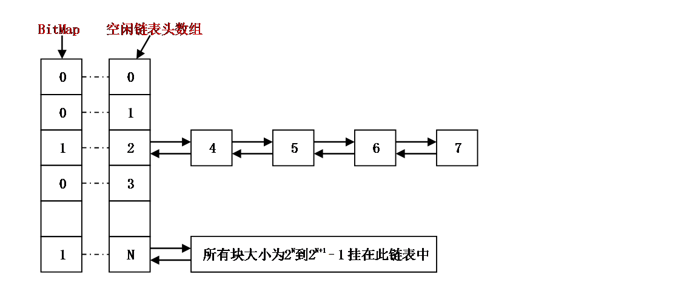
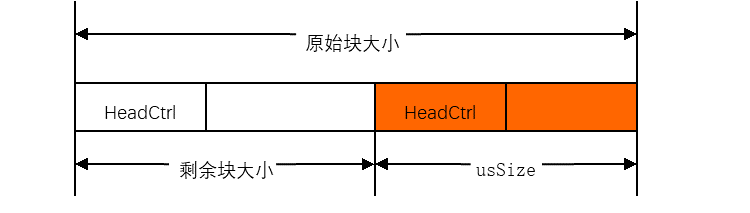

# UniProton Feature Design

## Task Management

UniProton is a single-process multi-thread operating system (OS). In UniProton, a task represents a thread. Tasks in UniProton are scheduled in preemption mode instead of time slice rotation scheduling. High-priority tasks can interrupt low-priority tasks. Low-priority tasks can be scheduled only after high-priority tasks are suspended or blocked.

A total of 32 priorities are defined, with priority 0 being the highest and 31 being the lowest. Multiple tasks can be created in a priority.

The task management module of UniProton provides the following functions:  Creates, deletes, suspends, resumes, and delays tasks; Locks and unlocks task scheduling; Obtains the current task ID; Obtains and sets task private data; Query the pending semaphore ID of a specified task; Query the status, context, and general information of a specified task; Obtains and sets task priorities; Adjusts the task scheduling order of a specified priority; Register and unregister hooks for task creation, deletion, and switching. During initialization, UniProton creates an idle task with the lowest priority by default. When no task is in the running status, the idle task is executed.

## Event Management

The event mechanism enables communication between threads. Event communication can only be event notifications and no data is transmitted.

As an extension of tasks, events allow tasks to communicate with each other. Each task supports 32 event types, each represented by a bit of a 32-bit value.

UniProton can read current task events and write specified task events. Multiple event types can be read or written at one time.

## Queue Management

A queue, also called message queue, is a method commonly used for inter-thread communication to store and transfer data. Data can be written to the head or tail of a queue based on the priority, but can be read only from the head of a queue.

When creating a queue, UniProton allocates memory space for the queue based on the queue length and message unit size input by the user. The queue control block contains **Head** and **Tail** pointers, which indicate the storage status of data in a queue. **Head** indicates the start position of occupied message nodes in the queue. **Tail** indicates the end position of the occupied message nodes in the queue.

## Hard Interrupt Management

A hardware interrupt is a level signal that is triggered by hardware and affects system running. A hardware interrupt is used to notify the CPU of a hardware event. Hardware interrupts include maskable interrupts and non-maskable interrupts (NMIs).

Hardware interrupts have different internal priorities, but they all have a higher priority than other tasks. When multiple hardware interrupts are triggered at the same time, the hardware interrupt with the highest priority is always responded first. Whether a high-priority hardware interrupt can interrupt a low-priority hardware interrupt that is being executed (that is, nested interrupts) depends on the chip platform.

The OS creates a tick hardware interrupt during initialization for task delay and software timer purposes. The tick is essentially a hardware timer.

## Memory Management

Memory management is to dynamically divide and manage large memory areas allocated by users. When a section of a program needs to use the memory, the program calls the memory application function of the OS to obtain the memory block of a specified size. After using the memory, the program calls the memory release function to release the occupied memory.

UniProton provides the FSC memory algorithm. The following table lists the advantages, disadvantages, and application scenarios of FSC.

| Algorithm                                                    | Advantages                                                        | Disadvantages                          | Application Scenarios                            |
| :----------------------------------------------------------- | ------------------------------------------------------------ | ------------------------------ | ------------------------------------ |
| Private FSC algorithm| The memory control block information occupies a small amount of memory. The minimum 4-byte-aligned memory block size can be applied for. Adjacent memory blocks can be quickly split and merged without creating memory fragmentation.| The efficiency of memory application and release is low.| It can flexibly adapt to various product scenarios.|

The FSC memory algorithm is described as follows:

### FSC Memory Algorithm

#### Core Idea

The size of the requested memory is **uwSize**. If the size is in binary, it is expressed as **0b{0}1xxx**. **{0}** indicates that there may be one or more zeros before **1**. Regardless of the content of following **1** (**xxx**), if **1** is changed to **10** and **xxx** is changed to **0**, **10yyy** is always greater than **1xxx** (**yyy** indicates that the corresponding bits of **xxx** are changed to **0**).

The subscript of the leftmost 1 can be directly obtained. The subscript values are 0 to 31 from the most significant bit to the least significant bit (BitMap), or 0 to 31 from the least significant bit to the most significant bit (uwSize). If the subscripts of the bits of the 32-bit register are 0 to 31 from the most significant bit to the least significant bit, the subscript of the leftmost 1 of 0x80004000 is 0. Therefore, we can maintain an idle linked list header array (the number of elements does not exceed 31). The subscript of the leftmost 1 of the memory block size is used as the index of the linked list header array. That is, all memory blocks with the same subscript of the leftmost 1 are mounted to the same idle linked list.

For example, the sizes of idle blocks that can be mounted to the linked list whose index is 2 are 4, 5, 6, and 7, and the sizes of idle blocks that can be mounted to the linked list whose index is N are 2^N to 2^(N+1)-1.

#### Memory Application

When applying for the memory of uwSize, use assembly instructions to obtain the subscript of the leftmost 1 first. Assume that the subscript is **n**. To ensure that the first idle memory block in the idle linked list meets the uwSize requirement, the search starts from the index n+1. If the idle linked list of index n+1 is not empty, the first idle block in the linked list is used. If the linked list of n+1 is empty, the linked list of n+2 is checked, and so on, until a non-empty linked list is found or the index reaches 31.

A 32-bit BitMap global variable is defined to prevent the for loop from checking whether the idle linked list is empty recursively. If the idle linked list of n is not empty, the value whose subscript is n of BitMap is set to 1. Otherwise, the value is set to 0. The bit whose subscript is 31 of the BitMap is directly set to 1 during initialization. Therefore, the first non-idle linked list is searched from linked list of n+1. Bits 0 to n of the BitMap copy can be cleared first, and then a subscript of the leftmost 1 of the copy is obtained. If the subscript is not equal to 31, the subscript is the array index of the first non-empty idle linked list.

All idle blocks are connected in series in the form of a bidirectional idle linked list. If the first idle block obtained from the linked list is large, that is, after a usSize memory block is split, the remaining space can be allocated at least once, The remaining idle blocks are added to the corresponding idle linked list.

The memory control header records the size of the idle memory block (including the control header itself). The memory control header contains a reused member at the beginning. When a memory block is idle, it is used as a pointer to the next idle memory block. When a memory block is occupied, it stores a magic number, indicating that the memory block is not idle. To prevent the magic number from conflicting with the pointer (same as the address value), the upper and lower four bits of the magic number are 0xf. The start addresses of the allocated memory blocks are 4-byte-aligned. Therefore, no conflict occurs.

#### Memory Release

When the memory is released, adjacent idle blocks are combined. First, the validity of the address parameter (**pAddr**) is determined by checking the magic number in the control header. The start address of the control header of the next memory block is obtained by adding the start address to the offset value. If the next memory block is idle, the next memory block is deleted from the idle linked list to which it belongs, and the size of the current memory block is adjusted.

To quickly find the control header of the previous memory block and determine whether the previous memory block is idle during memory release, a member is added to the memory control header to mark whether the previous memory block is idle. When the memory is applied for, the flag of the next memory block can be set to the occupied state (if the idle memory block is divided into two, and the previous memory block is idle, the flag of the current memory block is set to the idle state). When the memory is released, the flag of the next memory block is set to the idle state. When the current memory is released, if the previous memory block is marked as occupied, the previous memory block does not need to be merged; if the previous memory block is marked as idle, the previous memory block needs to be merged. If a memory block is idle, the flag of the next control block is set to the distance to the current control block.

   

## Timer Management

UniProton provides the software timer function to meet the requirements of timing services.

Software timers are based on the tick interrupts. Therefore, the period of a timer must be an integral multiple of the tick. The timeout scanning of the software timer is performed in the tick handler function.

Currently, the software timer interface can be used to create, start, stop, restart, and delete timers.

## Semaphore Management

A semaphore is typically used to coordinate a group of competing tasks to access to critical resources. When a mutex is required, the semaphore is used as a critical resource counter. Semaphores include intra-core semaphores and inter-core semaphores.

The semaphore object has an internal counter that supports the following operations:

- Pend: The Pend operation waits for the specified semaphore. If the counter value is greater than 0, it is decreased by 1 and a success message is returned. If the counter value of the semaphore is 0, the requesting task is blocked until another task releases the semaphore. The amount of time the task will wait for the semaphore is user configurable.

- Post: The Post operation releases the specified semaphore. If no task is waiting for the semaphore, the counter is incremented by 1 and returned. Otherwise, the first task (the earliest blocked task) in the list of tasks pending for this semaphore is woken up.

The counter value of a semaphore corresponds to the number of available resources. It means mutually exclusive resources remained that could be occupied. The counter value can be:

- 0, indicating that there is no accumulated post operation, and there may be a task blocked on the semaphore.

- A positive value, indicating that there are one or more post release operations.

## Exception Management

Exception takeover of UniProton is a maintenance and test feature that records as much information as possible when an exception occurs to facilitate subsequent fault locating. In addition, the exception hook function is provided so that users can perform special handling when an exception occurs. The exception takeover feature handles internal exceptions and external hardware exceptions.

## CPU Usage Statistics

The system CPU usage (CPU percentage, CPUP) in UniProton refers to the CPU usage of the system within a period of time. It reflects the CPU load and the system running status (idle or busy) in the given period of time. The valid range of the system CPUP is 0 to 10000, in basis points. 10000 indicates that the system is fully loaded.

The thread CPUP refers to the CPU usage of a single thread. It reflects the thread status, busy or idle, in a period of time. The valid range of the thread CPUP is 0 to 10000, in basis points. 10000  indicates that the process is being executed for a period of time. The total CPUPs of all threads (including interrupts and idle tasks) in a single-core system is 10000.

The system-level CPUP statistics of UniProton depends on the tick module, which is implemented by tick sampling idle tasks or idle software interrupt counter.

## STM32F407ZGT6 Development Board Support

The kernel peripheral startup process and board driver of UniProton supports the STM32F407ZGT6 development board. The directory structure is as follows:

├─apps         # Demo based on the real-time OS of UniProton
│ └─hello_world   # hello_world example program
├─bsp          # Board-level driver to interconnect with the OS
├─build          # Build script to build the final image
├─config         # Configuration items to adjust running parameters
├─include         # APIs provided by the real-time OS of UniProton
└─libs          # Static libraries of the real-time OS of UniProton. The makefile example in the build directory has prepared the reference of the header file and static libraries.

## OpenAMP Hybrid Deployment

OpenAMP is an open source software framework designed to standardize the interaction between environments in heterogeneous embedded systems through open source solutions based on asymmetric multi-processing. OpenAMP consists of the following components:

1. Remoteproc manages the life cycle of the slave core, shared memory, and resources such as buffer and vring used for communication, and initializes RPMsg and virtio.
2. RPMsg enables multi-core communication based on virtio.
3. Virtio, which is a paravirtualization technology, uses a set of virtual I/Os to implement driver communication between the master and slave cores.
4. libmetal shields OS implementation details, provides common user APIs to access devices, and handles device interrupts and memory requests.

## POSIX Standard APIs

[UniProton supports POSIX standard APIs](./uniproton_apis.md).

## Device Drivers

UniProton's driver architecture follows a Linux-like approach, treating devices as files through its Virtual File System (VFS). Drivers register with the file system via registration interfaces, enabling applications to access hardware through standard system calls. Adapted from Nuttx's open-source RTOS driver module, the framework maintains Nuttx-compatible interfaces. The file_operations structure (defined in fs.h) stores device operation methods, while register_driver associates devices with their inode structures that describe node locations and data. System calls reference these inodes to locate corresponding driver functions. For interface specifications, see [UniProton APIs](./uniproton_apis.md).

## Shell Commands

UniProton features a shell interface for command-line interaction with OS services, parsing user input and processing system outputs. Adapted from LiteOS's shell module, it supports custom command creation (requiring recompilation). Current implementation includes only the help command, with more commands planned for future releases.

| Interface | Description |
| :---: | :--: |
| SHELLCMD_ENTRY | Static command registration |
| osCmdReg | Dynamic command registration |

Static registration (5 parameters) typically handles system commands, while dynamic registration (4 parameters) manages user commands. Both share four common parameters after the static method's unique first parameter. Details in [UniProton APIs](./uniproton_apis.md).
